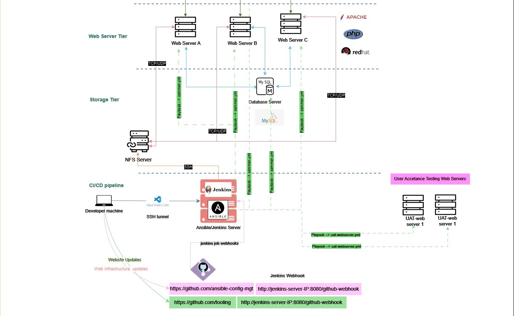
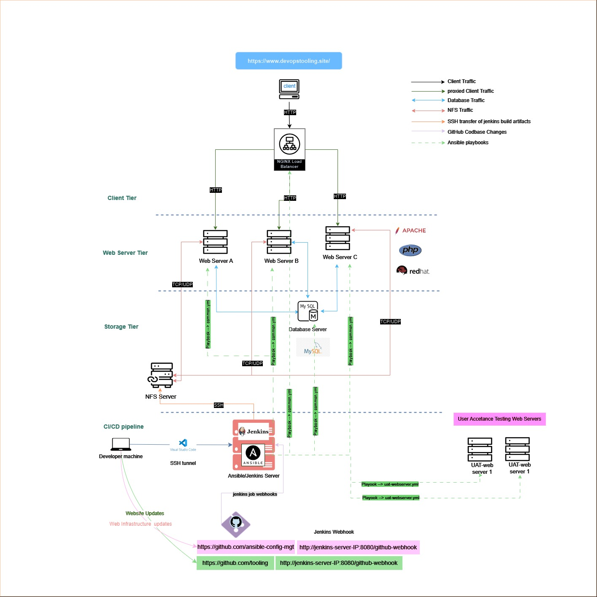

# How to Upgrade Your Ansible Set Up using Dynamic Assignments and Community Roles



## Introduction

This project is a build-up on two previous [projects](../Ansible_Refactoring_and_Static_Assignment/README.md) that introduced the basics of Ansible and how to use it to automate the deployment of our devops tooling web application. In this project, we will be looking at how to upgrade the current Ansible set up using dynamic assignments and community roles.

We will be working with the web infrastructure that we have been deploying in the previous projects. The web infrastructure consists of the following components:



Given the architecture diagram above you can see that we have a 3-tier web infrastructure configured and managed by the Ansible-Jenkins Node. We recently refactored the Ansible playbooks and roles to make them more modular and reusable. In this project, we will be looking at how to upgrade the current Ansible set up using dynamic assignments and community roles.

## Why Dynamic Assignments and Community Roles?

The current Ansible set up assumes that the web infrastructure is static and that the IP addresses of the target servers are Known. This is rarely the case in real-world scenarios. In real-world scenarios, the web infrastructure is dynamic and the IP addresses of the target servers often change or are unknown. 

Our build pipline would fail if the IP addresses of the target servers change. Dynamic assignments allow us to dynamically assign target servers to Ansible playbooks and roles. Even If we are among the most careful DevOps engineers and have tabs on all the IP addresses of the target servers, we would still have to update the Ansible playbooks and roles every time we deploy our web infrastructure to a new target server. This is where community roles come in. Community roles are pre-built Ansible roles that can be used to deploy web infrastructure to any target server without having to change the Ansible playbooks and roles. Are you still having doubts about the importance of dynamic assignments and community roles? Let's dive into the project and see how they work.

## Pre-requisites

As always I want to make sure you're set up for success. Before you start this project, make sure you have the following:

- 1.[ A basic understanding of Ansible](https://www.ansible.com/resources/webinars-training) and how to use it to automate the deployment of web infrastructure.

- 2. An existing web infrastructure that you have been deploying using Ansible. If you don't have one, you can use the web infrastructure that we have been deploying in the previous projects. you can build it by following the steps in the [previous projects](../README.md).

- 3. A basic understanding of dynamic assignments and community roles. If you don't have one, you can read more about them [here](https://docs.ansible.com/ansible/latest/user_guide/intro_dynamic_inventory.html) and [here](https://docs.ansible.com/ansible/latest/user_guide/playbooks_reuse_roles.html).

Awesome you're all caught up! Let's get started.

## Getting Started

We have the codebase for the ansible playbooks and roles that we have been using to deploy our web infrastructure in the previous projects. You can find the codebase [here](https://github.com/Simontagbor/ansible-config-mgt). We will be upgrading the codebase to use dynamic assignments and community roles. to follow along with this project, you can clone the codebase to your local machine by running the following command:

```bash
git clone https://github.com/Simontagbor/ansible-config-mgt
```
Then as good practice, you should create a new branch to work on by running the following command:

```bash
git checkout -b dynamic-assignments
```

You can now navigate to the `ansible-config-mgt` directory and start working on the project.

## Upgrading the Ansible Set Up

At a glance our dynamic assignment implementation uses environment variables to dynamically assign target servers to playbooks and roles. We will aslo create playbooks that use dynamic assignments to deploy the web infrastructure to target servers. We will also be using community roles to deploy the web infrastructure to target servers without having to change the Ansible playbooks and roles.

### Set Up New Directory Structure

Lets start by creating a new directory called `dynamic-assignments` in the `ansible-config-mgt` directory. we also need another directory for storing environment variables.
You can create the directory by running the following command:

```bash
mkdir dynamic-assignments env-vars
```

### Create Files for Environment Variables and Dynamic Assignments

In our `env-vars` directory, we will create four files for storing environment variables that will be used for development, User acceptancetesting, staging, and production environments. You can create the files by running the following command:

```bash
touch env-vars/dev.yml env-vars/uat.yml env-vars/staging.yml env-vars/prod.yml
```

we also need to create a file for storing the dynamic assignments. You can create the file by running the following command:

```bash
touch dynamic-assignments/env-vars.yml
```
Great now your overall structure should look like this🧮 

```bash
ansible-config-mgt
├── dynamic-assignments
├── env-vars
│   ├── dev.yml
│   ├── uat.yml
│   ├── staging.yml
│   └── prod.yml
├── inventory
│   ├── dev
│   ├── uat
│   ├── stage
│   └── prod
├── playbooks
│   ├── site.yml
├── static-assignments
│   ├── common_del.yml
│   ├── common.yml
│   ├── uat-webservers.yml

```
Great now that we have our directory structure set up, we can now start working on the environment variables and dynamic assignments.

### Set Up Environment Variables

we need update the playbook inside the `env-vars` directory with the environment variables for the development, User acceptancetesting, staging, and production environments. You can update the files with the following environment variables:

```yaml	
#dynamic-assignment/env-vars.yml
---

- name: collate variables from env specific file, if it exists
  hosts: all
  tasks:
    - name: looping through the lsit of available env files
      include_vars: "{{ item }}"
      with_first_found:
        - files:
            - dev.yml
            - uat.yml
            - stage.yml
            - prod.yml
            - uat.yml
          paths: "{{ playbook_dir }}/../env-vars"

      tags: 
        - always
```
What we have just done in the `env-vars/dev.yml` file is to include the environment variables from the `env-vars` directory. We are looping through the list of available environment files and including the variables from the first file that is found. This allows us to use the environment variables for the development, User acceptancetesting, staging, and production environments.

Notice How we used the `include_vars` module to include the environment variables from the `env-vars` directory. We also used the `with_first_found` loop to loop through the list of available environment files and include the variables from the first file that is found. This allows us to use the environment variables for the development, User acceptancetesting, staging, and production environments.

The values inside the curly braces `{{ }}` are Ansible variables that are used to reference the environment variables. The `playbook_dir` variable is used to reference the directory where the playbook is located. The `../` is used to move up one directory from the current directory. The `env-vars` is used to reference the `env-vars` directory.

Our dynamic assignment child playbook will now be included in our main playbook. You can update the `playbooks/site.yml` file with the following code:

```yaml

---
- hosts: all

  tasks:

    - name: include dynamic variables

      import_playbook:

        name: ../static-assignments/common.yml

      block:

        - include_vars: ../dynamic-assignments/env-vars.yml

  tags:

    - always


- hosts: uat-webservers

  tasks:
    - name: set up uat webservers
      block:
        - import_vars: ../static-assignments/uat-webservers.yml
```

What we have just done in the `playbooks/site.yml` file is to include the dynamic variables in the main playbook. We are including the dynamic variables from the `dynamic-assignments` directory. This allows us to use the dynamic variables to dynamically assign target servers to playbooks and roles.

We have the environment variables and dynamic assignments set up. Now whenever we need to deploy the web infrastructure to a new target server, we can simply update the environment variables and dynamic assignments without having to change the Ansible playbooks and roles.

### Set Up Community Roles

Community roles are pre-built Ansible roles that can be used to deploy web infrastructure to any target server without having to change the Ansible playbooks and roles. You can think of community roles as building blocks that can be used to build web infrastructure. The cooles aspect of community roles is that they are open source and can be used by anyone.

let's think about a common task that can be done using community roles. To explore the convenience that commuinity roles provide, we will set up a MySQL database on the target servers using the `geerlingguy.mysql` community role

We will use the `ansible-galaxy` install command to install the `geerlingguy.mysql` community role on our Jenkins-Ansible node. If at this point you have been working on the project om your local development environment, now is the time to push your changes to the remote repository. You can push your changes to the remote repository by running the following command:

```bash
git add .
git commit -m "Set up dynamic assignments"
git push origin --set-upstream dynamic-assignments
```
After that we will ssh into the Jenkins-Ansible node and install the `geerlingguy.mysql` community role by running the following command:

```bash
cd asible-config-mgt
git init
git pull https://github.com/<your username>/ansible-config-mgt.git
git remote add origin https://github.com/<your username>/ansible-config-mgt.git
git branch community-roles
git switch community-roles
cd roles
ansible-galaxy install geerlingguy.mysql
mv geerlingguy.mysql mysql
```
We will foollow the instructions in the mysql role documentation to set up the MySQL database on the target servers. You can find the documentation [here](https://galaxy.ansible.com/geerlingguy/mysql).

for our set up we will use the credentials used in accesing the db used by the tooling web application.

After updating the `mysql` role, we can now commit push the changes to the remote repository.

### More examples of Dynamic Assignments working together with Community Roles

Let's say we want to be able to choose between an `Nginx` and an `Apache` load balancers. We can use separate community roles to deploy the `Nginx` or `Apache` web server to the target servers without having to change the Ansible playbooks and roles.

currently our use case is basic general enough so we can rely on existing community roles to configure the load balancer to use either `Nginx` or `Apache` web server. We can use the `geerlingguy.nginx` and `geerlingguy.apache` community roles to deploy the `Nginx` and `Apache` web servers to the target servers. You can find the documentation for the `geerlingguy.nginx` and `geerlingguy.apache` community roles [here](https://galaxy.ansible.com/geerlingguy/nginx) and [here](https://galaxy.ansible.com/geerlingguy/apache).

We can use the `ansible-galaxy` install command to install the `geerlingguy.nginx` and `geerlingguy.apache` community roles on our Jenkins-Ansible node. You can install the roles by running the following command:

```bash
ansible-galaxy install geerlingguy.nginx
mv geerlingguy.nginx nginx

ansible-galaxy install geerlingguy.apache
mv geerlingguy.apache apache
```

This installs the `geerlingguy.nginx` and `geerlingguy.apache` community roles on our Jenkins-Ansible node. We also renamed the roles to `nginx` and `apache` respectively.

Before we proceed to start including the roles in the `site.yml`, let's declare variables inside the `default/main.yml` in the `roles/nginx` and `roles/apache` directories. The variables will allow us to check the value of the variable and decide which of the load balancer role to include in the `site.yml` file since we can't have both running at the same time.

```yaml
# roles/nginx/defaults/main.yml
---
enable_nginx: false
load_balancer_is_required: false
```

let's do same for the `roles/apache` directory

```yaml
# roles/apache/defaults/main.yml
---
enable_apache: false
load_balancer_is_required: false
```

let's now create a new dynamic assignment for configuring the load balancer. You can create the file by running the following command:

```bash
touch dynamic-assignments/loadbalancers.yml
```
we can edit the file to include the following code:

```yaml
# dynamic-assignments/loadbalancers.yml
---
- hosts: lb
  roles:
    - { role: nginx, when: load_balancer_is_required and enable_nginx }
    - { role: apache, when: load_balancer_is_required and enable_apache }
```

Now we can include the `nginx` and `apache` roles in the `site.yml` file. You can update the `site.yml` file with the following code:

```yaml
---
- name: Loadbalancer configuration assignment
  hosts: lb
     - import_playbook: ../dynamic-assignments/loadbalancers.yml
     when: load_balancer_is_required
```

Now let's set the  environment variables in the `env-vars` directory to enable the `Nginx` or `Apache` web server. We will update the `env-vars/uat.yml` file with the following code:

```yaml
enable_nginx: true
load_balancer_is_required: true
```

Now it easy to imagine how convinient it is to use dynamic assignments and community roles. If we do decide in the future to switch from `Nginx` to `Apache` web server, we can simply update the environment variables without having to change the Ansible playbooks and roles.

## Testing the Dynamic Assignments and Community Roles

We can create a new EC2 server to serve as the load balancer for the ua-test environment.
We can then update the environment variables in the `env-vars/uat.yml` file to enable the `Nginx` web server. We can then run the `site.yml` playbook to deploy the `Nginx` web server to the target server. We also need to make sure the inventory file is updated with the new server IP address.

You can the run the `site.yml` playbook by running the following command:

```bash
ansible-playbook playbooks/site.yml
```

This will the following:

1. configure the MySQL database on the target servers using the `geerlingguy.mysql` community role.
2. configure the `Nginx` web server on the target servers using the `geerlingguy.nginx` community role.


## Summary

As we have seen in this project, dynamic assignments and community roles are essential for upgrading the Ansible set up. Dynamic assignments allow us to dynamically assign target servers to Ansible playbooks and roles. This is useful for deploying web infrastructure to new target servers without having to change the Ansible playbooks and roles. Community roles are pre-built Ansible roles that can be used to deploy web infrastructure to any target server without having to change the Ansible playbooks and roles. This is useful for deploying web infrastructure to target servers without having to write the Ansible playbooks and roles from scratch.

As a recap this is what we have done in this project:

- [x] Set up a new directory structure for dynamic assignments and environment variables.
- [x] Created files for environment variables and dynamic assignments.
- [x] Set up environment variables for development, User acceptancetesting, staging, and production environments.
- [x] Set up community roles for deploying the MySQL database, `Nginx` and `Apache` web servers to the target servers.
- [x] Created a new dynamic assignment for configuring the load balancer.

With these updates our web infrastucture can now scale pretty easily and we can deploy to any target server without having to change the Ansible playbooks and roles. This ends our work on the devops tooling web application. In the next project, we will be taking on a capstone project to stress test our knowledge of devops tooling. Stay tuned!


