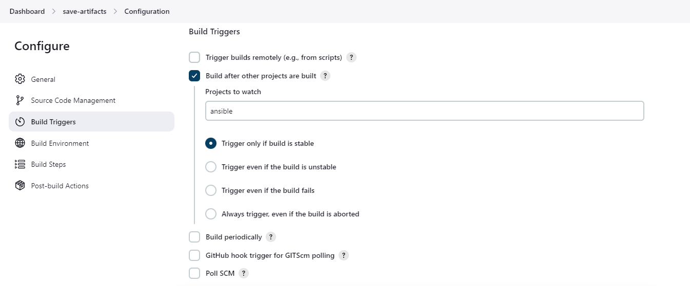
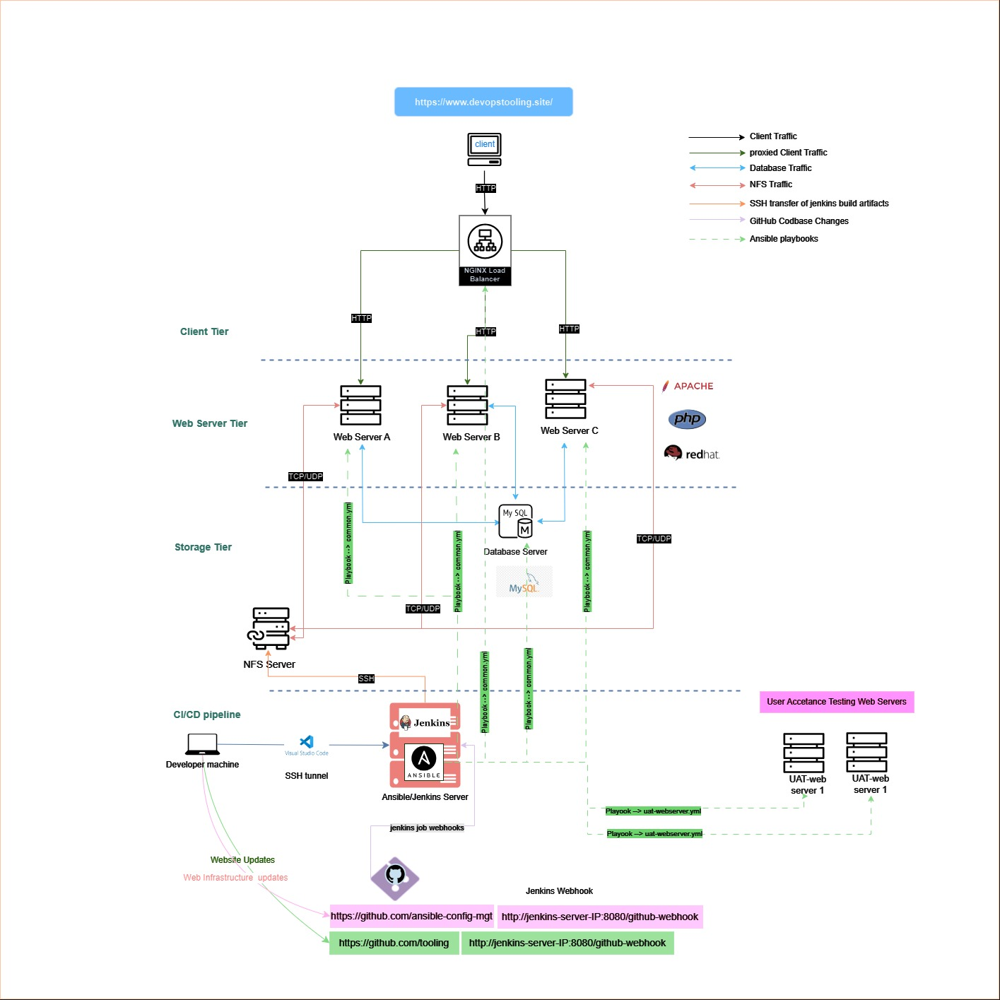

# Refactoring Existing Ansible Configuration Management Codebase With Static Assignment


If you have been following the previous projects, you would have noticed that at some point our 3 tier web architecture became a bit complex to manage. We had a total of 7 AWS EC2 instances, 3 of which were web servers, one database server, one load balancer and an NFS server. It became  necessary to introduce an Ansible jenkins job to automate the configuration management for the servers running our web application.

We created basic [playbooks](https://docs.ansible.com/ansible/latest/playbook_guide/playbooks_intro.html) to automate the configuration of the development servers specified in an ansible [inventory file](https://www.juniper.net/documentation/us/en/software/junos-ansible/ansible/topics/concept/junos-ansible-inventory-file-overview.html#:~:text=The%20Ansible%20inventory%20file%20defines,formats%20include%20INI%20and%20YAML.)
However, the playbooks were not well structured and were not reusable. If for instance we wanted set up a new server, with a similar configuration but with a few differences, we would have to create a new playbook from scratch. This is not the best practice in configuration management. 

In this project we will be restructuring the codebase for managing the configuration of our web infrastructure.


## Pre-requisites

- Web Infrastructure setup with Ansible. Refer to the latest project [here](../Configuration_Management_with_Ansible//README.md)

- A basic understanding of [Ansible](https://www.ansible.com/)

- Understanding declarative language like [YAML](https://yaml.org/)

Once we have the pre-requisites in place, we can proceed to refactor the playbooks. I will discuss the refactoring tasks in the next section.

## Refactoring Tasks

### Update Jenkins Job

In our ansible-config-mgt jenkins job, the existing configuration creates a separate directory of artifacts for after each build. This is not necessary and it consumes disk space. We will introduce a new jenkins job that will use [Copy Artifact Plugin](https://plugins.jenkins.io/copyartifact/) to copy the artifacts from the ansible-config-mgt job to the new job.

before creating a new job we need to create a new directory on the jenkins-Ansible server to store the artifacts.we will also need to install the copy artifact plugin on the jenkins server.

#### create a new directory on the jenkins server

```bash
sudo mkdir /home/ubuntu/ansible-artifact
```
we need to make sure the directory has all the necessary permissions.

```bash
sudo chmod -R 0777 /home/ubuntu/ansible-artifact
```
The command above will give all users read, write and execute permissions on the directory. next up we need to install the copy artifact plugin on the jenkins server.

#### Install the copy artifact plugin

In the jenkins dashboard, we need to navigate to Manage Jenkins > Manage Plugins > Available. Search for the `copy artifact` plugin and install it.


Once the plugin is installed, we can proceed to create a new jenkins freestyle project. We will name it `save-artifacts`. The job will copy the artifacts from the ansible-config-mgt job to the ansible-artifact directory. As a result, it needs to be configured to be triggered only after the `ansible-config-mgt` job completes successfully.

#### Create a new Jenkins job

In the jenkins dashboard, navigate to New Item > Freestyle project. Name the project `save-artifacts`. In the configuration page, navigate to the `Build` section and click on `Add build step`. Select `Copy artifacts from another project`. In the `Project name` field, enter `ansible`. In the `Which build` field, select `Latest successful build`. In the `Artifacts to copy` field, enter `**` to copy everything. In the `Target directory` field, enter `/home/ubuntu/ansible-config-artifact`. 


To save space, we need to configure our `save-artifacts` job to keep only the last two(2). To do that we need to navigate to the `Discard Old Builds` section and check the `Discard Old Builds` checkbox. In the `Max # of builds to keep` field, enter `2`.


##### Our build trigger



##### Our Build Step


##### Successfull build


Just like that we have added another jenkins job that will copy the artifacts from the ansible-conqfig-mgt job to the ansible-artifact directory. We now have a clean ansible setup on our jenkins server. The next step is to do the actual refactoring of the playbooks.


### Refactor the playbooks
As a  best practice let's create a `refactor` branch on which we will do all the refactoring tasks.
doing this will help us keep the `master` branch clean and free from any errors that may arise during the refactoring process.

```bash
git checkout -b refactor
```

#### Why Refactor?

currently our `common.yml` play book  attempts to configure all the servers the same way. This is fine for caases where all the servers have the same configuration. However, in a real-world scenario, we may have servers with different configurations. For instance, we may have a web server that requires a different configuration from the database server. In such a case, we would have to create a new playbook from scratch. This is not the best practice in configuration management.
we need to break configuration tasks into different playbooks to make them more modular and reusable.

##### Create Parent Playbook

We will create a parent playbook called `site.yml` that will call the child playbooks. The `site.yml` playbook will be the main playbook that will be executed by the ansible-playbook command. The `site.yml` playbook will call the child playbooks based on the server type. For instance, if we have a web server, the `site.yml` playbook will call the `web.yml` playbook. If we have a database server, the `site.yml` playbook will call the `db.yml` playbook.

##### Create Directory for Static Assignments

We need to create a `static-assignments` directory where other child playbooks will be stored. The `static-assignments` directory will contain the child playbooks that will be called by the `site.yml` playbook. The child playbooks will contain the tasks that will be executed on the servers.

since the `common.yml` playbook has become a child playbook, we will move it to the `static-assignments` directory to keep things tidy.
    
```bash

touch /home/ubuntu/ansible-config-mgt/playbooks/site.yml

sudo mkdir /home/ubuntu/ansible-config-mgt/playbooks/static-assignments

sudo mv /home/ubuntu/ansible-config-mgt/playbooks/common.yml /home/ubuntu/ansible-config-mgt/playbooks/static-assignments/common.yml
```

Now we will import the `common.yml` playbook into the `site.yml` playbook.
In the `site.yml` playbook, we will import the `common.yml` playbook using the `import_playbook` module. The `import_playbook` module will import the `common.yml` playbook into the `site.yml` playbook. The `site.yml` playbook will be the main playbook that will be executed by the ansible-playbook command.

```yaml
---
- hosts: all

- import_playbook: ../static-assignments/common.yml
```

After saving the file, our current directory is structured as follows:

```bash
ansible-config-mgt
├── static-assignments
│   └── common.yml

├── inventory
    └── dev.yml
    └── stage.yml
    └── uat.yml
    └── prod.yml
└── playbooks
    └── site.yml
```

##### Test the refactored codebase

In our `common.yml` playbook we were installing the `wireshark` package on a;; the servers. we will create another playbook to delete the `wireshark` package from all the servers. we will name the playbook `commom_del.yml` and store it in the `static-assignments` directory.

in our `static-assignments/common_del.yml` playbook we will have the following tasks:

```yaml

- name: update web, nfs amd db servers
    hosts: webservers, nfs, db
    remote_user: ec2-user
    become: true
    become_user: root
    tasks:
        - name: delete wireshark package
        apt:
            name: wireshark
            state: removed

- name: update LB servers
    hosts: lb
    remote_user: ubuntu
    become: true
    become_user: root
    tasks:
        - name: delete wireshark package
        apt:
            name: wireshark
            state: absent
            autoremoved: yes
            autoclean: yes
```

We can update the `site.yml` playbook to call the `common_del.yml` playbook. The `site.yml` playbook will call the `common_del.yml` playbook based on the server type. For instance, if we have a web server, the `site.yml` playbook will call the `common_del.yml` playbook. If we have a database server, the `site.yml` playbook will call the `common_del.yml` playbook.

```yaml
---
- hosts: all

- import_playbook: ../static-assignments/common.yml
- import_playbook: ../static-assignments/common_del.yml
```

if we run the `site.yml` playbook, the `wireshark` package will be removed from all the servers.

```bash

ansible-plybook -i inevntory/dev.yml playbooks/site.yml
```

To verify that the `wireshark` package has been removed from all the servers, we can log in to the servers and check if the package has been removed.

```bash

ssh ec2-user@<webserver-ip>
sudo apt list --installed | grep wireshark
```
The command above will list all the installed packages on the web server. If the `wireshark` package has been removed, it will not be listed in the output.

You can repeat the same process for the other servers. If the `wireshark` package has been removed from all the servers, the refactoring process is successful.
We now have clean and reusable configuration management playbooks for our development servers. Let's also set up another configuration management for User Aceptance Testing (UAT) servers.


#### Add Role-based Playbooks

To set up configuration management for the UAT Servers, we could write tasks specific to uat servers in the `common.yml` playbook. However, this is not the best practice in configuration management. We need to break configuration tasks into different playbooks to make them more modular and reusable. We will use [roles](https://docs.ansible.com/ansible/latest/user_guide/playbooks_reuse_roles.html) to achieve this.

Before we write the playbook we need to provsion two new RHEL 8 EC2 instances on AWS. Head over to [AWS](https://aws.amazon.com/) and create two new EC2 instances.


Let's also update the inventory file names `uat.yml` to include the new UAT servers. navigate to the `inventory` directory and update the `uat.yml` file to include the new UAT servers like so

```yaml
[uat-webservers]
<uat-web1-private-ip> ansible_ssh_user='ec2-user'
<uat-web2-private-ip> ansible_ssh_user='ec2-user'
```
great, our servers are up and running let's explore ansible roles.

Roles in ansible are essentially a way of structuring tasks, handlers, and variables in a structured way. Roles are reusable and can be shared with other playbooks. Roles are stored in the `roles` directory in the ansible project directory.

Roles are structured as follows:

```bash	
roles/
    common/               # this hierarchy represents a "role"
        tasks/            #
            main.yml      #  <-- tasks file can include smaller files if warranted
        handlers/         #
            main.yml      #  <-- handlers file
        templates/        #  <-- files for use with the template resource
            ntp.conf.j2   #  <------- templates end in .j2
        files/            #
            bar.txt       #  <-- files for use with the copy resource
            foo.sh        #  <-- script files for use with the script resource
        vars/             #
            main.yml      #  <-- variables associated with this role
        defaults/         #
            main.yml      #  <-- default lower priority variables for this role
        meta/             #
            main.yml      #  <-- role dependencies
        library/          # roles can also include custom modules
        module_utils/     # roles can also include custom module_utils
        lookup_plugins/   # or other types of plugins, like lookup in this case

    webtier/              # same kind of structure as "common" was above, done for the webtier role
    monitoring/           # ""
    fooapp/               # ""
```

##### Create a Role

To create a role we have the option to create a role with the `ansible-galaxy` command or manually. We will use the `ansible-galaxy` command to create our roles.
let's create a `webserver` role

```bash
sudo mkdir /home/ubuntu/ansible-config-mgt/roles

sudo ansible-galaxy init webservers
```
This creates a `webservers` role in the `roles` directory. The `webservers` role contains the following directories:


currently we have some directories that we do not need. For this project I only need the `defaults`,`handlers`, `meta`, `tasks` and `templates` directories. I will delete the other directories.

```bash
sudo rm -rf /home/ubuntu/ansible-config-mgt/roles/webserver/files
sudo rm -rf /home/ubuntu/ansible-config-mgt/roles/webserver/vars
sudo rm -rf /home/ubuntu/ansible-config-mgt/roles/webserver/tests
```

Now our `webserver` role is structured as follows:


##### Add path to the roles directory in the ansible.cfg file

I will add the path to the `roles` directory in the `ansible.cfg` file. This will allow ansible to search for roles in the `roles` directory.

We need to add `roles_path=/home/ubuntu/ansible-config-mgt/roles` to the `ansible.cfg` file in the `/etc/ansible` directpry. This tells ansible to search for roles in the `roles` directory.

Now that we have the roles directory set up, let's add some configuration management logic for our UAT web servers.

for the UAT web servers we need to have the following tasks:

- [x] Install the `httpd` package
- [x] Install git version control
- [x] Clone the web application from the git repository
- [x] copy the web application to the `/var/www/html` directory
- [x] start the `httpd` service

- [x] remove /var/www/html/ from the uat servers

Thanks to ansible we don't need to do this manaully on each server and we don't even need to write complicated bash scripts to perform all these tasks. we simply have to update the `webserver` role to include the tasks above. we will specifically update the `roles/tasks/main.yml`file to include the tasks above.

in our `roles/webserver/tasks/main.yml` file we will have the following tasks:

```yaml
---

- name: Install Apache
  become: true
  ansible.builtin.yum:
    name: httpd
    state: present

- name: install git
  become: true
  ansible.builtin.yum:
    name: git
    state: present

- name: clone a repo
    become: true
    ansible.builtin.git:
        repo: https://github.com/Simontagbor/tooling.git
        dest: /var/www/html
        force: yes

- name: copy html content to one level up
    become: true
    ansible.builtin.command: mv /var/www/html/* /var/www/

- name : recursively remove /var/www/html/
  become: true
  ansible.builtin.file:
    path: /var/www/html/
    state: absent

``` 

Great! we have our webserver role set up, complete with tasks needed to configure our two UAT servers. Next up we will reference the webserver role in a static assignment file.


##### Reference the Role in a Static Assignment File

We will reference the `webserver` role in a static assignment file. The static assignment  file will simply reference the target hosts specivied in `inventory/uat.yml` and also the roles that should be played on them(see what I did there?)

In the `static-assignment` directory, let's add a `uat-webservers.yml`file in which we will make the references.

###### Side Note

> We could have easily added the references in the `common.yml` file however that wouldn't serve our need to have modularity for our ansible toolinng set up.
> For instance we will need to be able to quickly debug issues with our configuration management tools. Breaking things down makes it all the more easier to locate issues with our code.

Inside the `uat-webbservers.yml` file we need to provide the follwowing references.

```yaml

---
- hosts: uat-webservers
  roles: webserver
```

At this point, we will simply import this static assignment in the parent `site.yml` playbook.

Inside our `playbooks/site.yml` let's import the child playbook written to target our UAT servers.

```yaml

--- 
 - hosts: all
 - import_playbok: ../static-assingmnets/common.yml

 - hosts: uat-webservers
 - import_playbook: ../static-assignments/uat-webservers.yml

```

#### Testing Role-based Playbooks

At this point our refactor branch on which we have been reorganising our ansible configuration management codebase is almost ready to be merged.

We need to test our code changes and then commit the changes and create a pull request for our teamates to review before merging into the master branch.

##### Testing the Refactored codebase.

To test the refactored codebase, we will run the `site.yml` playbook. The `site.yml` playbook will call the `common.yml` playbook and the `webserver` role. The `common.yml` playbook will configure the development servers, while the `webserver` role will configure the UAT servers.


On our jenkins server, we will run the `site.yml` playbook using the `ansible-playbook` command. navigate to the `ansible-config-mgt` directory and run the following command:

```bash
ansible-playbook -i inventory/dev.yml playbooks/site.yml
```

The command above will run the `site.yml` playbook. The `site.yml` playbook will call the `common.yml` playbook and the `webserver` role. The `common.yml` playbook will configure the development servers, while the `webserver` role will configure the UAT servers.


You should see a terminal output like this: 


We can also navigate to the index page of the site using the url  http://<uat-webserver-IP>/index.php this should redirect you to the login page below.


This is great! our refactoring worked it's time to create a pull request to share the update with the team.


yaay! it works...

let's reflect on what we've accomplished so far: 

- [x] We updated Jenkins with a new project to copy artifacts from an upstream project to a new directory on the jenkins server.

- [x] We implemented a new directory structure for the ansible project to make the playbooks more modular and reusable.

- [x] We set up a parent playbook that calls child playbooks based on the server type.

- [x] We created a role for the User Acceptance Testing web servers and referenced the role in a static assignment file.

- [x] We referenced the static assignment file in the parent playbook.

- [x] We tested the refactored codebase by running the site.yml playbook.

Now that we have tnested our code changes, we can commit the changes and create a pull request for our teamates to review before merging into the master branch.

```bash
git add ansible-config-mgt/playbooks ansible-config-mgt/static-assignments ansible-config-mgt/roles ansible-config-mgt/inventory

git commit -m "refactor playbooks and add role for UAT servers"

```
Finally let's push our branch and create a pull request.

```bash
git push --set-upstream origin refactor
```

For my pull request I added notes about the changes I made to clearly communicate the changes to my teamates.


This is how our CI/CD pipeline looks like currently after refactoring our ansible cofiguration management codebase:


Our entire Infrastructure should now look like this:



This is the end of the project. I hope you enjoyed it as much as I did. I look forward to seeing you in the next project where we will explore dynamic asignments with ansible.
