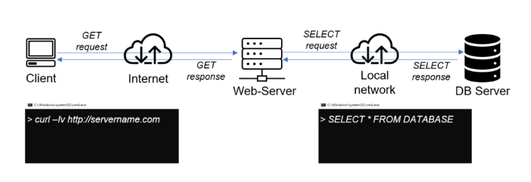
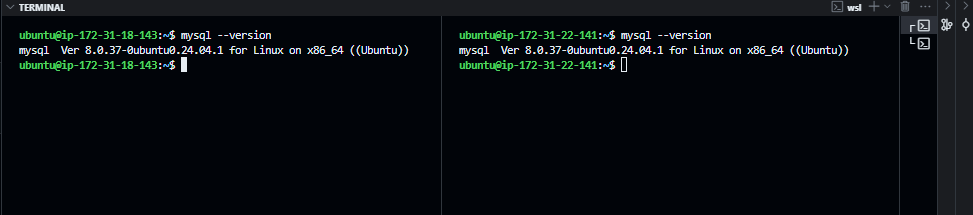
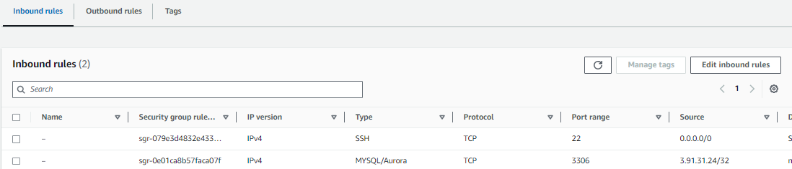
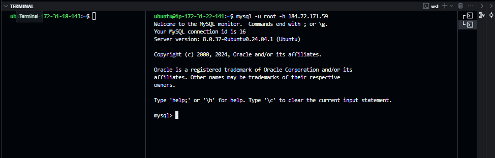
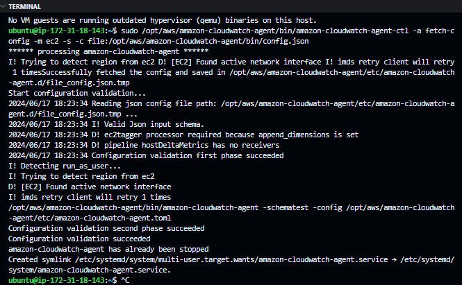
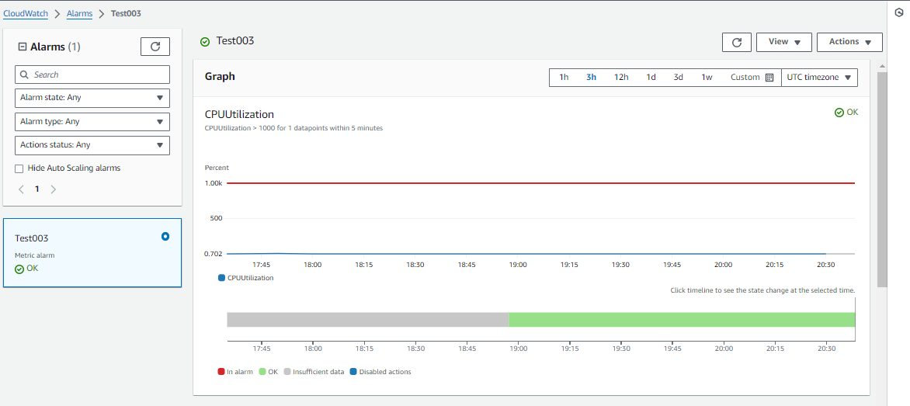
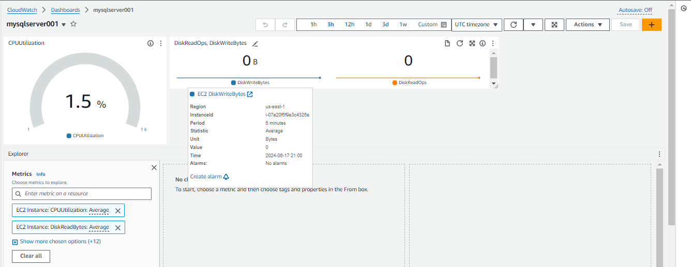

# How to Set Up a Client-Server Architecture on AWS

<div style="display: flex; justify-content: center; align-items: center; margin: 20px 0;">
   
</div>

## Introduction

For this project, I will be documenting the steps I took to successfully set up a secured client-server architecture on AWS. client-server architecture is a computing model in which the **server**- *a high-powered computer*- hosts, delivers and manages most of the resources and services to be consumed by the **client** - *any computer, device or browser*. This type of architecture has one or more client computers connected to a central server over a network or internet connection. The server provides the clients with access to share data, information, and resources. The server provides the client computer or device- with access to share data, information, and resources. A DevOps engineer must understand how to set up a client-server architecture as it is a fundamental concept in the field of computing. This project helped me understand how to set up a client-server architecture on AWS. I hope you find this project helpful and informative.

## Prerequisites

Before you begin, you need to have the following:

- [x] An AWS account. If you don't have one, you can create one [here](https://aws.amazon.com/)
- [x] A basic understanding of AWS services such as [EC2](), [VPC](), and [Security Groups]().

## What to Expect

> This documentation covers the following:
>
> - [x] Launching an EC2 instance using Infrastructure as Code (IaC) with AWS CloudFormation
> - [x] Configuring the EC2 instances for the implementation of a client-server architecture
> - [x] Setting up security groups and IAM roles for secure access
> - [x] Verifying the connection between the client and server
> - [x] Setting up AWS CloudWatch for monitoring and logging

## Tasks

### Launching EC2 Instances

I created two instances manually using the AWS Management Console. One instance will serve as the client and the other as the server. I will be using `Ubuntu 24` on both ec2 instances. I then SSH into both instances to configure them for the client-server architecture.



my client instance has the following details:
- mysql-client installation

my server instance has the following details:
- mysql-server installation

we can now proceed to configure the EC2 instances to allow the client to connect to the server.

### Configuring the EC2 Instances

Let's set up the inbound rules for the security group of the server instance to allow the client to connect to the server.
In the AWS EC2 instance console, I updated the inbound rules of the security group of the server instance by adding a new rule to allow the client to connect to the server on port 3306. Port 3306 is the default port for MySQL.



### Verifying the Connection Between the Client and Server

I SSH-ed into the client instance and connect to the server instance using the following command:

```bash
mysql -h <server-ip> -u root
```



The terminal output indicates the successful connection of the client instance to the server instance. This verifies that the client-server architecture has been successfully set up on AWS.

## Side Quest - Monitoring our Server Instance


Now that we have the client-server architecture set up, let's pause and consider for a moment, the need to know what is happening to the server instances on which client instances depend. This is where monitoring and logging come into mind and I wanted to try it out.

let's imagine that we are DevOp ninjas working with a team of rockstar developers on a government top-secret project. The team will use the client-server architecture we just set up.(shh...) Ironically, our team has a tight budget around CPU usage on the dedicated `mysql-server` instance. To stay within budget, we need to figure out a way to notify, and or take action when the CPU utilization exceeds a certain threshold.

To achieve this, we will set up AWS CloudWatch to monitor the `mysql-server` instance. We will set up an alarm to notify the developers when the CPU utilization exceeds a certain threshold. We will also set up a dashboard to monitor the CPU utilization of the `mysql-server` instance. let's get started.


# Setting Up CloudWatch Monitoring on an EC2 Instance

I followed these steps to set up CloudWatch monitoring on the `mysql-server` instance:

1. **Install and configure the AWS CLI**:

    I followed the [official AWS CLI User Guide](https://docs.aws.amazon.com/cli/latest/userguide/cli-configure-quickstart.html) to get `aws=cli` installed.

2. I then **Created an IAM role for CloudWatch and attached the CloudWatchAgentServerPolicy**:

    ```bash
    aws iam create-role --role-name CWAgentRole --assume-role-policy-document file://TrustPolicyForCWAgent.json
    aws iam attach-role-policy --role-name CWAgentRole --policy-arn arn:aws:iam::aws:policy/CloudWatchAgentServerPolicy
    ```

    Note: The `TrustPolicyForCWAgent.json` file contains the following trust policy:

    ```json
    {
      "Version": "2012-10-17",
      "Statement": [
        {
          "Effect": "Allow",
          "Principal": {"Service": "ec2.amazonaws.com"},
          "Action": "sts:AssumeRole"
        }
      ]
    }
    ```

3. **I then attached the IAM role to the `mysql-server`  instance**:

    ```bash
    aws ec2 associate-iam-instance-profile --instance-id i-1234567890abcdef0 --iam-instance-profile Name=CWAgentRole
    ```

    Replace `i-1234567890abcdef0` with your actual instance ID.

Then, continue with the steps as before:

4. **SSH into the mysql-server instance**:

    ```bash
    ssh -i </path/to/your/key.pem>ubuntu@<mysql-server-instance-public-ip>
    ```

5. **Update the mysql-server instance and install collectd** (optional but recommended):

    ```bash
    sudo apt-get update
    sudo apt-get upgrade
    sudo apt-get install collectd
    ```

6. **Download and install the CloudWatch agent**:

    ```bash
    wget https://s3.amazonaws.com/amazoncloudwatch-agent/ubuntu/amd64/latest/amazon-cloudwatch-agent.deb
    sudo dpkg -i -E ./amazon-cloudwatch-agent.deb
    ```

7. **Configure the CloudWatch agent**:

    ```bash
    sudo /opt/aws/amazon-cloudwatch-agent/bin/amazon-cloudwatch-agent-config-wizard
    ```

    During this step, I was presented with a series of questions to customize the `mysql-server` CloudWatch agent configuration. These include options for metrics and log files to monitor, and the frequency of data collection. Make sure to carefully review each option and select the ones that best suit your monitoring needs.

8. **Start the CloudWatch agent**:

    ```bash
    sudo /opt/aws/amazon-cloudwatch-agent/bin/amazon-cloudwatch-agent-ctl -a fetch-config -m ec2 -s -c file:/opt/aws/amazon-cloudwatch-agent/bin/config.json
    ```

You should get the following output: 



9. **Verify the CloudWatch agent is running**:

    ```bash
    sudo systemctl status amazon-cloudwatch-agent
    ```
you should get the following output:


Now that the CloudWatch agent is running, we can monitor the server instance using AWS CloudWatch console.

Let's play around with the CloudWatch console to see how we can monitor the server instance.

Using the AWS CloudWatch console I added an alarm to the `mysql-server` instance to monitor the CPU utilization. I set the alarm threshold to 70% CPU utilization. I then configured the alarm to send an email notification to the developers warning them to "minimise concurrent workloads, or risk temporary restriction to the database".



To keep an extra high-level eye on the CPU utilization, I also set up a dashboard on the CloudWatch console to monitor the CPU utilization of the `mysql-server` instance.



##### Keeping an eye on you CPU! 


## Easter Egg
>
> ### How might you automate the entire process of setting up the client-server architecture and CloudWatch monitoring using Infrastructure as Code (IaC)?
>
>
## Conclusion

In this project, I successfully set up a client-server architecture on AWS. I configured two EC2 instances to serve as the client and server. I set up security groups to allow the client to connect to the server. I verified the connection between the client and server by connecting to the server instance from the client instance. I also set up CloudWatch monitoring on the server instance to monitor the CPU utilization and set up an alarm to notify the developers when the CPU utilization exceeds a certain threshold. I hope you found this project helpful and informative. Thank you for reading!


