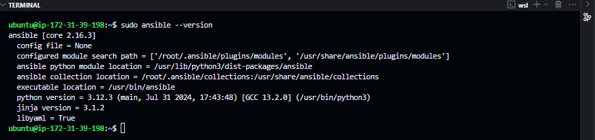
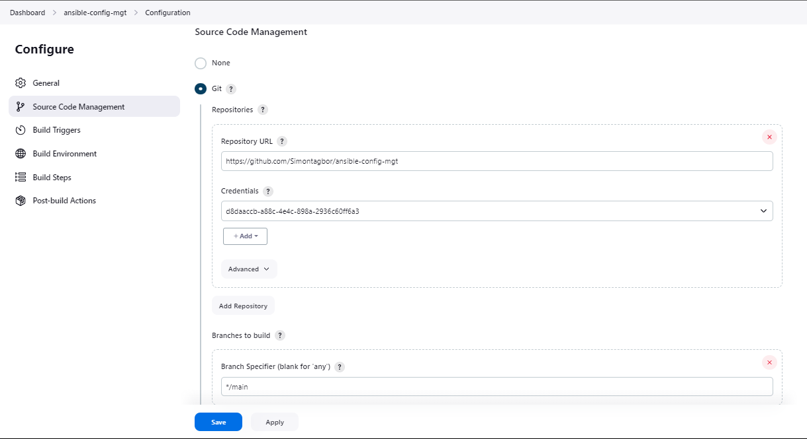
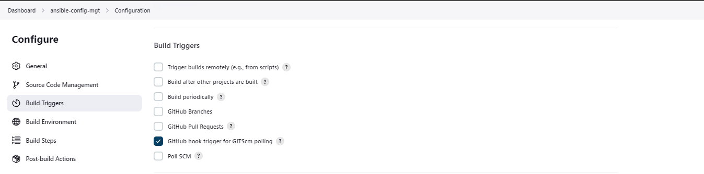
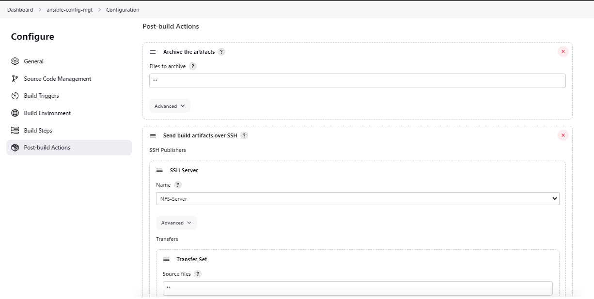
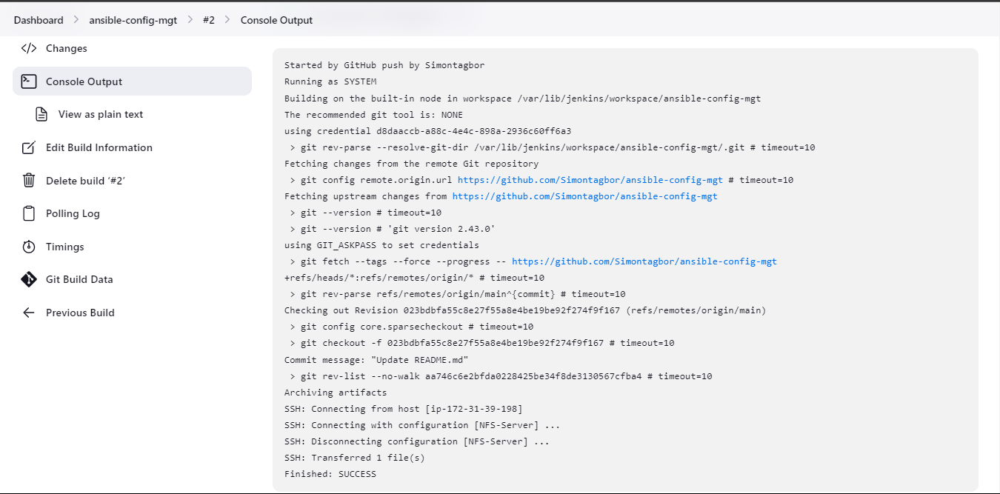
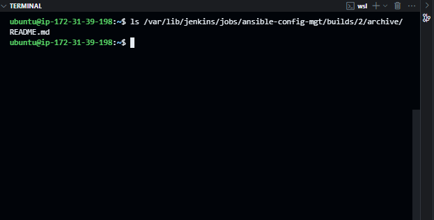
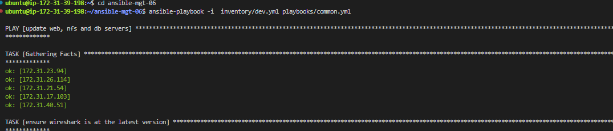
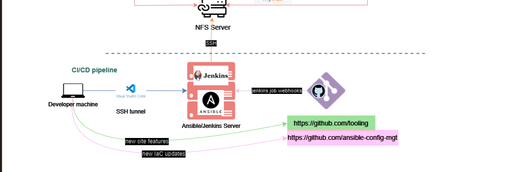
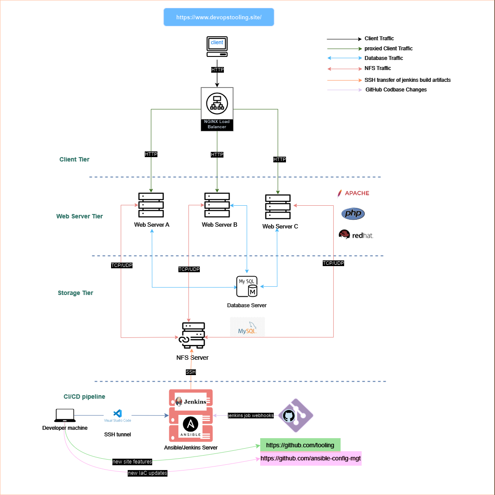

# Implementing Web Architecture Configuration Management with Ansible

<div style="display: flex; justify-content: center; align-items: center; margin: 20px 0;">
   
</div>

If you have been following along with my [projects](../README.md), you would notice that we have for the most part been manually configuring our servers. We tried in some cases to automate the process using bash scripts. However, as we scale our infrastructure, it becomes increasingly difficult to manage the configuration of multiple servers manually. Writing bash scripts does help to some extent but it is often error-prone and difficult to maintain as the infrastructure grows. This is where configuration management tools come in.

Configuration management tools are designed to automate the process of configuring and managing servers. They allow us to define the desired state of our infrastructure in code and then apply that code to your servers to ensure they are configured correctly. One such tool is [Ansible](https://www.ansible.com/). In this project, we will explore how to use Ansible to automate the configuration of a simple web architecture.

### Prerequisites

Before you begin this guide, you'll need the following:

- Web Infrastructure setup. Refer to the latest project [here](../Load_Balancer_Solution_Nginx_SSl/)

- A basic understanding of [Ansible](https://www.ansible.com/)

- Understanding declarative language like [YAML](https://yaml.org/)


### Tasks

Once you have the prerequisites in place, you can proceed with the following tasks:

#### 1. Install Ansible on the Jenkins Server

Ansible is not installed by default on the Jenkins server. To install Ansible, run the following commands:

```bash
sudo apt update
sudo apt install ansible -y
```

After installing Ansible, you can verify the installation by running the following command:

```bash
ansible --version
```

You should get a terminal output similar to the one below:

<div style="display: flex; justify-content: center; align-items: center; margin: 20px 0;">
   
</div>

#### 2. Integrate Ansible with Jenkins

Ansible relies on SSH to connect to remote servers and execute commands. To allow Ansible to connect to the web servers, we need to generate an SSH key pair on the Jenkins server and copy the public key to the web servers.

We will create a separate free-style project called `ansible-config-mgt` in Jenkins to manage the Ansible playbook. 

The project will have the following configurations:

- **Source Code Management**: I selected `Git` as the source code management tool. I provided the URL of the [`ansible-config-mgt`](https://github.com/Simontagbor/ansible-config-mgt) GitHub repository of our web infrastructure.



- **Build Triggers**: I selected `GitHub hook trigger for GITScm polling` to trigger the pipeline whenever a change is made to the codebase of our web infrastructure.



- **Post-build Actions**: I added a `archive the artifacts` post-build action to archive every single file in the codebase. I used the `**` wildcard to archive all files. we also added a post-build step to transfer the codebase to the NFS server.



After creating the jenkins ansible-config-mgt project, we can now proceed to create the Ansible playbook. But first let's test the configuration by updating the `README.md` file in the ansible-config-mgt repository.

Checking the Jenkins console output, we can see that the Jenkins server successfully pulled the latest changes from the repository and archived the artifacts and transferred them to the NFS server.

<div style="display: flex; justify-content: center; align-items: center; margin: 20px 0;">
   
</div>

We can also verify the archive files by checking the jenkins  build directory.

```bash
ls /var/lib/jenkins/jobs/ansible-config-mgt/builds/<build_number>/archive/
```
You would get all the content of the ansible-config-mgt repository. Currently, I only have the `README.md` file.

<div style="display: flex; justify-content: center; align-items: center; margin: 20px 0;">
   
</div>

#### Set Up Development Enviroment

We need to set up an Integrated Development Environment (IDE) to write our Ansible playbook. I will be using Visual Studio Code. You can download it [here](https://code.visualstudio.com/).

After installing Visual Studio Code, we need to clone our `ansible-config-mgt` repository to our local machine. We can do this by running the following command:

I usually prefer to clone the repo with my [Personal Access Token (PAT)](https://docs.github.com/en/github/authenticating-to-github/keeping-your-account-and-data-secure/creating-a-personal-access-token) to avoid the `Username` and `Password` prompt.

In the Visual Studio Code terminal, run the following command:

```bash
git clone https://<PAT>@github.com/<Username>/ansible-config-mgt.git
```
After cloning the repository, we can switch the ansible-config-mgt directory and open it in Visual Studio Code.

Before we start writing code for Ansible let's create a new branch for our changes. It's always a good practice to create a new branch for every new feature or bug fix. This helps to keep the codebase clean and organized.

in our Visual Studio Code terminal, let's run the following command to create a new branch:

```bash
git checkout -b playbook
```
let's organize our Ansible codebase by creating a new directory called `playbooks`. We will store all our Ansible playbooks in this directory. We also need to create the `inventory` directory to store the inventory files for our web servers.

In the Visual Studio Code terminal, run the following commands:

```bash
mkdir playbooks
mkdir inventory
```

After creating the directories, we can now create the Ansible playbook. An Ansible playbook is simply a [YAML](https://yaml.org/) file that defines a set of tasks to be executed on remote servers. The playbook is organized into plays, and each play contains a set of tasks to be executed on a group of hosts.

Let's create our very first playbook called `common.yml` in the `playbooks` directory. In the Visual Studio Code terminal, run the following command:

```bash
touch playbooks/common.yml
```

Let's also create a series of inventory files for our web servers. We will create an inventory file for each environment (development, staging, testing and production). In the Visual Studio Code terminal, run the following commands:

```bash
touch inventory/dev.yml
touch inventory/staging.yml
touch inventory/uat.yml
touch inventory/prod.yml
```
An inventory file is a simple YAML file that contains a list of hosts and groups of hosts that Ansible can connect to. The inventory file is used to define the hosts that Ansible will manage and the groups of hosts that Ansible will manage.

before we start organizing our inventory of target servers we want to manage and our playbook of tasks, let's first underdand how ansible allows us to implement the concept of [infrastructure as code](https://en.wikipedia.org/wiki/Infrastructure_as_code).

In a fast-paced environment, it is important to be able to quickly and easily deploy and manage infrastructure. Infrastructure as code is a practice that allows you to define your infrastructure in code and then use that code to deploy and manage your infrastructure. This allows you to treat your infrastructure as you would treat your application code, with version control, testing, and automation. 

There are some realy neat programs that were designed to help us implement infrastructure as code. Some of the popular tools include [puppet](https://puppet.com/), [chef](https://www.chef.io/), [terraform](https://www.terraform.io/), and [ansible](https://www.ansible.com/). In this project, we will be using Ansible to implement infrastructure as code.

As indicated this project will focus on Ansible. Ansible differs from a lot of these other options in a few ways. For instance unlike puppet, Ansible is **agentless**. What that means is that we don't need to install any client softawre on the target servers. Ansible uses SSH to connect to the target servers and execute commands. This makes it very easy to get started with Ansible. Also Ansible uses declarative language like [YAML](https://yaml.org/) to define the desired state of our infrastructure. This makes it very easy to read and understand the code unlike puppet for instance where we may need to understand a bit of [Ruby](https://www.ruby-lang.org/en/) to be able to use it.

Great, As hinted earlier, Ansible uses two main components to manage infrastructure. The first component is the inventory file. The inventory file is a simple text file that contains a list of hosts and groups of hosts that Ansible can connect to. The inventory file is used to define the hosts that Ansible will manage and the groups of hosts that Ansible will manage.

A typical command to execute a play book is like this:

```bash
ansible-playbook -i inventory/dev playbooks/common.yml
```

here, the `ansible-playbook` command is used to execute the playbook. The `-i` flag is used to specify the inventory file to use. In this case, we are using the `inventory/dev` file. The `playbooks/common.yml` file is the playbook that we want to execute.

A basic inventory file might look something like this:

```yaml

[web]
<web_server1_ip> ansible_ssh_user=<ssh_user>
<web_server2_ip> ansible_ssh_user=<ssh_user>
<web_server3_ip> ansible_ssh_user=<ssh_user>

[lb]
<lb_server_ip> ansible_ssh_user=<ssh_user>

[db]
<db_server_ip> ansible_ssh_user=<ssh_user>

[nfs]
<nfs_server_ip> ansible_ssh_user=<ssh_user>
```
A basic playbook file is a YAML file that contains a list of plays. A play is basically a set of tasks to be executed on a group of hosts. A basic playbook file might look something like this:

```yaml
---

- name: <clear description of the tasks>
   hosts: <group of hosts as named in the inventory file>
   tasks:
      - name: <clear description of the task>
         <module>: <module arguments>
      --- add more tasks here ---
```
Ansible uses modules to perform tasks on remote servers. A module is basically a small program that performs a specific task. Ansible comes with a lot of built-in modules that you can use to perform common tasks. For example, the `apt` module can be used to install packages on a Debian-based system. The `yum` module can be used to install packages on a Red Hat-based system. The `service` module can be used to start, stop, and restart services. The `copy` module can be used to copy files from the local machine to a remote server.

There are references to the [Ansible documentation](https://docs.ansible.com/ansible/latest/index.html) for more information on the modules available in Ansible. For this project we will use some of the modules to implement our basic IaC.

Now that we know how Ansible works. let's put our understanding to the test.

### Task 1  Add Target Servers to Inventory file for Development Environment

In the `inventory/dev` file, add the private IP addresses of the web servers, NFS servers and the load balancer. The inventory file should look something like this:

```yaml
[web]
<web_server1_ip> ansible_ssh_user=ec2-user
<web_server2_ip> ansible_ssh_user=ec2-user
<web_server3_ip> ansible_ssh_user=ec2-user

[lb]
<lb_server_ip> ansible_ssh_user=ubuntu

[db]
<db_server_ip> ansible_ssh_user=ubuntu

[nfs]
<nfs_server_ip> ansible_ssh_user=ec2-user

```
If You have been following, you should have the private IP addresses of the web servers, NFS servers and the load balancer. If not, you can get the private IP addresses from the AWS console.  Also we need to make sure we are using the appropriate SSH usernames for each server depending on the OS.

### Task 2 Create Ansible Playbook to Install some programs on our Development Server

In the `playbooks` directory, update  the  playbook called `common.yml`. In the `common.yml` file, add the following code:

```yaml

- name: update web, nfs and db servers
  hosts: webservers, nfs, db
  become: true
  tasks:
    - name: ensure wireshark is at the latest version
      yum:
        name: wireshark
        state: latest
    
- name: update LB server
  hosts: lb
  become: true
  tasks:
    - name: Update apt repo
      apt:
        update_cache: true

- name: Ensure Wireshark is at the latest version
  hosts: all
  become: true
  tasks:
    - name: Ensure Wireshark is at the latest version
      package:
        name: wireshark
        state: latest

```

In the playbook above, we have defined a play called `update web, nfs and db servers`. This play will run on the `webservers`, `nfs`, and `db` groups of hosts. The `become: true` line tells Ansible to run the tasks as the root user. The first task in the play is to ensure that `wireshark` is at the latest version. We use the `yum` module to install the `wireshark` package.


The second play is called `update LB server`. This play will run on the `lb` group of hosts. The first task in the play is to update the apt repository using the `apt` module.

The third play is called `Ensure Wireshark is at the latest version`. This play will run on all hosts. The first task in the play is to ensure that `wireshark` is at the latest version using the `package` module.

### Task 3 Run the Ansible Playbook

So far we've been working on the `playbook` github branch. we need to commit and push the configuration to the remote repository. In the Visual Studio Code terminal, run the following commands:

```bash
git add inventory/ playbooks/
git commit -m "Add inventory and playbook files"
git push origin [branch-name]

```

Right now, our ansible-config-mgt jenkins job is configured to build when any change is made to the main branch. However as a good practice we worked on a separate feture branch named `playbook`. we need to create pull request for our code to be integrated into the main branch. Only then will the webhook trigger the jenkins job to build the code. After a successful merge, our build artifacts for managing the infrastructure as code can be found in the jenkins build directory.

```bash
ls /var/lib/jenkins/jobs/ansible-config-mgt/builds/<build_number>/archive/
```

We will soon connect to the Jenkin/Ansible server to run the playbook. We will use SSH-agent to connect to the server using the Visual Studio SSH tunnling feature.
you can learn more about [conecting](https://code.visualstudio.com/docs/remote/ssh) to a remote server using Visual Studio Code here.


### Task 3 Running the Playbook

After connecting with the Jenkins/Ansible server, we can now run the playbook. In the Visual Studio Code terminal, run the following command:

```bash
ln -s /var/lib/jekins/jobs/ansible-config-mgt/builds/7/archive /home/ubuntu/ansible-config-mgt
cd /ansible-config-mgt
ansible-playbook -i inventory/dev playbooks/common.yml
```

You sould get a similar output:

<div style="display: flex; justify-content: center; align-items: center; margin: 20px 0;">
   

</div>

At this point our project is complete. We have successfully used Ansible to automate the configuration of our web servers. We have created an inventory file that contains the private IP addresses of the web servers, NFS servers and the load balancer. We have also created a playbook that installs the `wireshark` package on the web servers, NFS servers and the database server. We have also created a playbook that updates the apt repository on the load balancer server and ensures that `wireshark` is at the latest version on all servers.

This is how our CI/CD looks like now:

<div style="display: flex; justify-content: center; align-items: center; margin: 20px 0;">
   
</div>

This is how our entire 3-tier Web Infrastructure look like



### Conclusion

In this project, we have explored how to use Ansible to automate the configuration of a simple web architecture. We have created an inventory file that contains the private IP addresses of the web servers, NFS servers and the load balancer. We have also created a playbook that installs the `wireshark` package on the web servers, NFS servers and the database server. We have also created a playbook that updates the apt repository on the load balancer server and ensures that `wireshark` is at the latest version on all servers.


