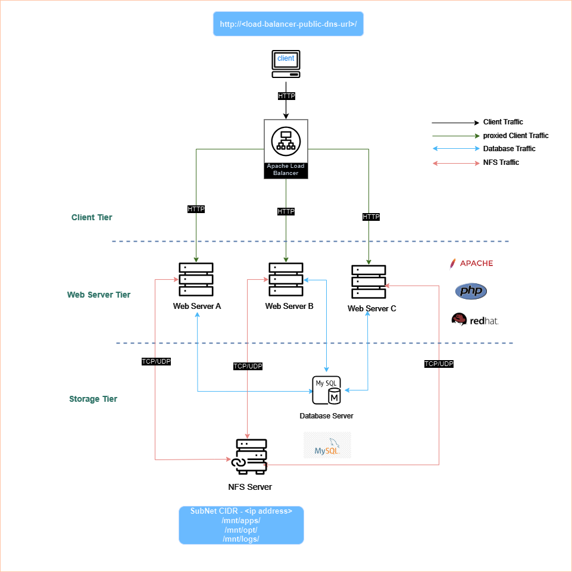

# How to Set Up Continous Integration For Web Infrastructure Using Jenkins

<div style="display: flex; justify-content: center; align-items: center; margin: 20px 0;">
   
</div>

Over a series of projects, I have been exploring how to develop a scalable and maintainable web infrastructure for a DevOps tooling website. I started by developing a [3-tier web solution](../DevOps_Tooling_Web_Solution/README.md) featuring three Apache web servers,  a Mysql database and an NFS server for file sharing. I then [implemented a load-balancing solution](../Load_Balancer_Solution_Apache/) on top of the 3-tier web solution using Apache.

So far our DevOps tooling website can serve content without worrying about traffic load from users or scenarios where any of the web servers is down. In this project, I will be improving the scalability of our web infrastructure further using the concept of continuous integration(CI).

Continuous Integration is a software development practice where members of a team integrate their work frequently, usually, each person integrates at least daily - leading to multiple integrations per day. Each integration is verified by an automated build (including a test) to detect integration errors as quickly as possible. Many teams find that this approach leads to significantly reduced integration problems and allows a team to develop cohesive software more rapidly.

In this project I will set up a basic CI pipeline using Jenkins to automate the process of building and deploying our web infrastructure. The CI pipeline will be triggered whenever a change is made to the [codebase](https://github.com/Simontagbor/tooling) of our web infrastructure. The pipeline will build the code using Jenkins and then transfer the code to the NFS server. This project will not focus on testing the codebase but rather on automating the process of building and deploying the codebase.

## Prerequisites

1. A 3-tier web solution with an NFS server for file sharing. You can follow the guide [here](../DevOps_Tooling_Web_Solution/README.md) to set up the 3-tier web solution.

2. A basic understanding of [Continuous Integration](https://www.atlassian.com/continuous-delivery/continuous-integration) and [Jenkins](https://www.jenkins.io/doc/).


## Tasks
Currently, this is how our web infrastructure looks like:

<div style="display: flex; justify-content: center; align-items: center; margin: 20px 0;">
   
</div>

In the next steps, we will set up a Jenkins server and create a CI pipeline to automate the process of building and deploying our web infrastructure.

### 1. Set Up Hardware for Jenkins

I created an EC2 instance on AWS to host Jenkins. Our Jenkins server runs on Ubuntu 20.04. This server will be responsible for building and deploying our web infrastructure.


### 2. Install Jenkins

Based on the [official Jenkins documentation](https://www.jenkins.io/doc/book/installing/linux/), I installed Jenkins on the Jenkins server. I added the Jenkins repository to the system and installed Jenkins using the following commands:

##### Update the package index

```bash
sudo apt-get update
```

##### Install Java Development Kit (JDK)

```bash
sudo apt-get install default-jdk-headless
```

##### Install Jenkins

```bash

wget -q -O - https://pkg.jenkins.io/debian/jenkins.io.key | sudo apt-key add -
sudo sh -c 'echo deb http://pkg.jenkins.io/debian-stable binary/ > /etc/apt/sources.list.d/jenkins.list'
sudo apt-get update

sudo apt-get install jenkins
```

##### Start Jenkins

```bash
sudo systemctl start jenkins
```

##### Enable Jenkins to start on boot

```bash
sudo systemctl enable jenkins
```

##### Check Jenkins status

```bash
sudo systemctl status jenkins
```
You should see an output similar to this:


### 3. Access Jenkins

Jenkinns runs on port `8080`. To be able to access the server from a browser we need to update the inbound rules of the security group attached to the Jenkins server to allow `TCP` traffic on port `8080`.

You can now navigate to `http://<Jenkins-Server-IP>:8080` using your browser. You should be presented with the Jenkins unlock page where you need to provide the initial admin password. You can get the initial admin password by running the following command:

```bash
sudo cat /var/lib/jenkins/secrets/initialAdminPassword
```

we need to copy the password and paste it in the Jenkins unlock page. Click on `Continue` to proceed.


### 4. Install Plugins

After unlocking Jenkins, you will be presented with the `Customize Jenkins` page. Here you can select the plugins you want to install. I selected the `Install suggested plugins` option to install the recommended plugins for Jenkins.


### 5. Create Admin User

After installing the plugins, you will be prompted to create an admin user. Fill in the required details and click on `Save and Continue`.


### 6. Configure Jenkins

For this step, I set up a webhook on the GitHub repository of our web infrastructure. This webhook will trigger the Jenkins pipeline whenever a change is made to the codebase of our web infrastructure.

I used the Jenkins url `http://<Jenkins-Server-IP>:8080/github-webhook/` as the payload URL for the webhook.

I then created an access token for the jenkins admin user on Jenkins. This token will be used to authenticate the webhook requests from GitHub.

To create the access token, navigate to `Dashboard` >` Manage Jenkins` >  under Security  select `Users`> `API Token` > `Add new token`. Fill in the required details and click on `Generate`.

We will use the access token to authenticate the webhook requests from GitHub.


Once the webhook is set up, we can now create a new Jenkins pipeline.

### 7. Create Jenkins Project or Job

Let's create a new Freestyle project in Jenkins. Navigate to `Dashboard` > `New Item` > Enter `tooling_github` for the project and select `Freestyle project`. Click on `OK`.


### 8. Configure Jenkins Project

At this point, we need to set up the `tooling_github` project. We will configure the project to pull the codebase from the GitHub repository of our web infrastructure and transfer the code to the NFS server.


I configured the project as follows:

- **General**: I provided a description for the project.

- **Source Code Management**: I selected `Git` as the source code management tool. I provided the URL of the GitHub repository of our web infrastructure and the access token created earlier.


- **Build Triggers**: I selected `GitHub hook trigger for GITScm polling` to trigger the pipeline whenever a change is made to the codebase of our web infrastructure.


- **Post-build Actions**: I added a `archive the artifacts` post-build action to archive every single file in the codebase. I used th `**` wildcard to archive all files in the codebase. archiving the artifacts will make it easy to transfer the codebase to the NFS server.


After configuring the project, click on `Save` to save the project.

### 9. Creating Our First Build

To trigger the pipeline, I made a change to the `tooling\README.md` file codebase of our web infrastructure. I added a new file to the codebase and pushed the changes to the GitHub repository.


As can be seen, our 5th build was successful. The freestyle project was triggered and the resulting build artifacts were archived successfully.

At this point our Jenkins server is creating builds whenever a change is made. The next task is to set up the process of transferring the codebase to the NFS server. For this we will rely on another Jenkins plugin called `Publish Over SSH`.

### 10. Install Publish Over SSH Plugin

To install the `Publish Over SSH` plugin, navigate to `Dashboard` > `Manage Jenkins` > `Manage Plugins` > `Available` > search for `Publish Over SSH` > `Install without restart`.

After Installation I configured the plugin by navigating to `Dashboard` > `Manage Jenkins` > `Configure System` > `Publish over SSH`.

I added the NFS server as a remote server and provided the required details. I also added the content of the `.pem` private key file that we can use to connect to the NFS Server to the Jenkins configuration.


I also added the `/mnt/apps` remote directory where the codebase will be transferred to on the NFS server. I saved the configuration after adding the remote server.


### 11. Update Jenkins Project

I updated the `tooling_github` project to transfer the codebase to the NFS server after archiving the artifacts. I added a `Send build artifacts over SSH` post-build action to transfer the codebase to the NFS server.


I configured the `Send build artifacts over SSH` post-build action as follows:

- **Source files**: I used the `**` wildcard to transfer all files in the codebase.

- **Remote directory**: I provided the remote directory `/mnt/apps` where the codebase will be transferred to on the NFS server.


### 12. Testing the Pipeline

I made a change to the `tooling\README.md` file codebase of our web infrastructure and pushed the changes to the GitHub repository. The pipeline was triggered and the codebase was transferred to the NFS server.


During the testing, I ran into an issue where the Jenkins user did not have permission to write to the `/mnt/apps` directory on the NFS server. I resolved this issue by changing the permissions of the `/mnt/apps` directory on the NFS server.

```bash
sudo chmod 777 /mnt/apps
```
I was then able to transfer the codebase to the NFS server successfully.

### 13. Verify Changes on NFS Server

I ssh into the NFS server and run `cat /mnt/apps/README.md` to verify that the codebase was transferred successfully.
I got the following terminal output:


I also checked the webhooks on the GitHub repository of our web infrastructure to verify that the Jenkins webhook was triggered.


As can be seen, the Jenkins webhook was triggered successfully. This means that the Jenkins pipeline was triggered whenever a change was made to the codebase of our web infrastructure.

Now we have successfully set up a basic CI pipeline using Jenkins to automate the process of building and deploying our web infrastructure. The pipeline is triggered whenever a change is made to the codebase of our web infrastructure. The pipeline builds the code using Jenkins and then transfers the code to the NFS server.

This is how our web infrastructure looks like now:

<div style="display: flex; justify-content: center; align-items: center; margin: 20px 0;">
   
</div>

## Conclusion

In this project, I set up a basic CI pipeline using Jenkins to automate the process of building and deploying our web infrastructure. The pipeline is triggered whenever a change is made to the codebase of our web infrastructure. The pipeline builds the code using Jenkins and then transfers the code to the NFS server with the help of the `Publish Over SSH` Jenkins plugin.


