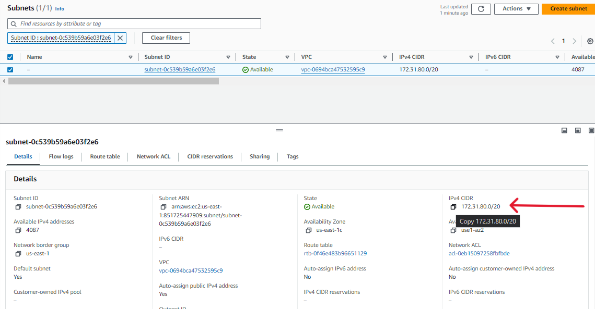

# Deploying a LAMP Stack Using 3-Tier Web Architecture Powered by NFS on AWS

<div style="display: flex; justify-content: center; align-items: center; margin: 20px 0;">
   
</div>

## Introduction

In the Previous project, we implemented a 3-tier Web Solution focusing on leveraging the capabilities of [Network File System (NFS)](https://en.wikipedia.org/wiki/Network_File_System) to deploy a scalable and easy to manage LAMP stack on AWS.

In this project, I will walk you through the process of deploying a website that will make access to DevOps tools within the corporate infrastructure easily accessible to the DevOps team. The DevOps tooling solution web application will rely on the 3-tier web infrastructure implementation.

## Pre-requisites

To follow along with this project, you need to have the following:

- An AWS account, which can be created [here](https://aws.amazon.com/)

- Understanding [Network File System (NFS)](https://en.wikipedia.org/wiki/Network_File_System)


## Project Requirements

> Our solution needs to consist of the following components:

>| **Component**     | **Technology**                    |
>|-------------------|-----------------------------------|
>| Cloud Platform    | AWS                               |
>| Web Server        | Linux                             |
>| Database Server   | Ubuntu 24.04 + MySQL              |
>| Storage Server    | Red Hat Enterprise Linux 8 + NFS  |
>| Language          | PHP                               |
>| Repository        | GitHub                            |
>
> 

## Project Tasks

### 1. Prepare NFS Server

#### Why Network File System (NFS)?

In Web architecture, a Network File System (NFS) serves as a distributed file system protocol that allows a user on a client computer to access files over a network like how local storage is accessed. Using the NFS comes with the following benefits to the DevOps team:

- **Centralized Storage**: NFS allows for the centralization of storage, making it easier to manage files across multiple servers. This is particularly useful for web applications that are distributed across several servers, as it ensures that all servers can access the same files in real time.

- **Simplified Data Management**: With NFS, data management becomes simpler because all the data is stored in one place. This reduces the complexity of managing data across different servers and makes backup and recovery processes more straightforward.

- **Scalability**: NFS supports scalability. As our web solution grows, we can easily add more storage or servers without significantly changing the underlying infrastructure. This makes NFS an excellent choice for web applications that anticipate growth.

- **Improved Collaboration and Efficiency**: For development teams, NFS can facilitate better collaboration by providing shared access to necessary files and tools. This can improve efficiency, as team members can easily access and work on the same files without needing to transfer them back and forth.

To implement the NFS server, we will follow these steps:

1. **Launch an EC2 Instance**: We will launch an EC2 instance to serve as our NFS server. This instance will be based on Red Hat Enterprise Linux 8.

2. **Install and Configure NFS**: We will install and configure the NFS server on the EC2 instance. This will involve setting up the NFS server to share a directory with other servers in the network.

3. **Mount the NFS Share**: We will mount the NFS share on the webserver to allow it to access the shared directory. This will enable the webserver to read and write files to the NFS share.

#### Launch an EC2 Instance

I launched an EC2 instance and retrieved the `instance id` of the instance.
We will use the `instance id` in a script to automate the configuration of the NFS server.

```bash
aws ec2 describe-instances --filters "Name=tag:Name,Values=<server name>" --query "Reservations[*].Instances[*].InstanceId" --output text
```
You should get an output similar to this
```bash
i-0a6cfec2d162c09ce
```
You can also retrieve the `instance id` from the AWS Management Console.

#### Prepare and Configure Logical Volumes on NFS

In this step, we will add  Logical Volumes to the NFS server. Remember from the [previous project](../DevOps_Tooling_Web_Solution/README.md), we introduced the concept of using logical volumes to manage and organize storage devices on our servers. We will use the same concept here to manage storage on the NFS server. However, we will automate the process using a script.

##### Planning Automation Process

Let's recap the manual steps we took to add Logical Volumes to the NFS server:

1. Create and Attach EBS Volumes on AWS using aws-cli

2. Attach the EBS Volumes to the NFS server

3. Create Physical Volumes

4. Create Volume Groups

5. Create 3 Logical Volumes `lv-opt`, `lv-apps`, `lv-logs` with the appropriate sizes.

6. Format disks on the Logical Volumes with the appropriate file system

7. Mount the Logical Volumes

That's a lot of steps! and prone to time-wasting and errors. We can automate this process using a script that combines aws-cli commands and LVM commands.

##### Automating the Process

I will three scripts that break down the process into smaller, manageable tasks:

1. [`create-ebs-volumes.sh`](./create-ebs-volumes.sh): This script will create and attach N number of EBS volumes to the NFS server.

2. [`attach-volumes-server.sh`](./attach-volumes-server.sh): This script will configure the NFS server by creating Logical Volumes and mounting them.

3. [`preapre-NFS-server.sh`](prepare-NFS-server.sh): This script will mount the NFS share on the web server.

Our scripts will require the following utilities:

- `aws-cli`: This is the command-line interface for AWS. It allows us to interact with AWS services from the command line.

- `lvm2`: This is the Logical Volume Manager for Linux. It allows us to manage logical volumes on Linux systems.

- `nfs-utils`: This is a set of utilities for managing NFS servers and clients.

Let's start by creating the `create-ebs-volumes.sh` script.

###### create-ebs-volumes.sh

let's now create the `create-ebs-volumes.sh` script that will automate the process of creating EBS volumes that we will attach to the NFS server.

<details>
  <summary>Click to expand!</summary>

```bash
#!/bin/bash

# Get the user's default region
default_region=$(aws configure get region)
if [ -z "$default_region" ]; then
    echo "Default region is not set. Please configure it using 'aws configure'."
    exit 1
fi

# Get the first available zone in the default region
default_zone=$(aws ec2 describe-availability-zones --region "$default_region" --query 'AvailabilityZones[0].ZoneName' --output text)
if [ -z "$default_zone" ]; then
    echo "Could not retrieve the default availability zone."
    exit 1
fi

# Default values
default_prefix="Default-Volume"
default_num_volumes=1
default_volume_type="gp2"
default_volume_size="10" # Size in GiB


# Check for command line arguments
if [ "$#" -ge 1 ]; then
    num_volumes="${1:-$default_num_volumes}"
    availability_zone="${2:-$default_zone}"
    volume_type="${3:-$default_volume_type}"
    volume_size="${4:-$default_volume_size}"
    volume_prefix="${5:-$default_prefix}"
else
    # Interactive mode
    read -p "Please Provide the Number of EBS Volumes [$default_num_volumes]: " num_volumes
    num_volumes="${num_volumes:-$default_num_volumes}"

    read -p "Enter volume name prefix for each volume [$default_prefix]: " volume_prefix
    volume_prefix="${volume_prefix:-$default_prefix}"
    
    read -p "Please Provide the Availability Zone [$default_zone]: " availability_zone
    availability_zone="${availability_zone:-$default_zone}"
    
    read -p "Please Provide The Volume Type [$default_volume_type]: " volume_type
    volume_type="${volume_type:-$default_volume_type}"
    
    read -p "Please Enter the Volume Size in GiB [$default_volume_size]: " volume_size
    volume_size="${volume_size:-$default_volume_size}"
fi

for ((i=1; i<=num_volumes; i++)); do
    # Create EBS volume
    volume_id=$(aws ec2 create-volume --size "$volume_size" --availability-zone "$availability_zone" --volume-type "$volume_type" --query 'VolumeId' --output text)
    echo "Created volume: $volume_id in zone: $availability_zone with type: $volume_type and size: ${volume_size}GiB"

    # Tag the volume with a name
    volume_name="${volume_prefix}-${i}"
    aws ec2 create-tags --resources "$volume_id" --tags Key=Name,Value="$volume_name"
    echo "Tagged volume $volume_id with name $volume_name"

    # Wait for the volume to become available
     # Start spinner and wait for the volume to become available
    aws ec2 wait volume-available --volume-ids "$volume_id"
    echo "Volume $volume_id is now available"

    # Attach the volume to the NFS server
    echo "Attaching volume $volume_id to instance $instance_name..."
    aws ec2 attach-volume --volume-id "$volume_id" --instance-id "$instance_id" --device "/dev/sdf"
    echo "Volume $volume_id attached to instance $instance_name"
done

echo "All volumes created and attached successfully..  :)"
```
</details>

The script above automates the process of creating and attaching EBS volumes to the NFS server. It takes the following parameters:

- `num_volumes`: The number of EBS volumes to create and attach. The default is 1.

- `availability_zone`: The availability zone in which to create the EBS volumes. The default is the first available zone in the user's default region.

- `volume_type`: The type of EBS volume to create. The default is `gp2``.

- `volume_size`: The size of the EBS volumes in GiB. The default is 10 GiB.

- `volume_prefix`: The prefix to use for the name of each EBS volume. The default is `Default-Volume`.

To run the script interactively, you can simply execute it without any arguments:

```bash
sudo chmod u+x create-ebs-volumes.sh
./create-ebs-volumes.sh
```

Here's how the script works:

- It starts by setting default values for the volume zone, type, size, and name prefix.

- It prompts the user for a volume name prefix, allowing for a default if none is provided.

- It asks the user for the number of volumes to create, the volume type, and the volume size, providing defaults for each.

- For each volume, it creates the volume with the specified parameters and tags it with a unique name based on the provided prefix and a counter.

- It waits for each volume to become available before proceeding to create and tag the next one.

- It prints a confirmation message once all volumes have been created and tagged.

After making the script executable and running it, you should see a terminal output similar to this:


Checking the AWS Console to confirm the creation of the EBS Volumes, we see the following:


We can now proceed to attach the EBS volumes to the NFS server and configure the Logical Volumes.

###### Attach EBS Volumes to the NFS Server

Currently, our volumes are not attached to any instance. We will attach the volumes we just created to the NFS server and set up the packages necessary to Manage our NFS server Logical Volumes using the `prepare-NFS-server.sh` script.

let's quickly recap the manual steps we took to configure server storage in our previous project:

1. Attach the EBS Volumes to the server via the AWS Management Console.

2. SSH into the NFS server.

3. Create Physical Volumes using the `pvcreate` command.

4. Create Volume Groups using the `vgcreate` command.

5. Create Logical Volumes using the `lvcreate` command.

###### side note:

> In our previous project, we had to partition the disks, but for this project, it is not necessary. We will create the Logical Volumes directly on the EBS volumes.The Linux Logical Volume Manager (LVM) allows us to create physical volumes directly on the raw devices without needing to partition them first. This approach simplifies management and maximizes flexibility, as LVM can easily resize logical volumes and move them between groups without concern for underlying partition boundaries.

Let's go ahead and create the `attach-volumes-server.sh` script that will automate the process of attaching the three volumes to the NFS server.

The script will need the target instance name(our NFS server), the operating system type, and the volume name prefix to search for volumes to attach. specifying the operating system will help us determine the appropriate device name to use when attaching the volumes. Device names can vary depending on the operating system, so it's important to account for this in our script.

<details>
  <summary>Click to expand!</summary>

```bash
#!/bin/bash

# specify default values
default_prefix="Default-Volume"

# Function to attach volume
attach_volume() {
    local volume_id=$1
    local instance_id=$2
    local device_name=$3

    aws ec2 attach-volume --volume-id "$volume_id" \
        --instance-id "$instance_id" \
        --device "$device_name"
}

# Check for command line arguments
if [ "$#" -ge 1 ]; then
    instance_name="${1:-$instance_name}"
    volume_name_prefix="${2:-$default_prefix}"
else
    # Prompt the user for the instance name
    read -p "Enter the name of the NFS server instance: " instance_name

    # prompt the user for prefix of the volumes name
    read -p "Enter volume name prefix for each volume [$default_prefix]: " volume_name_prefix
    volume_name_prefix="${volume_name_prefix:-$default_prefix}"
fi

echo "Fetching instance ID for $instance_name..."
# Retrieve the instance ID based on the instance name

instance_id=$(aws ec2 describe-instances \
    --filters "Name=tag:Name,Values=$instance_name" \
    --query "Reservations[].Instances[?State.Name=='running'].InstanceId" \
    --output text)

# Check if the instance ID was found
if [ -z "$instance_id" ]; then
    echo "Instance not found. Please check the name or verify that the server is created."
    exit 1
fi

# Ask the user to specify the operating system
echo "Please specify the operating system of the NFS server instance:"
select os_type in RedHat Ubuntu AWS; do
    case $os_type in
        RedHat ) device_names=("/dev/sdf" "/dev/sdg" "/dev/sdh"); break;;
        Ubuntu ) device_names=("/dev/xvdf" "/dev/xvdg" "/dev/xvdh"); break;;
        AWS ) device_names=("/dev/nvme1n1" "/dev/nvme2n1" "/dev/nvme3n1"); break;;
        * ) echo "Invalid selection. Please try again."; continue;;
    esac
done

# Loop through the volume names and attach them
for i in {1..3}; do
    volume_name="${volume_name_prefix}-${i}"
    volume_id=$(aws ec2 describe-volumes \
        --filters "Name=tag:Name,Values=$volume_name" \
        --query "Volumes[].VolumeId" \
        --output text)
    
    if [ -z "$volume_id" ]; then
        echo "Volume $volume_name not found."
        echo "please create $volume_name volume using create-ebs-volumes.sh script"
        echo "Exiting..."
        exit 1
    fi
    echo "Attaching volume $volume_name to instance $instance_name..."  
    (attach_volume "$volume_id" "$instance_id" "${device_names[$((i-1))]}") & spinner
done

echo "Volumes attached successfully."

```
</details>

To run the script interactively, you can simply execute it without any arguments:

```bash
sudo chmod u+x attach-volumes-server.sh
./attach-volumes-server.sh
```
When we run the script in interactive mode we should get the following output:


The AWs console should confirm the attachment of the EBS volumes to the NFS server:


We can now proceed to configure the logical volumes on the NFS server. for the next steps, we will create logical volumes out of the three EBS physical volumes we just attached to the NFS server. We will create three logical volumes and mount them at the `/mnt` directory.: 

- `lv-opt`: This logical volume will be used to store system files and other miscellaneous files. It will be mounted at `mnt/opt`.

- `lv-apps`: This logical volume will be used to store application files. It will be mounted at `mnt/apps`.

- `lv-logs`: This logical volume will be used to store log files. It will be mounted at `/var/log`.

To simplify the process, we will create a script called `mount-NFS-server.sh` that will automate the creation of the logical volumes and mounting them at the appropriate directories. Let's review the manual steps we took to configure the logical volumes in our previous project:

1. SSH into the NFS server.

2. Create Physical Volumes using the `pvcreate` command.

3. Create Volume Groups using the `vgcreate` command.

4. Create Logical Volumes using the `lvcreate` command.

5. Format disks on the Logical Volumes with the `xfs` file system.

6. Create mount points in the `/mnt` directory.

7. Mount the Logical Volumes.

Let's go ahead and create the `prepare-NFS-server.sh` script that will automate the process of configuring the logical volumes on the NFS server.

<details>
  <summary>Click to expand!</summary>
  
```bash
#!/bin/bash
sudo su
# To run this script on the NFS server instance
# Transfer this script to the NFS server instance:
# scp -i "your-key.pem" prepare-NFS-server.sh ec2-user@<NFS-server-public-ip>:/tmp

# run the script on the NFS server instance
# ssh -i "your-key.pem" ec2-user@<NFS-server-public-ip> "bash /tmp/prepare-NFS-server.sh"

# Install neccessary packages
sudo yum update -y
sudo yum install -y lvm2 xfsprogs nfs-utils

sudo systemctl start nfs-server.service
sudo systemctl enable nfs-server.service

# Create a directory to store the NFS data
sudo mkdir -p /mnt/nfs


# Create Physical Volumes
sudo pvcreate /dev/xvdf /dev/xvdg /dev/xvdh # add the EBS device names here

# Create a Volume Group named VG_NFS
sudo vgcreate VG_NFS /dev/xvdf /dev/xvdg /dev/xvdh # add the EBS device names here

# Create Logical Volumes
lvcreate -L 10G -n lv-opt VG_NFS
lvcreate -L 10G -n lv-apps VG_NFS
lvcreate -L 5G -n lv-logs VG_NFS

# Format Logical Volumes with XFS
sudo mkfs.xfs /dev/VG_NFS/lv-opt
sudo mkfs.xfs /dev/VG_NFS/lv-apps
sudo mkfs.xfs /dev/VG_NFS/lv-logs

# Create mount points in the /mnt directory
sudo mkdir -p /mnt/opt
sudo mkdir -p /mnt/apps
sudo mkdir -p /mnt/logs

# Mount the Logical Volumes
sudo mount /dev/VG_NFS/lv-opt /mnt/opt
sudo mount /dev/VG_NFS/lv-apps /mnt/apps
sudo mount /dev/VG_NFS/lv-logs /mnt/logs

# add entries to /etc/fstab for automatic mounting on boot
echo "/dev/VG_NFS/lv-opt /mnt/opt xfs defaults 0 0" | sudo tee -a /etc/fstab > /dev/null
echo "/dev/VG_NFS/lv-apps /mnt/apps xfs defaults 0 0" | sudo tee -a /etc/fstab > /dev/null
echo "/dev/VG_NFS/lv-logs /mnt/logs xfs defaults 0 0" | sudo tee -a /etc/fstab > /dev/null

# Set up permisions to allow NFS clients(webservers) to access the shared directory

sudo chown -R nobody: /mnt/apps
sudo chown -R nobody: /mnt/logs
sudo chown -R nobody: /mnt/opt

sudo chmod -R 777 /mnt/apps
sudo chmod -R 777 /mnt/logs
sudo chmod -R 777 /mnt/opt

# Start and enable NFS services
sudo systemctl restart nfs-server.service

```
</details>

The `prepare-NFS-server.sh` script installs the necessary packages, creates the physical volumes, volume group, and logical volumes, formats the logical volumes with the `xfs` file system, creates mount points in the `/mnt` directory, mounts the logical volumes, and adds entries to the `/etc/fstab` file for automatic mounting on boot. It also starts and enables the NFS services.

remember to add the device names of the EBS volumes you attached to the NFS server in the script.

```bash	
sudo ssh  -i ~/.ssh/<path/to/.pem/file>  ec2-user@<nfs-server-public-ip> "lsblk"

```
This will display the block devices attached to the NFS server. You can then add the device names to the script.


let's make the script executable and transfer it to the NFS server:

```bash
sudo chmod u+x prepare-NFS-server.sh
scp -i <path-to-your-pem-file> prepare-NFS-server.sh ec2-user@<NFS-server-public-ip>:/tmp/
```
let's now run the script on the NFS server:

```bash
ssh -i <path-to-your-pem-file> ec2-user@<NFS-server-public-ip> "bash /tmp/prepare-NFS-server.sh"
```

The script will run and configure the logical volumes on the NFS server. After the script completes successfully, we can check the status of the logical volumes by running the `df -hT | grep /mnt` command on the NFS server:

```bash
sudo ssh  -i <path-to-your-pem-file>  ec2-user@<NFS-server-public-ip> "df -hT | grep /mnt"
```

The output should show the logical volumes mounted at the `/mnt` directory:


Great! Up to this point, we have successfully attached the EBS volumes to the NFS server and configured the logical volumes. using bash scripts we wrote. We can now turn our attention to mounting the NFS share on the web server.

### 2. Configure Access to NFS Server.


Here, Our focus will be on understanding the steps, hence we won't be automating the process from here on out.

For the web architecture for this project, three web servers will be sharing the same storage space on the NFS server. To achieve this, we will mount the NFS share on each web server. This will allow the web servers to access the shared directory and store files on the NFS server.

#### Create Web Servers

I created three web servers on AWS, each running a Red Hat Enterprise Linux 8 operating system. I will mount the NFS share on each web server to allow them to access the shared directory.


Let's configure the **NFS exports**(*mounted directories available to be accessed by clients*) to allow access from the three servers' subnets, specified using CIDR notation. This means that any server within the defined CIDR IP address range will have permission to access the shared directory. CIDR notation is a method for specifying IP address ranges and is used here to efficiently define access permissions for a group of servers within a subnet. Our NFS server will use the specified CIDR IP address ranges to control access to the shared resources.


filtering our instances by `subnet-0c539b59a6e03f2e6` we can see in the above screenshot that, all servers are in the same subnet for the sake of simplicity. However, this is generally not recommended in a production environment because it can lead to serious security vulnerabilities. In a production environment, you would typically have separate subnets for different types of servers to enhance security and control access between servers.

We will use the CIDR IP address range for the subnet in which the web servers are located to define the access permissions for the NFS share. This will allow the web servers to access the shared directory on the NFS server.

we can find the CIDR IP address when we click on the URL to the subnet ID on the AWS console. We will then copy the address and edit our `/etc/exports` file on the NFS server to allow access from the web servers' subnet.



#### Add CIDR IP Address Range to `/etc/exports` File

let's add the CIDR IP address range to the `/etc/exports` file on the NFS server:

```bash
sudo echo "/mnt/apps <Your-Subnet-CIDR>(rw,sync,no_root_squash,no_all_squash)" | sudo tee -a /etc/exports > /dev/null

sudo echo "/mnt/logs <Your-Subnet-CIDR>(rw,sync,no_root_squash,no_all_squash)" | sudo tee -a /etc/exports > /dev/null

sudo echo "/mnt/opt <Your-Subnet-CIDR>(rw,sync,no_root_squash,no_all_squash)" | sudo tee -a /etc/exports > /dev/null
```

your `/etc/exports` file should look like this:

```bash
/mnt/apps <Your-Subnet-CIDR>(rw,sync,no_root_squash,no_all_squash)
/mnt/logs <Your-Subnet-CIDR>(rw,sync,no_root_squash,no_all_squash)
/mnt/opt <Your-Subnet-CIDR>(rw,sync,no_root_squash,no_all_squash)
```
For each export, the options are as follows:

- `rw`: This option allows the web servers to read from and write to the shared directory.

- `sync`: This option ensures that changes to the shared directory are written to the disk before they are applied. This helps to maintain data consistency.

- `no_root_squash`: This option allows the root user on the web servers to have root access to the shared directory. This is necessary for certain system operations that require root privileges.

- `no_all_squash`: This option ensures that all users on the web servers have the same permissions when accessing the shared directory. This helps to maintain consistency in access permissions across all servers.

let's run the following command to export the directories:

```bash
sudo exportfs -arv

```
You would get a terminal output similar to this:


#### Updating Security Group Rules

Let's now check the ports that our NFS service runs  on the NFS server:

```bash
rpcinfo -p | grep nfs
```

I got an output similar to this:


The output shows that the NFS service is running on port 2049, which is the default port for NFS. This information will be useful when configuring the firewall rules on the NFS server to allow access to the NFS service.

in addition to port `2049`, we need to allow the `111` port for the `rpcbind` service. The `rpcbind` service is used to map RPC program numbers to transport-specific addresses. It is essential for the proper functioning of NFS services.

let's update the security group rules for the NFS server to allow access to the NFS service on UDP port `2049` and the `rpcbind` service on TCP port `111` from the web servers' subnet.

The final inbound rules for the NFS server security group rules should look like this in the AWS console:


Awesome! At this point this is what our 3-tier web infrastructure looks like:


Our Web solution is almost complete, from the architecture diagram you can notice we are missing a database server. In the next section, we will configure the database server and connect it to the web servers.

### 3. Configure Database Server

In this section, we will configure a database server to store data for the web application. The database server will run MySQL, a popular open-source relational database management system. We will set up the database server on a separate EC2 instance to ensure that the database is decoupled from the web servers. This separation of concerns helps to improve the security, scalability, and maintainability of the overall web solution.

We will provision an EC2 instance running Ubuntu 24.04 and install MySQL on it. I will then create a `tooling` database and a `webaccess` user with the necessary permissions to access the database. The web servers will connect to the database server using the `webaccess` user to store and retrieve data.

Since we have done this process manually in the past, let's the advantage of aws-cli and bash scripting to automate the process.

The following steps will be automated:

1. Launch an EC2 instance running Ubuntu 24.04.

2. Install MySQL on the EC2 instance.

3. Create a `tooling` database.

4. Create a `webaccess` user with the necessary permissions to access the database.

5. Configure the database server to allow remote connections.

6. Update the security group rules for the database server to allow access to MySQL on port 3306 from the web servers' subnet.

we will create a reusable `deploy-db-server.sh` and `configure-db-server.sh` scripts to automate the process of deploying and configuring the database server.

#### Deploy Database Server

The `deploy-db-server.sh` will accept the following parameters:

- `instance_name`: The name of the database server instance. The default is `DB-Server`.
- `instance_type`: The instance type for the database server. The default is `t2.micro`.
- `os_type`: The operating system type for the database server. The default is `Ubuntu`.
- `key_name`: The key pair name to use for SSH access to the database server.
- `setup_script`: The script to run on the database server to configure the database. The default is None.

<details>
  <summary>Click to expand!</summary>

```bash
# deploy-db-server.sh
#!/bin/bash

# Set default values
default_instance_name="DB-Server"
default_instance_type="t2.micro"
default_os_type="ubuntu"
default_key_name="your-key-pair-name"

# Check for command line arguments
if [ "$#" -ge 1 ]; then
    instance_name="${1:-$default_instance_name}"
    instance_type="${2:-$default_instance_type}"
    os_type="${3:-$default_os_type}"
    key_name="${4:-$default_key_name}"
    key_path="$5"
    setup_script="${6:-None}"
else
    # Interactive mode
    read -p "Enter the name of the database server instance [$default_instance_name]: " instance_name
    instance_name="${instance_name:-$default_instance_name}"

    read -p "Enter the instance type for the database server [$default_instance_type]: " instance_type
    instance_type="${instance_type:-$default_instance_type}"

    read -p "Enter the operating system type for the database server [$default_os_type]: " os_type
    os_type="${os_type:-$default_os_type}"

    read -p "Enter the key pair name for SSH access to the database server [$default_key_name]: " key_name
    key_name="${key_name:-$default_key_name}"

    read -p "please provide the path to the key pair file [$default_key_name.pem]: " key_path
    key_path="${key_path}"

    read -p "Enter the script to run on the database server to configure the database [None]: " setup_script
    setup_script="${setup_script:-None}"
fi

# Fetch the latest Ubuntu 20.04 AMI ID
echo "Getting AMI ID for the latest Ubuntu 20.04 image..."


ami_id=$(aws ec2 describe-images \
    --owners 099720109477 \
    --filters "Name=name,Values=ubuntu/images/hvm-ssd/ubuntu-focal-20.04-amd64-server-*" \
    --query 'Images | sort_by(@, &CreationDate) | [-1].[ImageId]' \
    --output text) 
# Launch the EC2 instance

echo "Launching EC2 instance..."

instance_id=$(aws ec2 run-instances \
    --image-id "$ami_id" \
    --instance-type "$instance_type" \
    --key-name "$key_name" \
    --tag-specifications "ResourceType=instance,Tags=[{Key=Name,Value=$instance_name}]" \
    --query 'Instances[0].InstanceId' \
    --output text) 

echo "Instance $instance_id is being created..."

# Wait for the instance to be created
aws ec2 wait instance-running --instance-ids "$instance_id"

# Retrieve the public IP address of the instance
public_ip=$(aws ec2 describe-instances --instance-ids "$instance_id" --query 'Reservations[0].Instances[0].PublicIpAddress' --output text)

echo "Instance $instance_id has been created with public IP address $public_ip"
echo "Waiting for SSH to become available..."
sleep 60
# Run the setup script on the instance if provided
if [ "$setup_script" != "None" ]; then
    echo "Copying setup script to the instance and running it..."
    sudo scp -i "$key_path" "$setup_script" "ubuntu@$public_ip:/tmp/"
    sudo ssh -i "$key_path" "ubuntu@$public_ip" "bash /tmp/$setup_script"
fi 

```
</details>

The script above automates the process of deploying the database server. It launches an EC2 instance running Ubuntu 24.04, retrieves the public IP address of the instance, and runs the setup script on the instance if provided.

Now let's create the `configure-db-server.sh` script that will configure the database server by installing MySQL, creating the `tooling` database, and creating the `webaccess` user with the necessary permissions to access the database.

<details>
  <summary>Click to expand!</summary>

```bash
# configure-db-server.sh

#!/bin/bash

# Install MySQL
sudo apt-get update
sudo apt-get install -y mysql-server

# Start MySQL service
sudo systemctl start mysql
sudo systemctl enable mysql


# Log into MySQL as the root user
sudo mysql -e "
CREATE DATABASE IF NOT EXISTS tooling;


CREATE USER IF NOT EXISTS 'webaccess'@'172.31.%' IDENTIFIED BY 'password';
GRANT ALL PRIVILEGES ON tooling.* TO 'webaccess'@'172.31.%';

FLUSH PRIVILEGES;
"
```
</details>

Our `configure-db-server.sh` script installs MySQL on the database server, creates the `tooling` database, and creates the `webaccess` user with the necessary permissions to access the database. The `webaccess` user is granted all privileges on the `tooling` database, allowing it to read from and write to the database. Additionally, the `webaccess` user is configured to allow access from the web servers' subnet.

For instance, for a subnet with the CIDR IP address range `172.31.80.0/20`, the user is configured to allow access from any server within the broader `172.31.*.*` range, using `172.31.%` as the host specification. This ensures that any server within this range can access the database, aligning with the intended subnet access while acknowledging the broader access range due to MySQL's wildcard limitations. This approach introduces a trade-off between security and practicality, as it allows for easier configuration while potentially broadening the access range beyond the intended subnet. To make up for the security trade-off, we can consider additional layers of security like firewalls.

##### Putting it all Together

let's make our scripts executable and run them to deploy and configure the database server:

```bash

sudo chmod u+x deploy-db-server.sh configure-db-server.sh

sudo ./deploy-db-server.sh "DB-Server"

```

In interactive mode, you should get the following terminal output:


To allow connection from the subnet we need to change the mysql bind address to the private IP address of the database server. Let's do that by editing the `/etc/mysql/mysql.conf.d/mysqld.cnf` file:
we just need to find the `bind-address` line and change it to any IP address by assigning `0.0.0.0`.


let's verify that the database server has been successfully configured by connecting to the database server and checking the databases and users:

```sql
SHOW DATABASES;
SELECT User, Host FROM mysql.user;
```

You should get this output:


Great! We have successfully set up and configured the database server using our automation script. In the next section, we will connect the web servers to the database server and complete the web solution.

### 4. Prepare Web Servers for NFS Server Access.

The goal for this step is to make it possible for the web servers to serve the same content by accessing the shared directory on the NFS server. We will mount the NFS share on each web server to allow them to read and write files to the shared directory.

#### Configure NFS Clients

For each Web server, we will:

##### 1. install nfs client utilities

```bash
sudo yum install -y nfs-utils nfs4-acl-tools
```


##### 2. mount `/var/www` and target the NFS server's `/mnt/apps` directory.

```bash
sudo mkdir /var/www
sudo mount -t nfs -o rw,nosuid <NFS-Server-Private-IP>:/mnt/apps /var/www
```


##### 3. Verify that the NFS share is mounted correctly and persist our changes even after reboot.

```bash
sudo df -h
echo "<NFS-Server-Private-IP>:/mnt/apps /var/www nfs rw,nosuid 0 0" | sudo tee -a /etc/fstab > /dev/null
```

##### 4. Install Web Server Applications

```bash
# install Remi's Repository, Apache, and PHP
sudo yum install -y httpd

sudo dnf install https://dl.fedoraproject.org/pub/epel/epel-release-latest-8.noarch.rpm

sudo dnf install dnf-utils https://rpms.remirepo.net/enterprise/remi-release-8.rpm
# install php
sudo dnf module reset php
sudo dnf module install php:remi-7.4
sudo dnf install php php-opache php-gd php-curl php-mysqlnd

# Start php-fpm services
sudo systemctl start php-fpm
sudo systemctl enable php-fpm

setsebool -P httpd_execmem 1

```

#####  Automate the web server configuration process

we have 3 web servers, it will be quite time-consuming to go through the process three times so let's put all the steps in a script that will be run on each target web server.

let's create a `configure-web-server.sh` script that will automate the process of configuring the web servers to access the NFS share and install the necessary web server applications. The script accepts the Names of the webservers and the Name of the NFS server, it then retrieves the NFS server's private IP address and mounts the NFS exports on the web servers.

<details>
  <summary>Click to expand!</summary>

```bash
#!/bin/bash

# Set default values
default_web_server_prefix="WebServer"
default_nfs_server_name="NFS-Server"

# Check for command line arguments
if [ "$#" -ge 1 ]; then
    web_server_prefix="${1:-$default_web_server_prefix}"
    nfs_server_name="${2:-$default_nfs_server_name}"
    script_path="$3"
    key_path="$4"
else
    # Interactive mode
    read -p "Enter the prefix for the web server instances [$default_web_server_prefix]: " web_server_prefix
    web_server_prefix="${web_server_prefix:-$default_web_server_prefix}"

    read -p "Enter the name of the NFS server instance [$default_nfs_server_name]: " nfs_server_name
    nfs_server_name="${nfs_server_name:-$default_nfs_server_name}"

    read -p "Enter the path to the script to run on the web servers: " script_path
    script_path="${script_path}"
fi

# Get the private IP address of the NFS server
echo "Fetching private IP address for $nfs_server_name..."

nfs_server_private_ip=$(aws ec2 describe-instances \
    --filters "Name=tag:Name,Values=$nfs_server_name" \
    --query "Reservations[].Instances[0].PrivateIpAddress" \
    --output text)

if [ -z "$nfs_server_private_ip" ]; then

    echo "NFS server not found. Please check the name or verify that the server is created."
    exit 1
fi

# Loop through the web servers and configure them
for i in {1..3}; do
    web_server_name="${web_server_prefix}-${i}"
    echo "Configuring web server $web_server_name..."

    # Get the private IP address of the web server
    web_server_public_ip=$(aws ec2 describe-instances \
        --filters "Name=tag:Name,Values=$web_server_name" \
        --query "Reservations[].Instances[0].PublicIpAddress" \
        --output text)

    if [ -z "$web_server_public_ip" ]; then
        echo "Web server $web_server_name not found. Please check the name or verify that the server is created."
        continue
    fi

    # Copy the script to the web server
    echo "Copying script to web server $web_server_name..."
    scp -i "$key_path" "$script_path" "ec2-user@$web_server_public_ip:/tmp/"

    # Run the script on the web server
    echo "Running script on web server $web_server_name..."
    ssh -i "$key_path" "ec2-user@$web_server_public_ip" "bash /tmp/$script_path $nfs_server_private_ip"
done

echo "Web servers configured successfully."
```
</details>

Now let's add our `nfs-client-setup.sh` script that will be run on each web server to configure the NFS client and install the necessary web server applications.

<details>
  <summary>Click to expand!</summary>

```bash

#!/bin/bash

# Check for command line arguments

if [ "$#" -ge 1 ]; then
    nfs_server_private_ip="${1}"
else
    # Interactive mode
    read -p "Enter the private IP address of the NFS server: " nfs_server_private_ip
fi

# Install NFS client utilities
sudo yum update -y
sudo yum install -y nfs-utils nfs4-acl-tools git

# Mount the NFS share

sudo mkdir /var/www
sudo mount -t nfs -o rw,nosuid "$nfs_server_private_ip":/mnt/apps /var/www

# Verify that the NFS share is mounted correctly

sudo df -h

# Persist the changes even after reboot

echo "$nfs_server_private_ip:/mnt/apps /var/www nfs rw,nosuid 0 0" | sudo tee -a /etc/fstab > /dev/null
echo "$nfs_server_private_ip:/mnt/logs /var/log/httpd nfs rw,nosuid 0 0" | sudo tee -a /etc/fstab > /dev/null

# install Remi's Repository, Apache, and PHP
echo "Installing Apache and its dependencies.."
sudo yum install -y httpd


rpm -Uvh https://dl.fedoraproject.org/pub/epel/epel-release-latest-8.noarch.rpm

dnf install -y https://rpms.remirepo.net/enterprise/remi-release-8.rpm
# install php
echo "Installing php and Remi...."
sudo dnf module reset php
sudo dnf module enable php:remi-7.4 -y
sudo dnf install php php-opcache php-gd php-curl php-mysqlnd -y

# Start php-fpm services
echo "Starting PHP ....."
sudo systemctl start php-fpm
sudo systemctl enable php-fpm

# Start Apache service
sudo chown -R apache:apache /etc/httpd/logs
sudo chmod -R 750 /etc/httpd/logs
# Set SELinux context for Apache web root securely
sudo semanage fcontext -a -t httpd_sys_rw_content_t "/var/www/html(/.*)?"
sudo restorecon -Rv /var/www/html

sudo getenforce
sudo setenforce 0 # Permissive mode(for testing purposes only)

sudo systemctl start httpd
sudo systemctl enable httpd

sudo setsebool -P httpd_use_nfs 1
```
</details>

Let's make our `configure-web-server.sh` and `nfs-client-setup.sh` scripts  executable and run them to configure the web servers:

```bash
sudo chmod u+x configure-web-server.sh nfs-client-setup.sh
sudo ./configure-web-server.sh "WebServer" "NFS-Server" "nfs-client-setup.sh" "<path-to-your-key-pair-file>"
```
Our terminal output should look like this:


##### Verify the NFS Share on the Web Servers

We will verify that the NFS share is mounted correctly on the web servers by checking the mounted directories and the contents of the shared directory. we will also create a test file on the NFS share to ensure that the web servers can read and write files to the shared directory.

```bash

sudo ssh -i <path-to-your-key-pair-file> ec2-user@<web-server-public-ip> "df -h"
```
You should see the mount point `/var/www` in the output for each web server:


let's create a test file on the NFS share to ensure that the web servers can read and write files to the shared directory:

```bash	
sudo ssh -i <path-to-your-key-pair-file> ec2-user@<web-server-public-ip> "ls /var/www"
sudo ssh -i <path-to-your-key-pair-file> ec2-user@<web-server-public-ip> "touch /var/www/test-nfs-file.txt"
```


Before we proceed to deploy a web application using our web solution, let's mount the other NFS shares on the web servers. We will mount the `/mnt/logs` for our web servers to store Apache logs(`/var/log/httpd/`).


```bash
sudo mount -t nfs -o rw,nosuid <NFS-Server-Private-IP>:/mnt/logs /var/log/httpd/
sudo echo "172.31.88.197:/mnt/logs /var/log/httpd nfs rw,nosuid 0 0" | sudo tee -a /etc/fstab > /dev/null
```
You should get an output similar to this:


Great! We have successfully configured the web servers to access the shared directory on the NFS server. In the next section, we will create our PHP web application and deploy it using our web solution.

### 5. Deploy Web Application

There's a simple PHP application [source code](https://github.com/StegTechHub/tooling) that I will deploy on the web servers. The application will allow users to view and add tools to a database. The application will connect to the database server to store and retrieve data.

I forked the source code and cloned it to my local machine. I then transferred the contents of the `tooling/html` directory to the `/var/www/html` directory on one server and it became immediately available to the other web servers thanks to the NFS server. This will allow the web servers to serve the PHP application to users.


Let's open HTTP port 80 on the security group of the web servers to allow access to the web application.

When you open the public IP address of the web servers in a web browser, you should see the PHP application:


Great! We have all three web servers serving the PHP application from the shared directory on the NFS server. The web application is now accessible to users. It's now time to properly integrate the database server with the PHP application running on our web servers.

### 6. Connect Web Servers to Database Server

#### Configure Website configuration 

We need to find the `functions.php` file in the /var/www/html directory on the web servers and update the database connection details to connect to the database server. The `functions.php` file contains the database connection details for the PHP application. I replaced the database connection details in the `functions.php` file with the private IP address of the database server and created an initial `admin` user with the password `admin`.

inside the `functions.php` file, I updated the database connection details to connect to the database server:


change
```php
$db = mysqli_connect('mysql.tooling.svc.cluster.local', 'admin', 'admin', 'tooling');
```
to
```php
$db = mysqli_connect('<database-server-private-ip>', 'admin', 'admin', 'tooling');
```

I also created an initial `admin` user with the password `admin` in the `users` table of the `tooling` database on the database server. This user will be used to log in to the PHP application.

on the database server, I connected to the MySQL database and created the `admin` user with the password `admin`:

```sql
CREATE USER 'admin'@'%' IDENTIFIED BY 'admin';
GRANT ALL PRIVILEGES ON tooling.* TO 'admin'@'%';
FLUSH PRIVILEGES;
```
we can now log in to the PHP application using the `admin` user and the password `admin`. Now that we have successfully connected the web servers to the database server, we can proceed to test the web application. After Navigating to the web application in a web browser, you should see the login page:


At this point, we have successfully deployed a 3-tier web solution on AWS. The web solution consists of three web servers serving a PHP application from a shared directory on an NFS server. The web servers are connected to a database server running MySQL to store and retrieve data for the PHP application. The web servers are configured to access the shared directory on the NFS server, and the PHP application is connected to the database server. The web application is accessible to users and can store and retrieve data from the database server.


### Conclusion

This project was a great learning experience as it allowed me to deploy a 3-tier web solution on AWS using EC2 instances. I was able to configure the web servers to access a shared directory on an NFS server and connect to a database server running MySQL. I tried to keep things interesting by using scripts to automate repetitive tasks. It was rewarding to see that the web servers were able to serve a PHP application from the shared directory and connect to the database server to store and retrieve data.

see you on the next adventure! :rocket: :rocket: :rocket:

