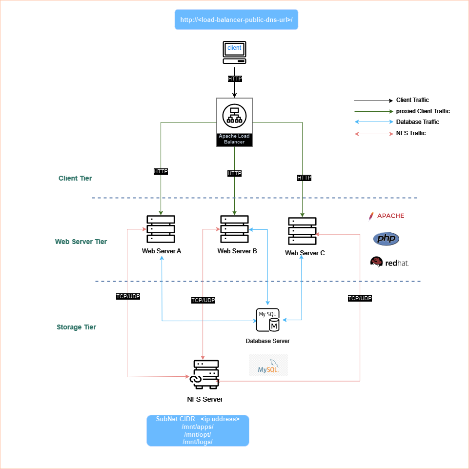

# Load Balancing Solution With Apache

<div style="display: flex; justify-content: center; align-items: center; margin: 20px 0;">
   
</div>

## Introduction

In the [DevOps Tooling Web solution project](./DevOps_Tooling_Web_Solution/README.md), I implemented a 3-tier architecture featuring three web servers, an NFS server, and a MySQL server. The current setup is efficient at file sharing and database management, but it lacks a load balancer which is crucial if we need our web infrastructure to be fault-tolerant and secure. In this project, I will walk you through implementing a load-balancing layer for our web infrastructure using Apache.

This is currently how are web infrastructure looks like:

<div style="display: flex; justify-content: center; align-items: center; margin: 20px 0;">
   

</div>

## Pre-requisites

To follow along with this project, you need to have the following:

- An AWS account, which can be created [here](https://aws.amazon.com/)

- An understanding of the 3-tier architecture. refer to the [DevOps Tooling Web Solution](./DevOps_Tooling_Web_Solution/README.md) project.

- A basic introduction to Load Balancing. learn more [here](https://www.nginx.com/resources/glossary/load-balancing/)

- A basic understanding of [Apache web server](https://httpd.apache.org/)


## Tasks

### 1. Set Up Hardware for Load Balancer on AWs

I created an EC2 instance to serve as the load balancer. The instance is running the Ubuntu OS and it is in the same VPC as the web servers and has a security group that allows HTTP traffic from the internet.


### 2. Setup Software on the Load Balancer

There are a couple of software options for load balancing such as Nginx, Apache, and HAProxy. For this project, I will be using Apache as the load balancer.
Apache is a popular choice for load balancing because it is easy to configure and has a lot of features that make it a good choice for load balancing.  There is also a lot of documentation and community support for Apache which makes it a good choice for beginners.

To set up Apache as a load balancer, we need to install the Apache web server and the `mod_proxy module`. The `mod_proxy` module is an Apache module that provides the functionality for *proxying* requests from one server to another. Proxying is the technique of forwarding requests from one server to another server. This is what we will be using to forward requests from the load balancer to the web servers.

To install Apache and the `mod_proxy` module, run the following commands on the load balancer:

```bash
sudo apt update
sudo apt install apache2
sudo apt-get libxml2-dev

# Enable the mod_proxy module
sudo a2enmod proxy
sudo a2enmod proxy_http
```

The `a2enmod` command is used to enable Apache modules. The `proxy` module is the core module that provides the proxying functionality, and the `proxy_http` module is an additional module that provides support for proxying HTTP requests. The `libxml2-dev` package is required for the `proxy_html` module which we will be using later. the `proxy_html` module is used to rewrite the URLs in the HTML content that is being proxied.

let's enable some other modules that will be useful for our load balancer:

```bash

sudo a2emond rewrite
sudo a2enmod headers
sudo a2enmod proxy_balancer
sudo a2enmod lbmethod_bytraffic

```
Great now let's start the Apache service:

```bash

sudo systemctl start apache2
sudo systemctl enable apache2

```
You should now be able to access the Apache default page by navigating to the public IP address of the load balancer in your browser.


### 3. Configure Apache Load Balancer

Now that we have Apache installed and running on the load balancer, we need to configure it to act as a load balancer. We will be using the `mod_proxy_balancer` module to configure the load balancer.

The `mod_proxy_balancer` module provides the functionality for load balancing requests across multiple backend servers. It allows you to define a group of backend servers and specify how requests should be distributed among them.

To configure the load balancer, we will update the `000-default.conf` configuration file in the `/etc/apache2/sites-available/` directory. We need to add the following configuration:
into the `<VirtualHost>` block:

```bash

<VirtualHost *:80>
    
    <Proxy balancer://mycluster>
        BalancerMember http://<webserver-1-priate-ip>:80 loadfactor=5 timeout=1
        BalancerMember http://<webserver-2-priate-ip>:80 loadfactor=5 timeout=1
        BalancerMember http://<webserver-3-priate-ip>:80 loadfactor=5 timeout=1
    </Proxy>

    ProxyPass / balancer://mycluster/
    ProxyPassReverse / balancer://mycluster/

    ProxyPreserveHost On

</VirtualHost>

```

In the configuration above, we define a balancer group called `mycluster` and add three backend servers to the group. We specify the private IP addresses of the web servers and set the `loadfactor` to 5 for each server. The `loadfactor` is used to specify the relative load that each server should handle. In this case, we are distributing the load evenly among the servers.

The `timeout` parameter specifies the timeout for requests to the backend servers. The `ProxyPass` directive is used to define the URL mapping for the balancer group, and the `ProxyPassReverse` directive is used to rewrite the URLs in the response from the backend servers.

The `ProxyPreserveHost` directive is used to preserve the original `Host` header in the request. This is important if the backend servers rely on the `Host` header to determine the virtual host. The proxy module we already enabled will use the directive to preserve the original `Host` header in the request.

After updating the configuration file, let's restart the Apache service to apply the changes:

```bash
sudo systemctl restart apache2
```

Currently, our Web infrastructure looks like this:

<div style="display: flex; justify-content: center; align-items: center; margin: 20px 0;">
   
</div>

### 4. Test the Load Balancer

When you navigate to the public IP address of the load balancer in your browser, you should see the login page of the devops tooling site. If you refresh the page multiple times, you should see the requests being distributed among the web servers. You can also check the access logs on the web servers to see the requests being load balanced.

<div style="display: flex; justify-content: center; align-items: center; margin: 20px 0;">
   
</div>


## Conclusion

In this project, I implemented a load-balancing layer for our web infrastructure using Apache. Load balancing is an essential component of a scalable and fault-tolerant web infrastructure. It helps distribute the load across multiple servers, improving performance and reliability. Apache is a popular choice for load balancing because it is easy to configure and has a lot of features that make it a good choice for load balancing. I hope you found this project helpful and that you now have a better understanding of load balancing with Apache.


