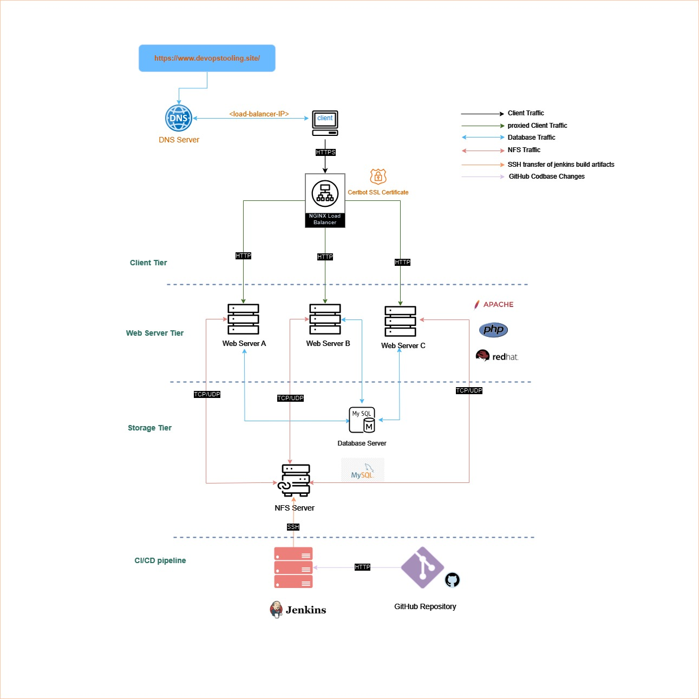
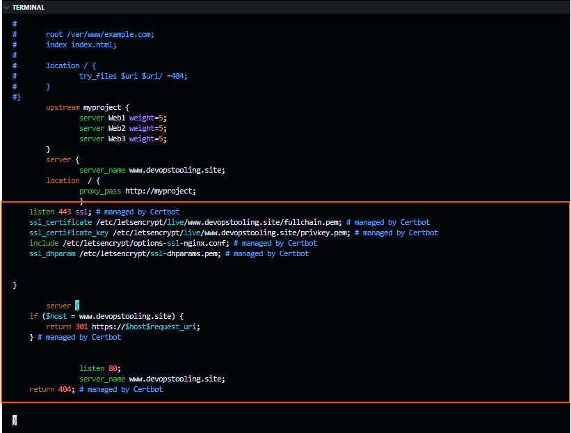
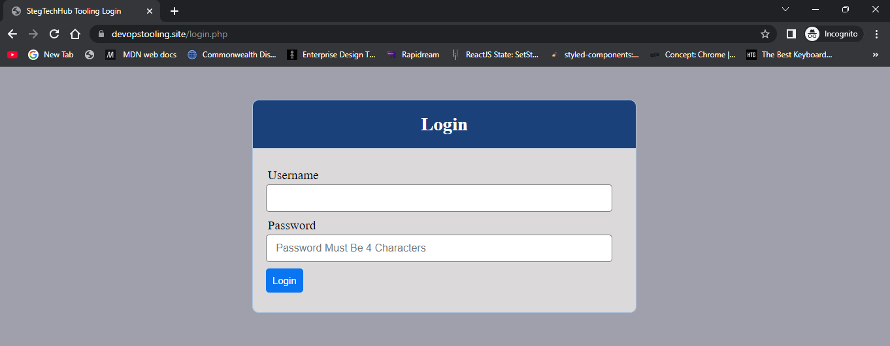
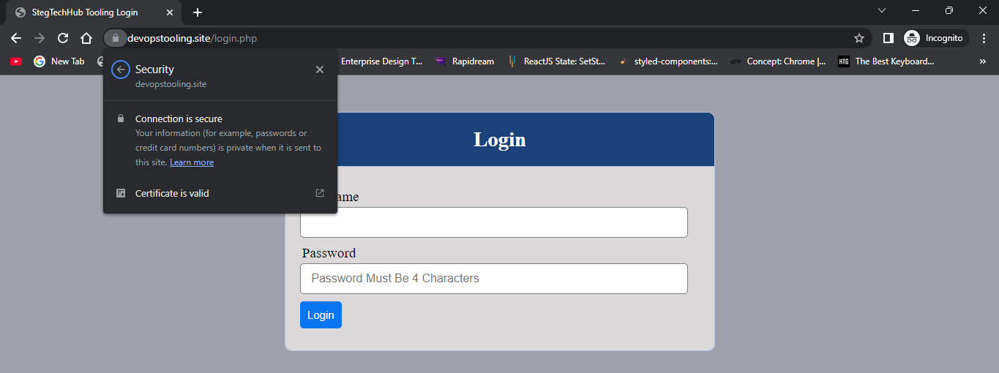
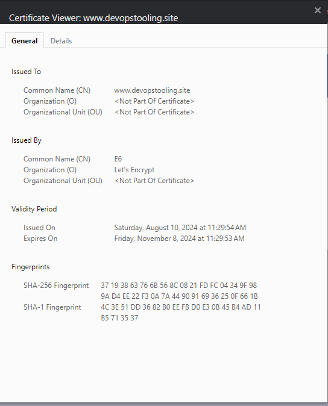
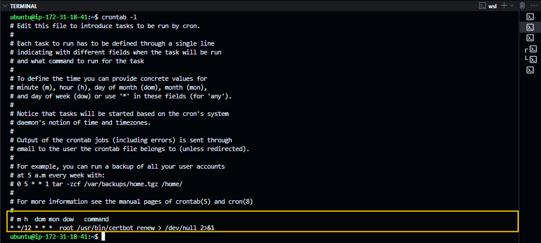

# Implementing Load Balancing Web Solution With Nginx and SSL

<div style="display: flex; justify-content: center; align-items: center; margin: 20px 0;">
   
</div>

## Introduction

In the [Load Balancer Web solution With Apache](./Load_Balancer_Solution_Apache/README.md) project, I improved the 3-tier architecture I implemented in the [DevOps Tooling Web solution project](./DevOps_Tooling_Web_Solution/README.md) by introducing load balancing techniques to handle client traffic more robustly. 

The current setup handles the client traffic appropriately thanks to the load balancing algorithm defined in our Apache load balancer configuration. However, communication between clients and the webservers is not secured. All along we have been relying on the less secured `HTTP` protocol. Our clients are currently at risk of cyber securirity threats such as [Man-In The Middle(MITM)](https://www.cloudflare.com/learning) attacks. In this project, I will walk you through implementing a secure communication channel between clients and web servers using the `HTTPS` protocol.

This is currently how are web infrastructure looks like:

<div style="display: flex; justify-content: center; align-items: center; margin: 20px 0;">
   
</div>

In the current setup, we implemented an Apache load balancer to handle client traffic. In this project, we will be using Nginx as our load balancer. We will also create a domain name for our web infrastructure and secure the communication channel between clients and web servers using the `HTTPS` protocol.

## Pre-requisites

To follow along with this project, you need to have the following:

- An AWS account, which can be created [here](https://aws.amazon.com/)

- An understanding of the 3-tier architecture. refer to the [DevOps Tooling Web Solution](./DevOps_Tooling_Web_Solution/README.md) project.

- A basic introduction to Load Balancing. learn more [here](https://www.nginx.com/resources/glossary/load-balancing/)

- A basic understanding of [Nginx web server](https://www.nginx.com/)

- A basic understanding of SSL/TLS. learn more [here](https://www.cloudflare.com/learning/ssl/what-is-ssl/)

- Understanding DNS Resolution will be an added advantage. learn more [here](https://www.cloudflare.com/learning/dns/what-is-dns/)


## Tasks

### 1. Prepare Load Balancer Server on AWS

Instead of creating a new EC2 instance, I will be using the same EC2 instance that I used for the Apache load balancer. The instance is running the Ubuntu OS and it is in the same VPC as the web servers and has a security group that allows HTTP traffic from the internet. I will simply uninstall Apache and install Nginx on the instance. if you have to create a new EC2 instance, you can follow the steps in the [Load Balancer Web solution With Apache](./Load_Balancer_Solution_Apache/README.md) project.

### 2. Install Nginx on the Load Balancer

After uninstalling Apache, I installed Nginx on the load balancer. To install Nginx, run the following commands on the load balancer:

```bash
sudo apt update
sudo apt install nginx -y
```
Yep! It's that simple. Nginx is now installed on the load balancer. Just as we did with Apache, we need to configure Nginx to act as a load balancer.


### 3. Configure Nginx as a Load Balancer

To configure Nginx as a load balancer, we need to create a new configuration file in the `/etc/nginx/sites-available/` directory. I updated the `/etc/nginx/sites-available/default` file with the following configuration:

```nginx
upstream myproject {                                                                                                                  
   server Web1 weight=5;                                                                                                         
   server Web2 weight=5;                                                                                                         
   server Web3 weight=5;                                                                                                         
}
server {                                                                                                                              
   listen 80;                                                                                                                       
   server_name yet_to_be_created_domain.name;                                                                                            
   location  / {                                                                                                                    
      proxy_pass http://myproject;                                                                                                 
   }                                                                                                                               
}
```

In the configuration above, I defined an `upstream` block that contains the IP addresses of the web servers. I also defined a `server` block that listens on port 80 and proxies requests to the web servers defined in the `upstream` block. The `weight` parameter is used to define the weight of each server. The higher the weight, the more requests the server will receive.

Notice that I used the `yet_to_be_created_domain.name` as the server name. This is because we are yet to create a domain name for our web infrastructure. We will create a domain name in the next task. For now, let's save the configuration file and restart the Nginx service:

```bash
sudo systemctl restart nginx
```

### 4. Create a Domain Name for the Web Infrastructure

Domain names are used to identify web servers on the internet. They are easier to remember than IP addresses. There are dedicated domain name registrars that manage domain names such s [Namecheap](https://www.namecheap.com/), [GoDaddy](https://www.godaddy.com/), [Google Domains](https://domains.google/) the core function of a domain name registrar is to manage the reservation of internet domain names and the assignment of IP addresses to those domain names. I used GoDaady to create a domain name for my web infrastructure. I followed their documentation to create a domain name and pointed it to the public IP address of the load balancer. you can follow the documentation of your domain name registrar to create a domain name for your web infrastructure.

Which ever domain name registrar you choose, you will need to create an `A` record that points to the public IP address of the load balancer. The `A` record is used to map a domain name to an IP address. Once the domain name is created and the `A` record is set up, you should be able to access the web servers using the domain name. For example, if the domain name is `myproject.com`, you should be able to access the web servers using `https://myproject.com`.

I will be using the domain name `devopstooling.site` for my web infrastructure. I created an `A` record that points to the public IP address of the load balancer. I also created a `CNAME` record that points to the domain name. The `CNAME` record is used to map a domain name to another domain name. This is useful when you want to point a domain name to another domain name. For example, if you want to point `www.devopstooling.site` to `devopstooling.site`, you can create a `CNAME` record that points `www.devopstooling.site` to `devopstooling.site`.

let's now update the Nginx configuration file with the domain name:

```nginx

upstream myproject {                                                                                                                  
   server Web1 weight=5;                                                                                                         
   server Web2 weight=5;                                                                                                         
   server Web3 weight=5;                                                                                                         
}

server {                                                                                                                              
   listen 80;                                                                                                                       
   server_name www.devopstooling.site;                                                                                            
   location  / {                                                                                                                    
      proxy_pass http://myproject;                                                                                                 
   }                                                                                                                               
}

```
Let's now go ahead and secure the communication channel between clients and web servers using the `HTTPS` protocol.

### 5. Secure Communication Channel with SSL/TLS

SSL/TLS is a protocol that provides secure communication over a computer network. It is used to secure the communication between clients and web servers. SSL/TLS uses encryption to protect the data that is being transmitted between the client and the server. This ensures that the data cannot be intercepted by unauthorized parties.(our users are safe from MITM attacks phewww! 🙂)

To secure the communication channel between clients and web servers, we need to install an SSL certificate on the load balancer. An SSL certificate is a digital certificate that is used to secure the communication between the client and the server. It contains information about the domain name, the public key of the server, and the digital signature of the certificate authority that issued the certificate.

There are several ways to obtain an SSL certificate. You can purchase an SSL certificate from a certificate authority such as [Let's Encrypt](https://letsencrypt.org/), [Comodo](https://www.comodo.com/), [DigiCert](https://www.digicert.com/), or [Symantec](https://www.symantec.com/). You can also generate a self-signed certificate using the `openssl` command. I will be using certbot to obtain a free SSL certificate from Let's Encrypt. Certbot is a free, open-source software tool that automates the process of obtaining and renewing SSL certificates.

To install certbot, run the following commands on the load balancer:

```bash
sudo apt update
sudo snap install --classic certbot
```

Once certbot was installed I followed the instructions in the [certbot documentation](https://certbot.eff.org/instructions?ws=nginx&os=ubuntufocal) to obtain an SSL certificate on my Ubuntu server runninng Nginx load balancer. I ran the following command to obtain an SSL certificate:

```bash
sudo certbot --nginx
```

I then run the following command to make it possible for us to run `certbot` commands on the terminal:

```bash
sudo ln -s /snap/bin/certbot /usr/bin/certbot
```
What we have done is to create a symbolic link to the `certbot` binary file in the `/snap/bin` directory. This makes it possible for us to run `certbot` commands on the terminal.

After running the `sudo certbot --nginx` command, certbot will ask you to enter your email address and agree to the terms of service. Once you have done that, certbot will automatically obtain an SSL certificate for your domain name and configure Nginx to use the SSL certificate. You should now be able to access the web servers using the `HTTPS` protocol. For example, if the domain name is `myproject.com`, you should be able to access the web servers using `https://myproject.com`.

let's  verify that our `/etc/nginx/sites-available/default` Nginx configuration file has been updated to use the SSL certificate by certbot:

```bash
sudo vi /etc/nginx/sites-available/default
```
You should see a similar update to your `/etc/nginx/sites-available/default` file.

<div style="display: flex; justify-content: center; align-items: center; margin: 20px 0;">
   
</div>

### 6. Test the Load Balancer

When you navigate to the domain name of the load balancer in your browser, you should see the login page of the devops tooling site. If you refresh the page multiple times, you should see the requests being distributed among the web servers. You can also check the access logs on the web servers to see the requests being load balanced.

#### verify The Secured Connection with the browser

You can also verify that the connection is secure by checking the SSL certificate in your browser. When you navigate to the domain name of the load balancer in your browser, you should see a padlock icon in the address bar. If you click on the padlock icon, you should see information about the SSL certificate that was issued by Let's Encrypt.

<div style="display: flex; justify-content: center; align-items: center; margin: 20px 0;">
   
</div>

When you click on the padlock icon, you should see information about the SSL certificate that was issued by Let's Encrypt. You should see that the connection is secure and that the certificate is valid.

<div style="display: flex; justify-content: center; align-items: center; margin: 20px 0;">
   
</div>

This is the detail info on the SSL certificate that was issued by Let's Encrypt.

<div style="display: flex; justify-content: center; align-items: center; margin: 20px 0;">
   
</div>


### Schedule a Cron Job to Renew SSL Certificate

SSL certificates have an expiration date. It is important to renew the SSL certificate before it expires to avoid any downtime. Certbot provides a `renew` command that can be used to renew the SSL certificate. Instead of trying to remember to routinely renew the SSL certificate. We can schedule a cron job to run the `certbot renew` command every month to renew the SSL certificate.

Cron jobs are a really neat way to automate tasks on a Linux system. They are used to schedule commands to run at specific times. To schedule a cron job to renew the SSL certificate, we will need to update the crontab file. On Linux systems the crontab follows a tabular format with the following columns:

- `Minute`: The minute when the cron job will run (0-59)
- `Hour`: The hour when the cron job will run (0-23)
- `Day` of the month: The day of the month when the cron job will run (1-31)
- `Month`: The month when the cron job will run (1-12)
- `Day` of the week: The day of the week when the cron job will run (0-6, where 0 is Sunday)
- `Command`: The command to run

To schedule a cron job to renew the SSL certificate, run the following command:

```bash
sudo crontab -e
```

This will open the crontab file in the default text editor. Add the following line to the file to schedule a cron job to renew the SSL certificate twice every day(12:00 AM and 12:00 PM):

```vim
* * */12 * * * root /usr/bin/certbot renew > /dev/null 2>&1
```

Save the file and exit the text editor. The cron job will now run twice every day to renew the SSL certificate. You can check the cron job by running the following command:

```bash
sudo crontab -l
```
You should the following terminal output:

<div style="display: flex; justify-content: center; align-items: center; margin: 20px 0;">
   
</div>

Awesome! We have successfully implemented a secure communication channel between clients and web servers using the `HTTPS` protocol. Our clients are now safe from cyber security threats such as MITM attacks. We have also scheduled a cron job to renew the SSL certificate automatically. Our web infrastructure is now more robust and secure.

This is how our web infrastructure looks like now:

<div style="display: flex; justify-content: center; align-items: center; margin: 20px 0;">
   
</div>

## Conclusion

In this project, I walked you through implementing a secure communication channel between clients and web servers using the `HTTPS` protocol. We used Nginx as our load balancer and obtained a free SSL certificate from Let's Encrypt using certbot. We also created a domain name for our web infrastructure and scheduled a cron job to renew the SSL certificate automatically. Our web infrastructure is now more robust and secure. We can now handle client traffic more efficiently and securely.

I hope you found this project helpful. If you have any questions or feedback, feel free to reach out to me. I would be happy to help. Thank you for reading. 😊