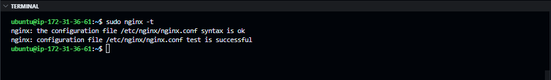

# WEB STACK IMPLEMENTATION (LEMP) in AWS


For this project-based learning task,  I deployed a LEMP stack on an AWS EC2 instance. The LAMP stack consists of `Linux`, `NGINX`,   `MySQL`, and `PHP`. I used an Ubuntu 22 server for Linux, NGINX for the web server, MySQL for the database, and PHP for the server-side scripting language. I also configured the NGINX web server with virtual hosts.

Skills: `scripting`, `cloud computing`

# Learning Outcomes

- [x] I revisited some basic SQL syntax and practiced commonly used command
- [x] Became comfortable navigating my AWS console for managing cloud resources
- [x] I learned to manage redundant running EC2 instances to save money and resources.
- [x] I learned to configure the NGINX web server with virtual hosts

# Challenges

>I encountered two main challenges during this project-based learning task:
>
>### **Authentication Issue**
>I had trouble fetching the public IP address and public hostname of the EC2 instance. I discovered it was an authentication issue while reading this documentation and figured out that I needed to use tokens.
>
>### **Attempt to Secure PHP Script with Environment Variables**
>I tried to secure the PHP script by using environment variables to store the database credentials. I did a quick research, read some documentation and found a package called `PHP dotenv` that helped. I installed the package using `composer` and created a `.env` file to store the database credentials as environment variables. The PHP script was able to securely connect and retrieve data form the database without exposing database credentials to attackers.
>
> 
# Tasks

## Task 100 - Self-study 

>I did a self-study on MySQL syntax and common commands. I practiced creating databases, tables, and users and learned about the different types of SQL queries. I also learned about the different types of SQL joins and how to use them to retrieve data from multiple tables. I also discovered some cool cheat sheets for MySQL commands and syntax.

## Task 101 - Environment Setup

I Crosschecked my local and cloud environment to make sure it's set up to facilitate the implementation of the LEMP stack.

- [x] I created an EC2 instance on AWS and connected to it using SSH.
- [x] Verified nano and vim are installed on the EC2 instance.
- [x] Update inbound rules for the EC2 instance to allow HTTP and HTTPS traffic.

#### My AWS EC2 instance after connecting to it using SSH


#### Check for vim installation on the EC2 instance


## 102 Installing NGINX Web Server

After setting up my environment, I installed the NGINX web server on my EC2 instance. NGINX is a popular web server that is known for its high performance and low resource usage. I installed NGINX on my EC2 instance and started the NGINX service. I also verified that the NGINX web server was running by checking the status of the NGINX service.

#### Installing NGINX on the EC2 instance

```bash
sudo apt update
sudo apt install nginx
```

This command updates the package list and installs the NGINX web server on the EC2 instance.

#### My NGINX webserver Status after installation


#### The default NGINX webpage


The default NGINX webpage indicates that the NGINX web server was installed successfully. The next step is to install the MySQL database management software on the EC2 instance.

## Task - 103 Installing MySQL

After NGINX web server installation, it was time to install database management software to store data for the web application that will be served on the LAMP stack. I settled on MySQL since it's the appropriate DBMS for a **LEMP** stack implementation. I installed MySQL on my EC2 instance and secured it by running the `mysql_secure_installation` script. The script removed some default settings that made the MySQL installation less secure. I also set a secured password for the root user.

some of the default settings that were adjusted include:

- [x] Disallow root login remotely
- [x] Remove the test database and any access to it
- [x] Validate user password strength by default.
- [x] remove anonymous users

I made these adjustments to secure the MySQL installation on the EC2 instance.

#### MySQL Installation Status


To continue the implementation of the LEMP stack, I will install PHP and configure the NGINX web server with virtual hosts.

## Task - 104 Installing PHP

At this point, I had installed NGINX and MySQL on my EC2 instance. The next step was to install `PHP`, the server-side scripting language that will process the code and generate dynamic content for the web application.
Unlike `Apache` as used in LAMP implementation, `NGINX` does not have built-in support for processing PHP code. We will need to install `PHP-FPM` (FastCGI Process Manager) to handle PHP requests on the NGINX web server. We will also need to install the `php-mysql` package to allow PHP to communicate with the MySQL database.

```bash
sudo apt install php-fpm php-mysql
```

#### PHP Installation Status


Our `LEMP` stack checklist is now complete:

- [x] **L**inux (Ubuntu 24) - Installed on AWS EC2 instance
- [x] **E**Nginx - Installed on EC2 instance
- [x] **M**ySQL - Installed on EC2 instance
- [x] **P**HP - Installed on EC2 instance

#### Configuring NGINX to Use PHP Processor

To complete the LEMP stack implementation, I needed to configure the NGINX Virtual Host to serve multiple websites on the same server.
The default page we saw earlier during the NGINX installation was served using the default and only virtual host on the server. I will create a new virtual host to serve a different website. the default page was served from `/var/www/html/` directory.

The NGINX server was configured by default to look for the index.html file in the `/var/www/html/` directory to serve the default page.
let's take a look at the default configuration file for NGINX's default virtual host.

```bash
cat /etc/nginx/sites-available/default
```

```bash
##
# You should look at the following URL's in order to grasp a solid understanding
# of Nginx configuration files in order to fully unleash the power of Nginx.
# https://www.nginx.com/resources/wiki/start/
# ....
# Default server configuration
#
server {
        listen 80 default_server;
        listen [::]:80 default_server;

        # SSL configuration
        #
        .....
        #
        # include snippets/snakeoil.conf;

        root /var/www/html;

        # Add index.php to the list if you are using PHP
        index index.html index.htm index.nginx-debian.html;

        server_name _;

        location / {
                # First attempt to serve request as file, then
                # as directory, then fall back to displaying a 404.
                try_files $uri $uri/ =404;
        }
....
}

```

for the next steps, I will define a new virtual host for a new website called projectLEMP which will be served dynamically through PHP.

## Task - 105 Adding a New NGINX Virtual Host

####  Add a new directory for the projectLEMP domainmain

```bash
sudo mkdir /var/www/projectLEMP
```

##### Assign Ownership of the Directory to the Ubuntu User

```bash
sudo chown -R $USER:$USER /var/www/projectLEMP
```

next up, let's create the new projectLEMP virtual server by adding a new block file in the  `/etc/nginx/sites-available/` directory.

#### Create  a New Virtual Host File

```bash
sudo vim /etc/nginx/sites-available/projectLEMP
```

I added the following bare-bones configuration to the block file

```bash
cat /etc/nginx/sites-available/projectLEMP
```

```bash
#/etc/nginx/sites-available/projectLEMP

server {
    listen 80;
    server_name projectLEMP www.projectLEMP;
    root /var/www/projectLEMP;

    index index.html index.htm index.php;

    location / {
        try_files $uri $uri/ =404;
    }

    location ~ \.php$ {
            include snippets/fastcgi-php.conf;
            fastcgi_pass unix:/var/run/php/php8.3-fpm.sock;
    }

    location ~ /\.ht {
        deny all;
    }

}
```

The configuration file defines a new virtual host for the projectLEMP website. The server block listens on `port 80` and serves the projectLEMP website from the `/var/www/projectLEMP` directory. The `index.html`, `index.htm`, and `index.php` files are served by default. The location block for PHP files uses the `fastcgi-php.conf` file to process PHP requests using the PHP-FPM service. The location block for `.ht` files denies access to hidden files

##### check the NGINX configuration file for syntax errors

```bash
sudo nginx -t
```



##### Activate the New NGINX Virtual Host configuration

The virtual host won't respond unless it is enabled. To enable the new virtual host, we need to create a symbolic link from the `/etc/nginx/sites-available/` directory to the `/etc/nginx/sites-enabled/` directory.

```bash
sudo ln -s /etc/nginx/sites-available/projectLEMP /etc/nginx/sites-enabled/
```

##### Disable the Default Virtual Host

The default virtual host is still enabled and will respond to requests on the server. To disable the default virtual host, we need to remove the symbolic link from the `/etc/nginx/sites-enabled/` directory.

```bash
sudo unlink /etc/nginx/sites-enabled/default
```

Finally, let's reload the NGINX server to apply the changes.

```bash
sudo systemctl reload nginx
```

Our new virtual host is now ready to serve the projectlamp website. but there is currently nothing to serve. I will create an index.htm file in the `/var/www/projectlamp` directory to test the virtual host configuration, and then I will create an index.php file to test the PHP installation.

### Create an index.html file in the /var/www/projectlamp directory

```bash
sudo echo 'Hello LAMP from hostname'
$(curl -s http://169.254.169.254/latest/meta-data/public-hostname)
 'with public IP' $(curl -s http://169.254.169.254/latest/....)> /var/www/projectlamp/index.html
```

### Authentication Issue


The code above creates an index.html file as expected. however it could not retrieve the public IP address and the public hostname of the EC2 instance. I read [the documentation](https://docs.aws.amazon.com/AWSEC2/latest/UserGuide/instancedata-data-retrieval.html#instance-metadata-ex-1) and discovered it was an authentication issue.

### My Solution

I had to use the EC2 instance metadata service to fetch the public hostname and public IP address of the EC2 instance. I used the `X-aws-ec2-metadata-token` header to authenticate the request. The token is fetched from the EC2 instance metadata service and used in the HTTP header for authentication.

```bash

ubuntu@simon:~$ TOKEN=`curl -X PUT "http://169.254.169.254/latest/api/token"

ubuntu@simon:~$ echo 'Hello LEMP from hostname' $(curl -H "X-aws-ec2-metadata-token: $TOKEN" http://169.254.169.254/latest/meta-data/public-
hostname) 'With public IP' $(curl -H "X-aws-ec2-metadata-token: $TOKEN" http://169.254.169.254/latest/meta-data/public-ipv4) > /var/www/projectLEMP/index.html
```

- `TOKEN=curl -X PUT "http://169.254.169.254/latest/api/token"` fetches the token from the EC2 instance metadata service. The token is used for authentication when fetching the public hostname and public IP address of the EC2 instance.

- `curl -H "X-aws-ec2-metadata-token: $TOKEN" http://169.254.169.254/latest/meta-data/public-hostname` fetches the public hostname of the EC2 instance. The `-H "X-aws-ec2-metadata-token: $TOKEN"` part sends the token in the HTTP header for authentication.

- `curl -H "X-aws-ec2-metadata-token: $TOKEN" http://169.254.169.254/latest/meta-data/public-ipv4` fetches the public IPv4 address of the EC2 instance

- `echo 'Hello LEMP from hostname' $(...) 'With public IP' $(...) > /var/www/projectLEMP/index.html` writes the fetched information into the index.html file in the /var/www/projectLEMP/ directory.

### Now let's  see if this works..


### It Worked!!!


This is the expected output of the index.html file, with the hostnames and ipv4 address showing. The file is served by the projectLEMP virtual host we just created. 
The projectLEMP virtual host works as expected. now let's go ahead and test the PHP installation.

## Task - 106 Enable PHP on the new website

I added the `info.php` file to the `/var/www/projectLEMP` directory to test the PHP installation. I added `<?php phpinfo(); ?>` to the file to display the PHP configuration information.

### Create an info.php file in the /var/www/projectLEMP directory

```bash
sudo echo '<?php phpinfo(); ?>' > /var/www/projectLEMP/info.php
```

### Browser view of the index.php file


Finally, the PHP installation is working as expected. The `projectLEMP` virtual host is now serving the `info.php` file. The LEMP stack implementation is now complete.

## Task - 107 Retrieve Data from MySQL Database

For this final task, I created a test database: `example_database` and a table of To-Do list items. I inserted some data into the table and retrieved it using SQL queries. I used the MySQL command-line client to interact with the MySQL database.

#### Create a new database

```sql
CREATE DATABASE example_database;
```

#### create a new User

```sql
CREATE USER 'example_user'@'localhost' IDENTIFIED WITH mysql_native_password BY 'PassWord.1';
```

#### Grant privileges to the new user

```sql
GRANT ALL  ON example_database.* TO 'example_user'@'localhost';
```

#### Connect to the MySQL database

```bash
mysql -u example_user -p
```


next up, I created a table called `todo_list` in the `example_database` database and inserted some data into the table.

#### Create a table in the example_database database

```sql
CREATE TABLE example_database.todo_list (
    item_id INT AUTO_INCREMENT PRIMARY KEY,
    content VARCHAR(255)
);
```

This command creates a table called `todo_list` in the `example_database` database. The table has two columns: `item_id` and `content`. The `item_id` column is an auto-incrementing integer that serves as the [primary key](https://www.google.com/search?q=what+are+primary+keys+in+sql&oq=what+are+primary+keys+for+&aqs=chrome.1.69i57j0i22i30l9.12543j0j7&sourceid=chrome&ie=UTF-8) for the table. The `content` column is a `VARCHAR` column that stores the content of the to-do list item.

#### Insert data into the todo_list table

```sql
INSERT INTO example_database.todo_list (content) VALUES ('Learn MySQL'), ('Learn PHP'), ('Learn NGINX');
```


The `example_user` can run SQL queries on the `example_database`. Now let's focus on how we can retrieve the data at the application level. We will create a PHP script that connects to the MySQL database and retrieves the to-do list items from the `todo_list` table.

## Task - 108 Create a PHP script to retrieve data from the MySQL database

```bash
sudo vim /var/www/projectLEMP/todo_list.php
```

### Unsecured Approach (Not Recommended)

```php
<?php
$servername = "localhost";
$username = "example_user";
$password = "PassWord.1";
$dbname = "example_database";
$table = "todo_list";

// Create connection
try {
    $db = new PDO("mysql:host=$servername;dbname=$dbname", $username, $password);
    echo "<h2>Connected successfully to the $dbname database</h2>";
    echo "<h3>Todo List</h3><ol>";
    foreach($db->query("SELECT * FROM $table") as $row) {
        echo "<li>Item ID: " . $row['item_id'] . " - Content: " . $row['content'] . "</li>";
    }
    echo "</ol>";
} catch (PDOException $e) {
    print "Error!: " . $e->getMessage() . "<br/>";
    die();
}
?>
```
<!--  i have one problem gif -->
This script does the job of connecting to the MySQL database and retrieving data from the `todo_list` table. However, **it is not secure** as it exposes the database credentials in the script. I will fix this by using [environment variables](https://www.google.com/search?q=what+are+environment+variables+in+linux&oq=what+are+environment+va&aqs=chrome.3.0i512j69i57j0i512l8.20396j0j9&sourceid=chrome&ie=UTF-8) to store the database credentials.

### Secured Approach (Recommended)

```php
<?php
require 'vendor/autoload.php';

$dotenv = Dotenv\Dotenv::createMutable(__DIR__, '.env');
$dotenv->load();
$dotenv->required(['DB_HOST', 'DB_NAME', 'DB_USER', 'DB_PASS']);

$servername = $_ENV['DB_HOST'];
$username = $_ENV['DB_USER'];
$password = $_ENV['DB_PASS'];
$dbname = $_ENV['DB_NAME'];
$table = "todo_list";

// retrieve information from the database
try {
        // Create connection
    $db = new PDO("mysql:host=$servername;dbname=$dbname", $username, $password);    
    // Display the todo list
    echo "<h2>Connected successfully to the $dbname database</h2>";
    echo "<h3>Todo List</h3><ol>";
    // query the database
    foreach($db->query("SELECT * FROM $table") as $row) {
        // Display the todo list items on the webpage
        echo "<li>Item ID: " . $row['item_id'] . " - Content: " . $row['content'] . "</li>";
    }
    echo "</ol>";
    // catch any errors and or close the connection
} catch (PDOException $e) {
    print "Error!: " . $e->getMessage() . "<br/>";
    die();
}

?>
```

This script uses the  [`PHP dotenv`](https://github.com/vlucas/phpdotenv) package to load the database credentials from the `.env` file. The database credentials are stored as environment variables and are not exposed in the script. The script connects to the MySQL database and retrieves the to-do list items from the `todo_list` table.

I had to install [PHP composer](https://www.digitalocean.com/community/tutorials/what-is-composer) to use the `dotenv` package. 
I installed the `dotenv` package using the following command:

```bash
cd /var/www/projectLEMP
sudo apt install composer
composer require vlucas/phpdotenv
```

I then created a `.env` file in the `/var/www/projectLEMP/` directory to store the database credentials as environment variables.

```bash
sudo vim /var/www/projectLEMP/.env
```

```bash
DB_HOST=plceholder_host
DB_USER=placeholder_user
DB_PASS=placeholder_password
DB_NAME=placeholder_database
```

#### The Todo list Page Works!!!


# Conclusion


in this project-based learning task, I deployed a LEMP stack on an AWS EC2 instance. I installed NGINX, MySQL, and PHP on the EC2 instance and configured the NGINX web server with virtual hosts. I then created a new virtual host to serve a website called projectLEMP and tested the PHP installation by creating an info.php file. I also created a MySQL database and table and inserted data into the table. I retrieved the data from the MySQL database using a PHP script to display the to-do list items on a webpage. I secured the PHP script by using environment variables to store the database credentials. The LEMP stack implementation was successful, and I learned a lot about managing cloud resources and configuring web servers.
