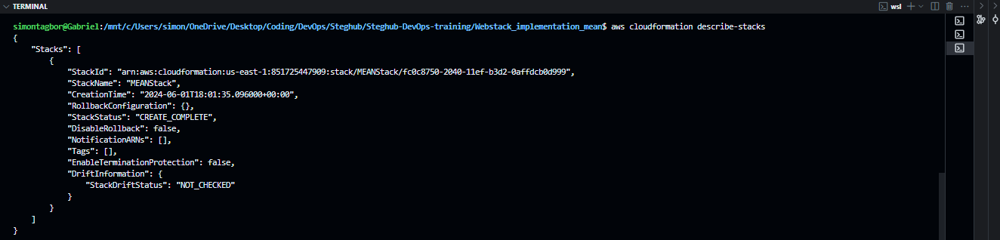
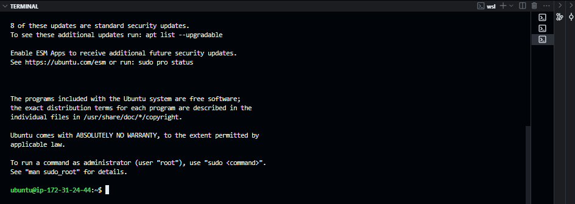
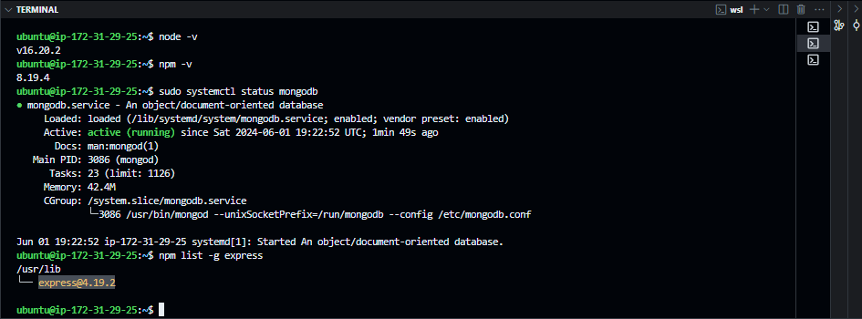
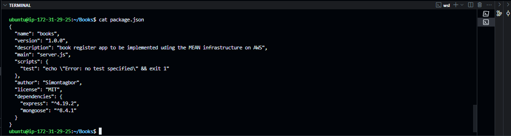
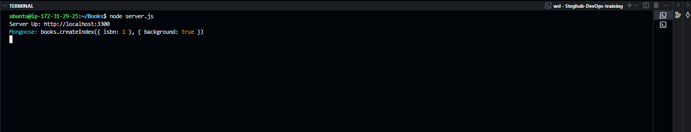

# How I Implemented a Book Register Web App Using MEAN Stack on AWS

<div style="display: flex; justify-content: center; align-items: center; margin: 20px 0;">
   
</div>

## Introduction

As a DevOps Engineer in training at Steghub, I am documenting my process for implementing a `MEAN` stack application. The `MEAN` stack is a JavaScript-based web architecture framework used to build and deploy web applications. It includes four open-source components: **M**ongoDB, **E**xpress, **A**ngular, and **N**ode. These components provide a comprehensive framework for web developers. This documentation will detail the steps necessary to successfully implement a `MEAN` stack application.

## Prerequisites

Before we begin, let's ensure you have everything needed to proceed. Below are the prerequisites for this project:

- [x] **AWS Account**: You need to have an AWS account. If you don't have one, you can create one [here](https://aws.amazon.com/).
- [x] **Create an AWS EC2 Instance**: Follow the instructions [here](https://docs.aws.amazon.com/AWSEC2/latest/UserGuide/EC2_GetStarted.html) to create an EC2 instance for hosting your application.
- [x] **Basic Understanding of JavaScript**: You can get up to speed with JavaScript basics [here](https://developer.mozilla.org/en-US/docs/Learn/Getting_started_with_the_web/JavaScript_basics).
- [x] **Basic Understanding of Angular**: Learn the basics of Angular [here](https://angular.io/start).
- [x] **Basic Understanding of Node.js**: Learn about the JavaScript runtime environment [here](https://nodejs.dev/learn).
- [x] **Basic Understanding of Non-Relational Databases**: Learn about non-relational databases [here](https://www.mongodb.com/nosql-explained).
- [x] **Basic Understanding of MongoDB**: Learn the basics of MongoDB [here](https://www.mongodb.com/basics).

Detailed setup instructions and the deployment process will be provided in the subsequent sections.

# Tasks

## Task - 100 Side Self Study


<p>Here's what I learned:</p>

Working as a DevOps Engineer in a team, Knowing the standards and protocols that coordinate the interconnection of networks on which clients and servers operate can be very helpful. It is also useful to understand the load-balancing techniques for managing traffic to Web stack servers. I did personal research about the [OSI model](https://en.wikipedia.org/wiki/OSI_model) and some common [load-balancing](https://en.wikipedia.org/wiki/Load_balancing_(computing)) techniques.

As A DevOps Engineer, the OSI model can be a great reference during troubleshooting and debugging network issues at specific layers of the networking infrastructure. The OSI model can also be helpful during the implementation of security measures at different layers of the model. In general, the OSI model was a good reference for understanding how network devices communicate with each other and where the DevOps Engineer can come in to optimize the communication process. You can check out this [link](https://www.cloudflare.com/learning/ddos/glossary/open-systems-interconnection-model-osi/) for more information.

I also learned about load-balancing techniques and how they are used to distribute incoming network traffic across multiple servers. Load balancing ensures that no single server becomes overwhelmed with traffic, which can lead to slow performance or downtime. As a DevOps Engineer, getting familiar with load-balancing techniques is critical for ensuring high-availability and fault-tolerant systems. You can check out this [link](https://www.nginx.com/resources/glossary/load-balancing/) for more information.

Doing the self-study was a great way to get up to speed with the technologies and techniques involved in the `MEAN` stack. I am now ready to proceed with the implementation of the `MEAN` stack application on AWS. Fun fact, we will be deploying a Book Register web app on a `MEAN` stack on AWS.

## Let's get our hands dirty now!! 

<div style="display:flex; justify-content:center;">

</div>


## Task - 101 Prepare MEAN Pre-requisites

Before we can deploy the  `MEAN` stack application on AWS, we need to prepare the following prerequisites:

- [x] **Set up AWS Account**.
- [x] **Create an Ubuntu EC2 Instance**
- [x] **Update firewall rules**
- [x] **Install Node.js**
- [x] **Install MongoDB**
- [x] **Install Express.js**

### Automating the process

I already have an AWS account, let's go ahead and provision an EC2 instance to create a `MEAN` stack for our Book Register web app.
In my previous [projects]() I have been manually setting up the web infrastructure. This time I will be automating the process using the [Infrastructure as Code(IaC)]() paradigm. This model encourages us to think of software application infrastructure as if it were code, which can be versioned, tested, and deployed with the same rigor as application code.
I will use Amazon's [CloudFormation]() IaC tool to automate the process of setting up the prerequisites for a `MEAN` stack.

#### Planing the Automation Process

Looking back on my previous projects, I identified the following steps I could automate using CloudFormation:

1. **Create an EC2 Instance**: I will create a CloudFormation template that provisions an EC2 instance with the necessary configurations.

2. **Update Firewall Rules**: I will update the security group associated with the EC2 instance to allow inbound traffic on port 22 (SSH) and port 80 (HTTP).

3. Environment Setup: I will install Node.js, MongoDB, and Express.js on the EC2 instance using a CloudFormation template.

I gathered all the necessary technical requirements for the MEAN stack application and created a CloudFormation template to automate the process of setting up the prerequisites for the AWS EC2 instance. The result is a `YAML` file that defines the resources and configurations needed to set up the MEAN stack application.

```yaml
Metadata:
  Version: '1.0'
Resources:
  MEANStackServer:
    Type: AWS::EC2::Instance
    Properties:
      ImageId: ami-03e9149278a6f457c # Image id for Ubuntu OS
      InstanceType: t2.micro # choose eligible free tier instance type
      KeyName: <public key name> # key name for ssh access
      UserData: 
        Fn::Base64: |
          #!/bin/bash
          # Update the package lists for upgrades and new package installations
          sudo apt-get update 
          # Upgrade all the installed packages to their latest version
          sudo apt upgrade
          # Install necessary packages
          sudo apt -y install curl dirmngr apt-transport-https lsb-release ca-certificates
          # Install Node.js and npm
          curl -SL https://deb.nodesource.com/setup_14.x | sudo -E bash -
          sudo apt install -y nodejs npm
          # Install Express and body-parser globally
          sudo npm install -g express body-parser
          # Add MongoDB's GPG key
          sudo apt-key adv --keyserver hkp://keyserver.ubuntu.com:80 --recv 0C49F3730359A14518585931BC711F9BA15703C6
          # Add MongoDB's repository details
          echo "deb [ arch=amd64 ] https://repo.mongodb.org/apt/ubuntu trusty/mongodb-org/4.4 multiverse" | sudo tee /etc/apt/sources.list.d/mongodb-org-4.4.list
          # Install MongoDB
          sudo apt install -y mongodb
          # Start the MongoDB service
          sudo service mongodb start
      Tags:
        - Key: Name
          Value: MEANStackServer
      SecurityGroupIds:
        - <security group id> # security group id for the EC2 instance
```
The template defines an EC2 instance with the necessary configurations to set up the MEAN stack application. It installs Node.js, npm, Express.js, and MongoDB on the EC2 instance. The `UserData` section contains the shell script that runs when the EC2 instance is launched. The script updates the package lists, installs necessary packages, and sets up the MEAN stack environment.

We will use AWS CLI to programmatically interact with AWS services. The AWS CLI provides a set of commands for managing AWS resources from the command line. To use the AWS CLI, we need to install it on your local machine.


#### Install and Configure AWS CLI

To [install](https://docs.aws.amazon.com/cli/latest/userguide/getting-started-install.html) the AWS CLI, run the following commands:

```bash
sudo curl "https://awscli.amazonaws.com/awscli-exe-linux-x86_64.zip" -o "awscliv2.zip"
sudo unzip awscliv2.zip
sudo ./aws/install
```
To verify the installation, run the following command:

```bash
aws --version
```

The output should be the version of the AWS CLI installed.

```bash
aws-cli/2.15.60 Python/3.11.8 Linux/5.15.153.1-microsoft-standard-WSL2 exe/x86_64.ubuntu.22
```
##### Configure AWS CLI

To configure the AWS CLI, run the following command:

```bash
aws configure
```
You will be prompted to enter your AWS Access Key ID, AWS Secret Access Key, Default region name, and Default output format. You can find your Access Key ID and Secret Access Key in the AWS Management Console under your user account.

```bash
AWS Access Key ID [None]: <your-access-key-id>
AWS Secret Access Key [None]: <your-secret-access-key>
Default region name [None]: <your-region>
Default output format [None]: json
```

The AWS CLI is now configured to interact with AWS services. We can now use the CLI to create the CloudFormation stack for setting up the prerequisites for the MEAN stack application.

#### Create CloudFormation Stack

To create the CloudFormation stack, we will use the `create-stack` command. The command requires the `--stack-name` parameter to specify the name of the stack and the `--template-body` parameter to specify the path to the CloudFormation template file.

```bash
aws cloudformation create-stack --stack-name MEANStack --template-body file://mean-stack.yaml
```

AWS Cloudformation service responds with the StackId of the newly created stack in the terminal.

```bash
{
    "StackId": "arn:aws:cloudformation:us-west-2:123456789012:stack/MEANStack/1a2b3c4d53w4x5y6z7a8b9c0d1"
}
```
The CloudFormation stack takes a couple of seconds to provision the EC2 intanc. We can check the status of the stack using the `describe-stacks` command.

```bash
aws cloudformation describe-stacks
```



from the output, we can see that our stack has been created successfully. The EC2 instance has now being provisioned with the necessary configurations to set up the MEAN stack application. We can now connect to the EC2 instance using SSH to verify the installation of Node.js, npm, Express.js, and MongoDB.

To connect, we need the public ip address and the private key file for the EC2 instance. The private key file is the key pair used to launch the EC2 instance. We can use the `ssh` command to connect to the EC2 instance. let's retrieve the public ip address of the EC2 instance from the terminal.

```bash
aws ec2 describe-instances --filters "Name=tag:Name,Values=MEANStackServer" --query "Reservations[*].Instances[*].PublicIpAddress" --output text
```

The command returns the public IP address of the EC2 instance with the name `MEANStackServer`. The output should be like this:

```bash
34.227.53.94
```

Great! now we have the public IP address of the EC2 instance. Let's connect to the EC2 instance using the `ssh` command.

```bash
sudo ssh -i <path-to-private-key-file> ubuntu@34.227.53.94
```

#### It worked!!



Now let's verify the installation of 

- [x] Node.js
- [x] npm
- [x] Express.js
- [x] MongoDB



From the terminal, we can see that the installation of Node.js, npm, Express.js, and MongoDB was successful.

Our EC2 Instance is now ready for the next steps in developing the Book Register app. Next up we will set up the directory structure for the Book Register web application.

## Task - 102 Configure Backend

in this task, we will be configuring the backend of our Book Register web application. The backend will be set up using Node.js and Express.js. We will also set up a NOSQL database using MongoDB. Thanks to the CloudFormation template we created in the previous task, we already have Node.js, npm, Express.js, and MongoDB installed on our EC2 instance.

### Setting up the Directory Structure

I created a `Books` Directory to organise the code for the Book Register web app. I then Initialise the node project.

```bash
mkdir Books && cd Books
npm init
```

After following all the init prompts the project was suscessfully initialised we can verify by looking at the `package.json`  file



### Set up Web server Code

For the backend we will use express to handle the processing of requests to the backend. Our express object will use the `body-parser` package to handle json data received from or sent to clients.  We will also configure the location for the express object to find our static files. We also need to define the routing for CRUD operations on the book register web app. Finally we will specify the listeining port for our express object.

In the code below we will create an `express` object called `app`, we then configured the app appropriately to mee the needs of the book register app.

```javascript
var express = require('express');
var bodyParser = require('body-parser');
var app = express();

app.use(express.static(__dirname +'/public'));
app.use(bodyParser.json());

require('./apps/routes') (app);
app.set('port', 3300)
app.listen(app.get('port'), function() {
  console.log('Server Up: http://localhost:' + app.get('port'));
});

```

### Set Up Routes for Book Register App

Now that we have sucessfully configured the server for the book register app in the `server.js` file, we need to define CRUD routes for the the actions clients can perform on our book register 
web app. we will create a `apps/routes.js` file to organise all the CRUD operations allowed on the book register app.

```javascript
var Book = require('./models/book');

module.exports = function(app) {
  app.get('/book', function(req, res) {
    Book.find({}, function(err, result) {
      if ( err ) throw err;
      res.json(result);
    });
  });
  app.post('/book', function(req, res){
    var book = new Book ( {
      name:req.body.name,
      isbn:req.body.isbn,
      author:req.body.author,
      pages:req.body.pages
    });
    book.save(function(err, result) {
      if ( err ) throw err;
      res.json ({
        message:"Succesfully added book"
        book:result
      });
    });
  });
  app.delete("./book/:isbn", function(req, res) {
    Book.findOneAndRemove(req.query, function(err, result) {
      if ( err ) throw err;
      res.json( {
        message:"Successfully deleted the book",
        book:result
      });
    });
  });
  var path = require('path');
  app.get('*', function(req, res) {
    res.sendfile(path.join(__dirname + '/public', 'index.html'));
  });
  
};
```
The `apps/routes.js` file defines methods for creating, retrieving and deleting book entries.  Notice how each method relies on the `Book` object which is a blueprint for working with book entries. we will define the blueprint inside `apps/models/book.js`.  we will create a `apps/models` directory and inside it we will have our `book` model.

```javascript
var mongoose = require('mongoose');
var dbHost = 'mongodb://localhost:27017/test';
mongoose.connect(dbHost);
mongoose.connection;
mongoose.set('debug', true);

var bookSchema = mongoose.Schema( {
  name:String, 
  isbn: {type: String, index: true},
  author: String,
  pages: Number
});

var Book = mongoose.model('Book', bookSchema);
module.exports = mongoose.model('Book', bookSchema);
```

In the `apps/models/book.js` file, we are simply creating a Book interface which will serve as a blueprint for creating new book objects anytime they are needed.
the Book interface is been created using mongodb's [object relational mapper]() `mongoose` the `mongoose.model()` method tells mongoose to create a `Book` interface based on a specified Schema. Schema is like a set of specifications that a given interface should have. For our `Book` interface we want to model the real-world representation of a book and so we want all books that will be created with the `Book` interface to have a `Name`, `isbn`, `author`, and `pages`.

We rely heavily on the mongoose orm package let's make sure it's installed.

```bash
sudo npm install mongoose
```
let's spin up the newly configured backend server

```bash
sudo node server.js
```


The server is up as expected. next up lets create the frontend with angular.

## Task - 103 Configure Frontend

For the MEAN stack we need to use Angular - the frontend framework for building client facing webpages. Angular uses the Model-View-Controller (MVC) architecture to build dynamic web applications. The MVC architecture separates the application into three components: the model (data), the view (UI), and the controller (logic). Angular provides a way to bind data to the view and handle user interactions. 

In this task, we will set up the frontend for the Book Register web app using AngularJS.

### Set Up Frontend Directory Structure

We will create a `public` directory to store all the frontend files for the Book Register web app. Inside the `public` directory, we will create an `index.html` file to serve as the entry point for the web app. We will also create a `js` directory to store the AngularJS files.

```bash
mkdir public && cd public
mkdir js && touch js/script.js
touch index.html
```
In the `js/script.js` file, we will define the AngularJS module and controller for the Book Register web app. The module will be called `myApp`, and the controller will be called `myCtrl`.

```javascript
var app = angular.module('myApp', []);
app.controller('myCtrl', function($scope, $http){
  $http({
    method: 'GET',
    url: '/book'
  }).then(function successCallback(response) {
    $scope.books = response.data;
  }, function errorCallback(response) {
    console.log('Error: ' + response);
  });
  $scope.del_book = function(book) {
    $http({
      method: 'DELETE',
      url: '/book/' + book.isbn
    }).then(function successCallback(response) {
      console.log(response.data);
    }, function errorCallback(response) {
      console.log('Error: ' + response);
    });
  };
  $scope.add_book = function() {
    var body = '{ "name": "' + $scope.name + '", "isbn": "' + $scope.isbn + '", "author": "' + $scope.author + '", "pages": ' + $scope.pages + ' }';
    $http({
      method: 'POST',
      url: '/book',
      data: body
    }).then(function successCallback(response) {
      console.log(response.data);
    }, function errorCallback(response) {
      console.log('Error: ' + response);
    });

  };
});
```