# WEB STACK IMPLEMENTATION (MERN) in AWS

<div style="display: flex; justify-content: center; align-items: center; margin: 20px 0;">
    
</div>

# Introduction

As a DevOps Engineer In training on Steghub, I learned to deploy a `MERN` stack application on AWS. The `MERN` stack is a JavaScript stack designed to make the development process smoother. MERN includes four open-source components: **M**ongoDB, **E**xpress, **R**eact, and **N**ode. These components provide an end-to-end framework for web developers to work in. In this documentation, I will be demonstrating how to successfully deploy a `MERN` stack application on AWS.

# Prerequisites

Before we begin let's make sure you are all set to proceed. Below are the prerequisites for this project:

- [x] **AWS Account**: You need to have an AWS account to begin with. If you don't have one, you can create one [here](https://aws.amazon.com/).

- [x] **Basic Understanding of JavaScript**: You can get up to speed with JavaScript basics [here](https://developer.mozilla.org/en-US/docs/Learn/Getting_started_with_the_web/JavaScript_basics).

- [x] **Basic Understanding of React**: You can check out this page [here](https://legacy.reactjs.org/tutorial/tutorial.html).
- [x] **Basic Understanding of Node.js**: You can check out this simple intro [here](https://nodejs.dev/learn).
- [x] **Basic Understanding of MongoDB**: You can check out this simple intro [here](https://www.mongodb.com/company/what-is-mongodb).

# Tasks

## Task - 100 Side Self Study

<p>Working as a DevOps Engineer in a team, I think it is important to appreciate the technology choices that are made. Often, having a basic understanding of the technology stack used by the team can help you make better decisions. For this task, I did a self-study on the technologies involved in the <code>MERN</code> stack.</p>


<p>Here's what I learned:</p>

- **Relational vs Non-relational Database Management Systems**: Depending on the project goals and requirements, the development team can choose between a relational database management system (RDBMS) like MySQL, PostgreSQL, etc. or a non-relational database management system (NoSQL) like MongoDB, CouchDB, etc. I learned about the differences between these two types of databases and when to use them. For this specific implementation of MERN, we obviously will turn our attention to Mongodb. You can check out this [link](https://www.mongodb.com/nosql-explained/nosql-vs-sql) for more information.

- **Javascript Programming Language**: Again the development team might choose to use Javascript as the programming Language for both ends of the application development or production stack. As a DevOps Engineer, I think it is important to appreciate the quirks of the language. I discovered that JavaScript is a [high-level](https://www.google.com/search?q=what+does+it+mean+when+a+programing+language+is+high+level&oq=what+does+it+mean+when+a+programing+language+is+high+level&aqs=chrome..69i57j33i160.22411j0j7&sourceid=chrome&ie=UTF-8), often [just-in-time compiled](https://www.google.com/search?q=what+does+it+mean+when+a+programing+language+is+just-in-time+compiled%3F&sca_esv=60dc4929967d691f&sca_upv=1&sxsrf=ADLYWIIh1Ifx4q5aXvtjWgVtsPZcIY1zSw%3A1716029073318&ei=kYZIZoP_EuO8hbIP2qGW4AM&ved=0ahUKEwjDi9u6gpeGAxVjXkEAHdqQBTwQ4dUDCA8&uact=5&oq=what+does+it+mean+when+a+programing+language+is+just-in-time+compiled%3F&gs_lp=Egxnd3Mtd2l6LXNlcnAiRndoYXQgZG9lcyBpdCBtZWFuIHdoZW4gYSBwcm9ncmFtaW5nIGxhbmd1YWdlIGlzIGp1c3QtaW4tdGltZSBjb21waWxlZD9IodIBUL8JWK7OAXAFeAGQAQCYAYgDoAGBP6oBCDAuMS4yNC41uAEDyAEA-AEBmAIdoAKYOMICChAAGLADGNYEGEfCAgQQIxgnwgIIEAAYgAQYogTCAgYQABgWGB7CAggQABgWGB4YD8ICCxAAGIAEGIYDGIoFwgIIEAAYogQYiQXCAgUQIRigAcICBxAhGKABGAqYAwCIBgGQBgiSBwo1LjAuMTYuNy4xoAfjwAE&sclient=gws-wiz-serp), and multi-paradigm programming language. It has a pretty neat syntax and it's suitable for [object-oriented software design](https://www.scaler.com/topics/software-engineering/object-oriented-design/#:~:text=Object%2Doriented%20design%20(OOD)%20is%20the%20process%20of%20creating,oriented%20programming%20(OOP)%20paradigm.). You can geek out on JavaScript [here](https://developer.mozilla.org/en-US/docs/Web/JavaScript) enjoy :).

- **Web Application Frameworks**: Often the development team would rely on a web application framework which is a collection of specialized libraries and modules that help developers write web applications without having to handle low-level details such as protocols, sockets, or process/thread management. As a DevOps Engineer, it is only prudent to understand the different web application frameworks available for the technology stack used by the team. And so I learned about the different web application frameworks available for JavaScript. For this project, we will be using the Express.js framework. You can check out this [link](https://expressjs.com/) for more information.

- **RESTful APIs**: I learned about RESTful APIs and how they are used to build web services that are lightweight, maintainable, and scalable. RESTful APIs are designed to take advantage of existing protocols. As a DevOps Engineer, I think it is important to understand how RESTful APIs work because they are the backbone of modern web services. I wiil have to work with them at some point. You can check out this [link](https://www.redhat.com/en/topics/api/what-is-a-rest-api) for more information.

These are some of the things I discovered during my self-study. Doing the self-study was a great way to get up to speed with the technologies involved in the `MERN` stack. I am now ready to proceed with the implementation of the `MERN` stack application on AWS. Fun fact, we will be deploying a TO-DO web app on a `MERN` stack on AWS.

## Let's get our hands dirty now!! 
<div style="display:flex; justify-content:center;">

</div>


## Task - 101 Prepare MERN Pre-requisites

Before we can deploy the  `MERN` stack application on AWS, we need to prepare the following prerequisites:

- [x] **Set up AWS Account**.
- [x] **Create an Ubuntu EC2 Instance**
- [x] **Update firewall rules**

To kick things off I created an EC2 instance on AWs. I chose the Ubuntu linux distro and the set up the appropriate outboud and inboud rules. I then was able to connect to it using ssh.

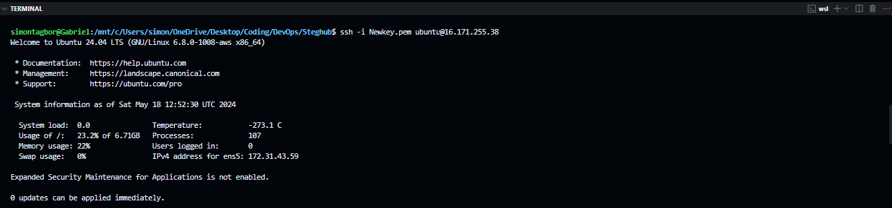

Our EC2 Instance is now ready for the next steps for developing and deploying the TO-DO web up on the MERN stack.
The TO-DO web application will have a backend infrastructure using Node.js and Express.js, a frontend using React.js, and a NOSQL database set up using MongoDB. our Ubuntu EC2 instance will be the host for the backend and frontend of the application.

For the next steps, let's configure our Backend.

## Task - 102 Configure Backend
in this task, we will be configuring the backend of our TO-DO web application. The backend will be set up using Node.js and Express.js. We will also set up a NOSQL database using MongoDB.

### Install Node.js
`Node.js` will be used to run the backend logic for our TO-DO web app written in JavaScript. [Node.js](https://nodejs.org/en) uses an event-driven, non-blocking I/O model that makes it lightweight and efficient. It is perfect for data-intensive real-time applications that run across distributed devices.

To install Node.js, run the following commands:

```bash
sudo apt update
```
Add repository for Node.js package for Ubuntu. Doing so will allow us to install the latest version of Node.js.
```bash
curl -fsSL https://deb.nodesource.com/setup_14.x | sudo -E bash -
```
Install the Latest Node.js package for Ubuntu.
```bash
sudo apt-get install -y nodejs
```
The above command will install node and [npm](https://www.npmjs.com/), the package manager for Node.js. package managers help developers to install, update, configure, and uninstall code libraries and dependencies.

now let's check the version of Node.js and npm installed.
```bash
node -v
npm -v
```
The output should be the version of Node.js and npm installed.
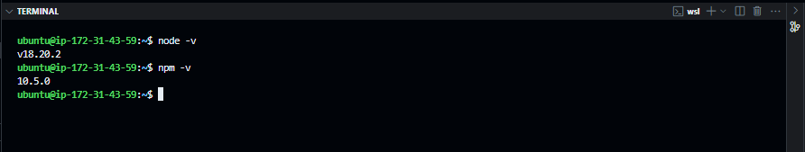

great! Node.js and npm are now installed on our EC2 instance. Next, we will set up the directory structure for the TO-DO app. This helps to keep the codebase organized and maintainable.

### Set up Directory Structure

Create a directory for the TO-DO app.
```bash
mkdir Todo && cd Todo
```
With this command, we created and changed into the Todo directory. Next, we will initialize a new Node.js project in the Todo directory.

### Initialize Node.js Project

I initialized a new Node.js project in the Todo directory using the following command:
```bash
npm init
```

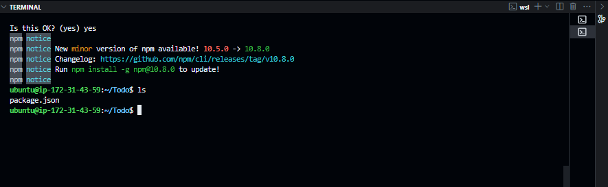

The `npm init` command creates a `package.json` file in the Todo directory. The `package.json` file contains metadata about the project and the dependencies required to run the project. Next, we will install the dependencies required to run the TO-DO app.

### Install Dependencies

One of the backend dependencies for our `MERN` web app is the Express.js framework. The development team will use Express.js to define the routes and handle requests from the frontend(we are yet to setup). To install Express.js, run the following command:

```bash
npm install express
```

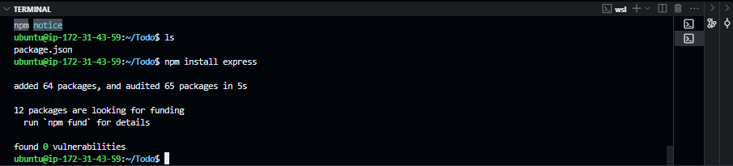

Great! Express.js is now installed in our project. Next up, we will create an index route for the TO-DO app to test if the backend is working as expected.

### Create Index Route

I created an index route in the `index.js` file in the Todo directory. The index route will be used to test if the backend is working as expected. Here is the code for the index route:

```bash
touch index.js
```
I will then define the index route in the `index.js` file. The index route will return a message to the client when the client makes a request to the route. Here is the code for the index route:

```javascript
const express = require('express');
require('dotenv').config();

const app = express();
// get the port from the environment variable or use port 5000
const PORT = process.env.PORT || 5000;

// define the index route
app.use((req, res, next) => {
    res.header("Access-Control-Allow-Origin", "\*");
    res.header("Access-Control-Allow-Headers", "Origin, X-Requested-With, Content-Type, Accept");
    next();
});

app.use((req, res, next) => {
    res.send('Welcome to the TO-DO app powered by MERN stack');
});

// start the server
app.listen(PORT, () => {
    console.log(`Server running on port ${PORT}`);
});
```

The code above defines an index route that returns a message to the client(the browser or another server) when the client makes a request to the route. The server listens on port 5000 by default. The [port number](https://www.google.com/search?q=what+are+port+numbers&oq=what+are+port+numbers&aqs=chrome..69i57j0i512l4j0i22i30l5.6222j0j7&sourceid=chrome&ie=UTF-8) can be changed by setting the `PORT` [environment variable.](https://www.geeksforgeeks.org/environment-variables-in-linux-unix/)

Notice how our express app is listening on port number `5000` by default. We need to ensure that our EC2 instance allows traffic on port 5000. We will do this by updating the inbound rules for the EC2 instance. I[ added a custom TCP rule](https://docs.aws.amazon.com/finspace/latest/userguide/step5-config-inbound-rule.html) for port 5000 to allow traffic from all IP addresses(not a particularly strict inbound rule but we'll manage).

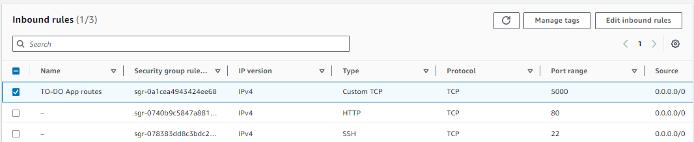

Notice also that in the `index.js` snippet,  we are using `dotenv` package to load the port number on which the app's backend listens, from the environment variable. We will need to install the `dotenv` package. To install the `dotenv` package, run the following command:

```bash
npm install dotenv
```

This will install the `dotenv` package which will be used to load the port number on which the app's backend listens, from the environment variable. now let's test the index route.

### Test Index Route

To test the index route, run the following command:

```bash
node index.js
```
In the terminal output we should see the message "Server running on port 5000". This means that the backend is working as expected.

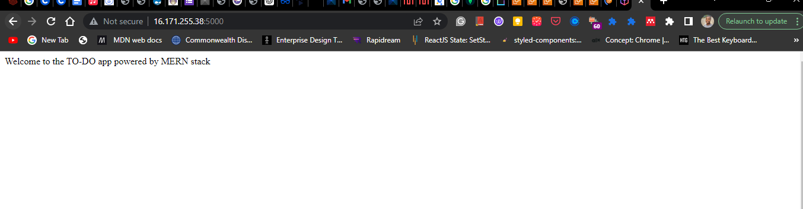

let's try it out in the browser. Open a browser and navigate to `http://<public-ip>:5000`. You should see the message "Welcome to the TO-DO app powered by MERN stack".

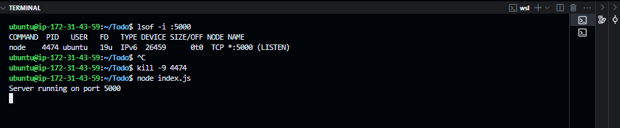

Great! The backend is working as expected. Before we do the next steps, let's quickly review what we have done so far.
We are setting up a MERN stack application on AWS. After spinning up an EC2 instance, we installed Node.js and npm. We then set up the directory structure for the TO-DO app and initialized a new Node.js project. We installed the Express.js framework and created an index route to test if the backend is working as expected. The index route returns a message to the client when the client makes a request to the route. We also updated the inbound rules for the EC2 instance to allow traffic on port 5000. The backend is now ready for the next steps.

### ah yes! your very own surprise side quest.

You have earned a quick pause for hydration :) when you return we'll define the routes for the TO-DO app.


A few moments later...

## Task - 103 Define Routes for TO-DO App

Now that the backend is working as expected, let's put on our backend web developer hats and define some simple routes for our TO-DO app. Think of routes as being the different paths that a user can take to interact with the app. The routes will be used to perform [CRUD operations](https://www.freecodecamp.org/news/crud-operations-explained/) on the TO-DO app. CRUD stands for Create, Read, Update, and Delete. The routes we will design will help our users create a new TO-DO item, read all TO-DO items, update a TO-DO item, and delete a TO-DO item.

### Create Routes

we can define routes inside the `index.js` file but that would make the codebase messy and hard to maintain. To keep the codebase organized and maintainable, we will create a new directory called `routes` and define the routes in separate files. Let's create the `routes` directory and define the routes for the TO-DO app.

```bash
mkdir routes && cd routes
```

inside the `routes` directory, we will create a new file called `api.js` and define the routes for the TO-DO app. Here is the code for the `api.js` file:

```javascript
const express = require('express');
const router = express.Router();

// define the routes for the TO-DO app
router.get('/todos', (req, res, next) => {
    res.send('GET list of todos[feature comming soon]');
});

router.post('/todos', (req, res, next) => {
    res.send('POST:add a new todo [feature comming soon]');
});

router.put('/todos/:id', (req, res, next) => {
    res.send('PUT:update a todo [feature comming soon]');
});

router.delete('/todos/:id', (req, res, next) => {
    res.send('DELETE  an embaraasing todo item [feature comming soon]');
});

module.exports = router;
```

## Task - 104 Model TO-DO Items

We will use the routes defined inside the `api.js` in a moment. For now, we need to model the real-world idea of a TO-DO item. You can think of modeling as us defining a blueprint in Javasript for spawning TO-DO objects. The model will define the structure of a TO-DO item, giving it properties, and methods to interact with the TO-DO item.


| Field        | Type   | Description                              |
|--------------|--------|------------------------------------------|
| id           | String | A unique identifier for the TO-DO item.  |
| action       | String | The title of the TO-DO item.             |
| description  | String | A detailed description of the TO-DO item.|
| status       | String | The status of the TO-DO item.            |
| created_at   | Date   | The date and time when the TO-DO item was created. |
| updated_at   | Date   | The date and time when the TO-DO item was last updated. |


when these TO-DO objects are created by the user we need a way to persist them for retrieval later.(we don't want to lose our TO-DO items when the server is restarted). We will use a NOSQL database to store the TO-DO items. at the risk of sounding repetitive, we will use MongoDB as the NOSQL database.

### Set up NoSQL Database

We need to install a node.js package called `mongoose` to interact with MongoDB. Mongoose is an Object Data Modeling (ODM) library for MongoDB and Node.js. It provides a straightforward, schema-based solution to model the application data. To install mongoose, run the following command:

```bash
npm install mongoose
```

### Define TO-DO Models

We will define the TO-DO model in a new file called `todo.js` inside the `models` directory. Let's create the `models` directory and define the TO-DO model.

```bash
mkdir models && cd models && touch todo.js
```

Inside the `todo.js` file, we will define the TO-DO model. Here is the code for the `todo.js` file:

```javascript
const mongoose = require('mongoose');
const Schema = mongoose.Schema;

// define the TO-DO schema
const TodoSchema = new Schema({
    action: {
        type: String,
        required: true
    },
    description: {
        type: String,
        required: true
    },
    status: {
        type: String,
        required: true
    },
    created_at: {
        type: Date,
        default: Date.now
    },
    updated_at: {
        type: Date,
        default: Date.now
    }
});

// create the TO-DO model
const Todo = mongoose.model('Todo', TodoSchema);

module.exports = Todo;
```

### Integrate Routes and Models

Now that we have the blueprint for creating and storing todo items via `models/todo.js` and the half-baked API request endpoints defined in the `api.js`, it's time to fully implement the CRUD operations defined in the `api.js` file. We will use the `mongoose` package to interact with the MongoDB database. Let's integrate the routes and models.

```javascript
const express = require('express');
const router = express.Router();
const Todo = require('../models/todo');

// define the routes for the TO-DO app

// Retrieve all TO-DO items
router.get('/todos', (req, res, next) => {
    Todo.find({}, 'action')
        .then(data => res.json(data))
        .catch(next)
});

// add a new TO-DO item
router.post('/todos', (req, res, next) => {
    if(req.body.action){
        Todo.create(req.body)
            .then(data => res.json(data))
            .catch(next)
    }else{
        res.json({
            error: "The input field is empty"
        })
    }
});
// update todo item by id
router.put('/todos/:id', (req, res, next) => {
    Todo.findByIdAndUpdate({_id: req.params.id}, req.body)
        .then(() => {
            Todo.findOne({_id: req.params.id})
                .then(data => res.json(data))
        })
        .catch(next)

});

// delete todo item by id
router.delete('/todos/:id', (req, res, next) => {
    Todo.findByIdAndDelete({_id: req.params.id})
        .then(data => res.json(data))
        .catch(next)
});

module.exports = router;
```
At this point our backend is almost ready. We have all the API endpoints the client side will need to interact with the backend. We have also defined the TO-DO model to create the TO-DO items. The next step is to connect the backend to the MongoDB database. 

## It's a lot of details let's just take a moment.

<div align="center" style="margin: 50px 0;">
    
</div>


## Task 106 - Set Up MongoDB Database

For this step there are two options:

- 1. Set up MongoDB on the local EC2 instance.

- 2. Use a Database Management as a Service on the cloud.(DBaaS)

We will choose the second option and use[ mLab](https://www.mongodb.com/products/try-free/platform/atlas-signup-from-mlab) a MongoDB [database as a service solution](https://www.opentext.com/what-is/database-as-a-service-dbaas#:~:text=Database%20as%20a%20Service%20(DBaaS)%20is%20a%20category%20of%20cloud,software%2C%20or%20configure%20the%20database.). let's say we lunched our TO-DO app and it instantly became a hit. We will need to quickly scale our MERN stack implementation on AWS to meet storage and performance needs. choosing the first option will mean we spend more money on costly EC2 storage and processing(see [vertical scaling](https://www.cloudzero.com/blog/horizontal-vs-vertical-scaling/#:~:text=Horizontal%20scaling%20(aka%20scaling%20out,server%20may%20be%20your%20solution.)) component upgrades and most likely spend a lot of time and effort on doing database administration stuff. This approach does not scale very well.

With a DBaaS solution like[ mLab ](https://www.mongodb.com/products/try-free/platform/atlas-signup-from-mlab)we can decouple the database from our EC2 instance and shed most of the database administration responsibilities saving the development team time and effort.

### Setup  mLab service

I created a free account on mLab and created a new database. I then created a new user for the database. soon we will be connecting our backend to the MongoDB database on mLab.

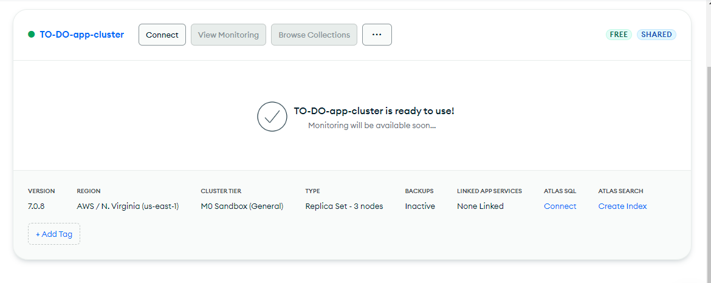

I will create a database `Todo-list`database and the collection `todo-items` to store the TO-DO items. I also created a user `db-admin` with a password to access the database. I then retrieved the connection string for the database. The connection string will be used to connect the backend to the MongoDB database.

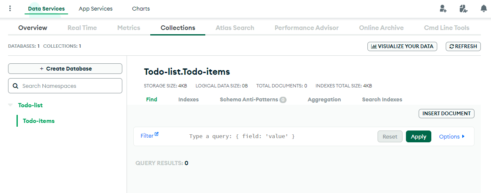

The connection string to connect to database through the backend

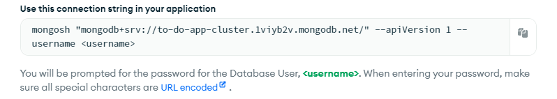

we will use this in our .env file to connect to the database.

```bash
echo "DB='mongodb+srv://<username>:<password>d@to-do-app-cluster.1viyb2v.mongodb.net/?retryWrites=true&w=majority&appName=TO-DO-app-cluster''">>.env
```
remember to replace `<username>` and `<password>` with the username and password you created on mLab. The connection string generated by mLab will be used to connect the backend to the MongoDB database.

### Test Backend Connection to MongoDB

It's time to test our connection to the database by starting the development server.

```bash
node index.js
```

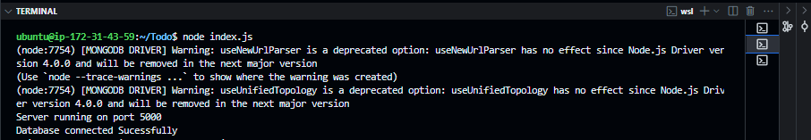

### It works!!!


The backend is now connected to the MongoDB database. The TO-DO items will be stored in the `Todo-list` database on mLab. The next step is to test the API endpoints using Postman.

## Task 107 - Test API endpoints with Postman

We designed the backend of the TO-DO app to allow [CRUD Operations](https). In this task, I will test the API endpoints using Postman. Postman is a popular API client that allows developers to test API endpoints. 

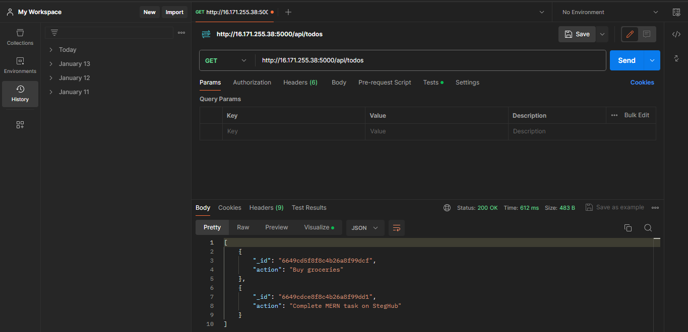

I will use Postman to test:

- [x] **C**reation of TO-DO items -> POST request
- [x] **R**etrieval of TO-DO items -> GET request
- [x] **U**pdate of TO-DO items -> PUT request
- [x] **D**elete of TO-DO items -> DELETE request

### Test Creation of TO-DO Items

I tested the `POST http://16.171.255.38:5000/api/todos` endpoint  to see if we can create a todo app

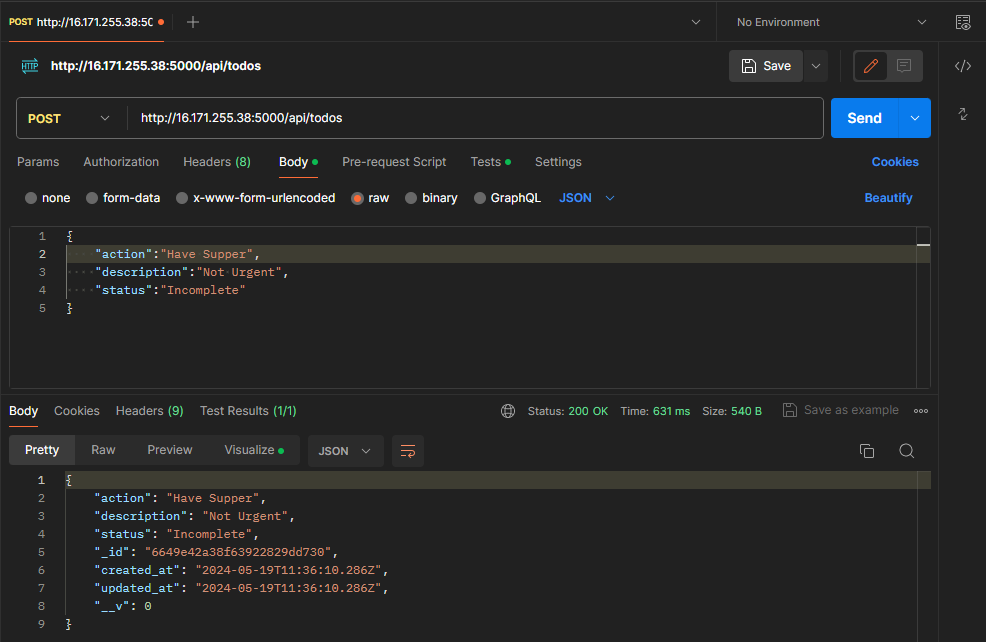

The response suggests that we created a todo item. Let's verify by checking our MongoDB database.

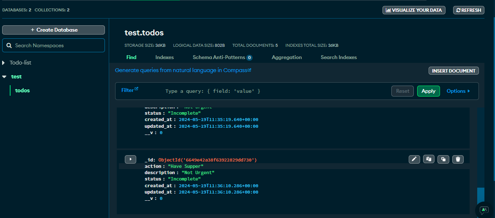

Our POST request was successful. We created a new TO-DO item in the database. Next, we will test the retrieval of TO-DO items.

### Test Retrieval of TO-DO Items

I tested the `GET http://16.171.255.38:5000/api/todos` to see if we can retrieve all the TO-DO items from the database.

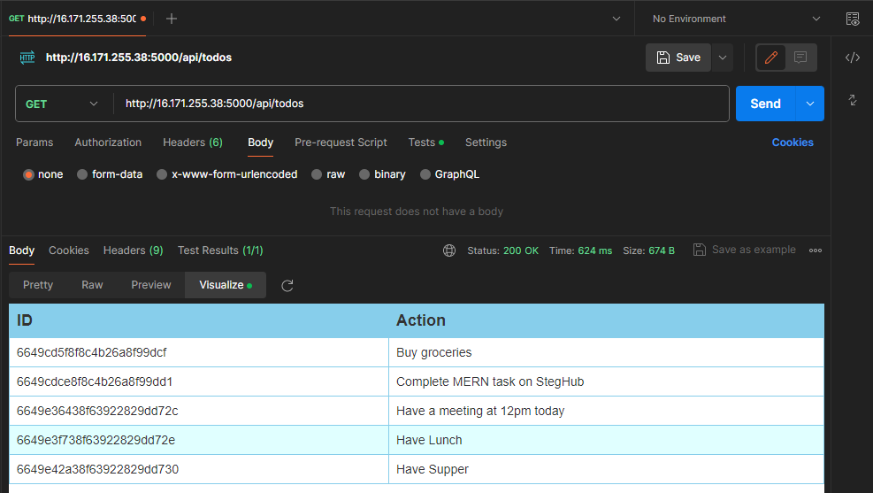

our GET request was successful. We retrieved all the TO-DO items from the database. Next, we will test the update of TO-DO items.

### Test Update of TO-DO Items

I wanted to update the TO-DO item with the id `6649e3f738f63922829dd72e` to see it it will work. calling the `PUT http://16.171.255.38:5000/api/todos` with the updated values should modify the TO-DO item.

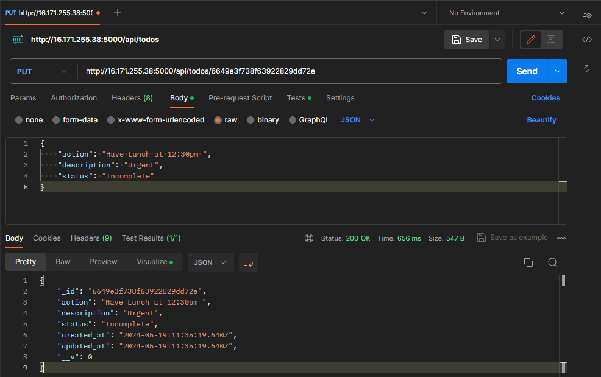

it works, to conclude our tests let's test the deletion of TO-DO items.	

### Test Deletion of TO-DO Items

let's say I needed to cancel lunctime from my todo list. The acorresponding action id is  `6649e3f738f63922829dd72e`
let's see it a call to `DELETE http://16.171.255.38:5000/api/todos/6649e3f738f63922829dd72e` will remove it from the database.

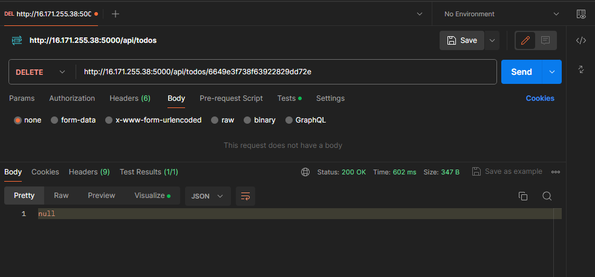

The DELETE request was successful. We deleted the TO-DO item from the database. The API endpoints are working as expected. The backend is now ready for the next steps.

## Task 108 - Configure Frontend

### initialise frontend project
I created a simple frontend application with react

```bash
sudo npx create-react-app client
```
This will create a new directory for client inside the Todo directory. The client directory will contain the frontend code for the TO-DO app. Next, I intalled a few dependencies for the frontend.

### Install frontend Dependencies
we will use [concurrently](https://www.npmjs.com/package/concurrently) to run the backend and frontend servers concurrently. To install concurrently, run the following command:

```bash
npm install concurrently --save-dev
```

Let's add some server monitoring packages to the frontend. We will use [nodemon](https://www.npmjs.com/package/nodemon) to monitor the backend server for changes and [react-scripts](https://www.npmjs.com/package/react-scripts) to monitor the frontend server for changes. To install nodemon and react-scripts, run the following command:

```bash
npm install nodemon react-scripts --save-dev
```

### Configure Frontend Package.json

I updated the `Todo/package.json` file in the Todo directory to include the scripts for running the backend and frontend servers concurrently. I also added the proxy to `Todo/client/package.js` for the frontend to communicate with the backend. A proxy tells the frontend to forward requests to the backend server.

Here is the updated `Todo/package.json`  and `Todo/client/package.js/`files:

```json
// Todo/package.json
{
  "name": "Todo",
  "version": "1.0.0",
  "description": "MERN stack implementation on AWS",
  "main": "index.js",
  "scripts": {
    "start": "node index.js",
    "server": "nodemon index.js",
    "client": "npm start --prefix client",
    "dev": "concurrently \"npm run server\" \"npm run client\""
  },
  "author": "Steghub",
  "license": "MIT",
  "devDependencies": {
    "concurrently": "^6.2.0",
    "nodemon": "^2.0.12",
    "react-scripts": "^4.0.3"
  }
}
```
```json
// Todo/client/package.json
{
  "name": "client",
  "version": "0.1.0",
  "private": true,
  "dependencies": {
    "@testing-library/jest-dom": "^5.11.4",
    "@testing-library/react": "^11.1.0",
    "@testing-library/user-event": "^12.1.10",
    "react": "^17.0.2",
    "react-dom": "^17.0.2",
    "react-scripts": "4.0.3",
    "web-vitals": "^1.0.1"
  },
  "scripts": {
    "start": "react-scripts start",
    "build": "react-scripts build",
    "test": "react-scripts test",
    "eject": "react-scripts eject"
  },
  "eslintConfig": {
    "extends": [
      "react-app",
      "react-app/jest"
    ]
  },
  "browserslist": {
    "production": [
      ">0.2%",
      "not dead",
      "not op_mini all"
    ],
    "development": [
      "last 1 chrome version",
      "last 1 firefox version",
      "last 1 safari version"
    ]
  }
}
```
when we run `npm run dev` we should see the terminal output below

```bash
npm run dev
```
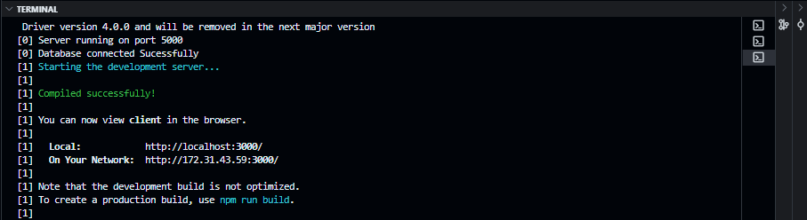

before we test it in the browser let's update the inbound rules of the EC2 instance to allow traffic on port 3000. we will be running the frontend server on port 3000.

### update inbound rules for EC2 instance.

I added a custom TCP rule for port 3000 to allow traffic from all IP addresses.

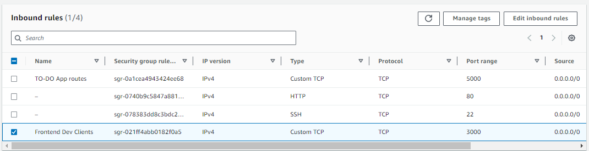

### Test Frontend in the Browser

If the EC2 server is still running you will see the client app working [here](http://16.171.255.38:3000/)

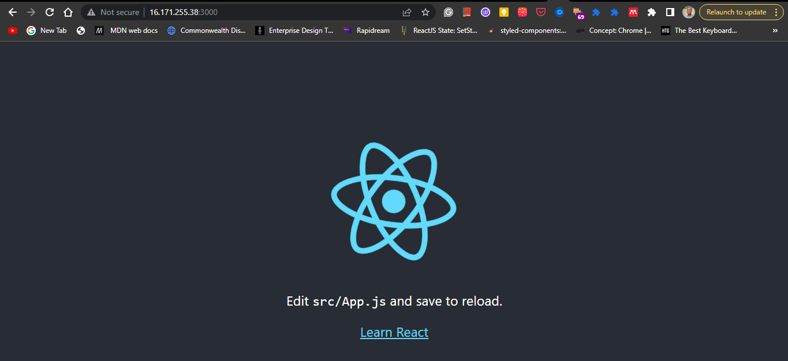


We can also retrieve all todo items using the client side URI http://16.171.255.38:3000/api/todos)

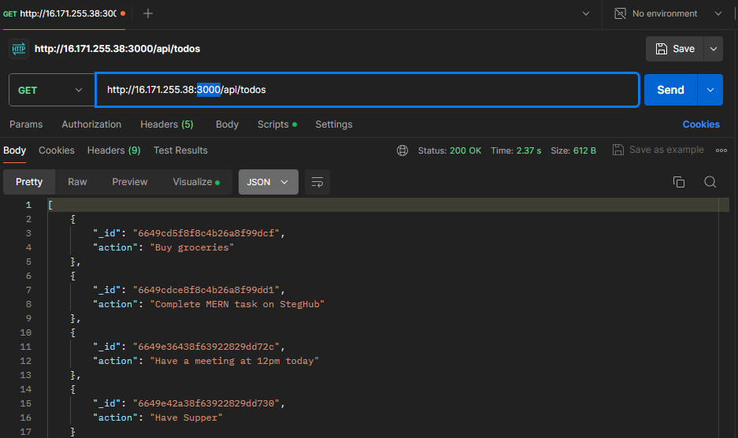

The frontend is working as expected. 

## Bonus Task - Create React Components

I created a few React components to display the TO-DO items. The components will be used to display the TO-DO items on the frontend. I created a new directory called `components` inside the `client/src` directory. Inside the `components` directory, I created a new file called `Todo.js` and defined the `Todo` component. Here is the code for the `Todo.js` file:

```javascript
// client/src/components/Input.jss
import React, { Component } from 'react';
import axios from 'axios';

class Input extends Component {
    state = {
        action: '',
    }

    addToDo = () => {
        const task = {
            action: this.state.action
        }

        if (task.action && task.action.length > 0) {
            axios.post('/api/todos', task)
                .then(res => {
                    if (res.data) {
                        this.props.getTodos();
                        this.setState({ action: '' });
                    }
                })
                .catch(err => console.log(err))

        } else {
            console.log('Input field is empty')
        }
}

handleChange = (e) => {
    this.setState({
        [e.target.name]: e.target.value
    })
}

render() {
    let { action } = this.state;
    return (
        <div>
            <input type="text" name="action" value={action} onChange={this.handleChange} />
            <button onClick={this.addToDo}>Add</button>
        </div>
    )
}

export default Input;
```

This code defines the `Input` component that will be used to add a new TO-DO item. The `Input` component has an input field and a button. The user can type the TO-DO item in the input field and click the button to add the TO-DO item. The `addToDo` method is called when the user clicks the button. The `handleChange` method is called when the user types in the input field.

notice that we use `axios` to make a POST request to the backend to add a new TO-DO item. We will need to install the `axios` package. [axios] will make it easier to make HTTP requests from the frontend to the backend. To install the `axios` package, run the following command:

```bash
npm install axios
```

now let's create a few more components to display the TO-DO items. I created a new file called `ListTodo.js` inside the `/client/src/components` directory. Here is the code for the `ListTodo.js` file:

```javascript
// client/src/components/ListTodo.js

import React from 'react';

const ListTodo = ({ todos, deleteTodo }) => {
    return (
        <div>
            <ul>
                {todos && todos.length > 0 ? todos.map(todo => (
                    <li key={todo._id}>
                        {todo.action}
                        <button onClick={() => deleteTodo(todo._id)}>Delete</button>
                    </li>
                )) : <li>No TO-DO items</li>}
            </ul>
        </div>
    )
}

export default ListTodo;
```

Let's also add a `Todo.js` component to display the TO-DO items. I created a new file called `Todo.js` inside the `/client/src/components` directory. Here is the code for the `Todo.js` file:

```javascript
// client/src/components/Todo.js

import React, { Component } from 'react';
import axios from 'axios';

import Input from './Input';
import ListTodo from './ListTodo';

class Todo extends Component {
    state = {
        todos: []
    }

    componentDidMount() {
        this.getTodos();
    }

    getTodos = () => {
        axios.get('/api/todos')
            .then(res => {
                if (res.data) {
                    this.setState({ todos: res.data })
                }
            })
            .catch(err => console.log(err))
    }

    deleteTodo = (id) => {
        axios.delete(`/api/todos/${id}`)
            .then(res => {
                if (res.data) {
                    this.getTodos();
                }
            })
            .catch(err => console.log(err))
    }

    render() {
        let { todos } = this.state;
        return (
            <div>
                <h1>TO-DO List</hh1>
                <Input getTodos={this.getTodos} />
                <ListTodo todos={todos} deleteTodo={this.deleteTodo} />
            </div>
        )
    }
}

export default Todo;
```

Finally, I updated the `App.js` file in the `/client/src` directory to include the `Todo` component.
I also added some styling to the `App.css` file in the `/client/src` directory to style the TO-DO app.

Here is the code for the `App.js` file:

```javascript
// client/src/App.js

import React from 'react';

import Todo from './components/Todo';
import 'App.css';

const App = () => {
    return (
        <div className="App">
            <Todo />
        </div>
    )
}

export default App;
```

the `App.css` file will contain the following code:

```css	
/* client/src/App.css */

.App {
    text-align: center;
    font-zize: calc(10px + 2vmin);
    width: 60%;
    margin-left: auto;
    margin-right: auto;
}

input {
    height: 40px;
    width: 50%;
    border: none;
    border-bottom: 1px solid #000;
    background-color: none;
    font-size: 1.5rem;
    color: #787a80;
}

input:focus {
    outline: none;
}

button {
    height: 45px;
    width: 25%;
    background: #101113;
    color: #787a80;
    border: none;
    cursor: pointer;
    font-size: 25px;
    margin-left: 10px;
}

button:focus {
    outline: none;
}

ul {
    list-style-type: none;
    padding: 0;
    text-align: left;
    padding: 15px;
    backcground: #171a1f;
    border-radius: 5px;
}

li {
    padding: 10px;
    margin: 10px;
    background: #282c34;
    color: #787a80;
    border-radius: 5px;
    overflow-wrap: break-word;
    cursor: pointer;

}

@media only screen and (max-width: 600px) {
    .App {
        width: 90%;
    }

    .input {
        width: 80%;
    }

    button {
        width: 100%;
        margin-top: 10px;
        margin-left: 0;
    }
}
```

### Test New React Components

Finally time for live testing of the TODO app. I ran the frontend server using the following command:

```bash
npm run dev
```

I then navigated to http://16.171.255.38:3000/api/todos to test it out.

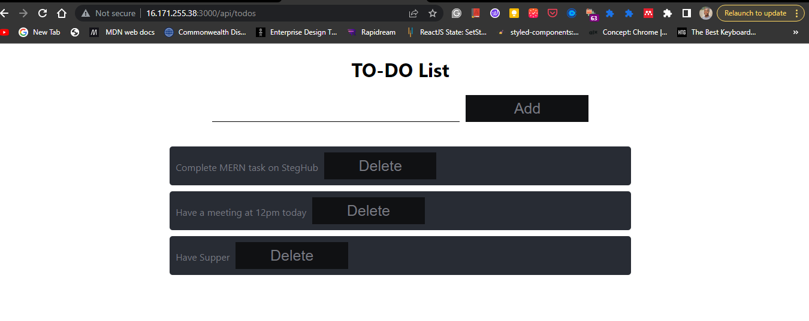

The TO-DO app is working as expected. The user can add a new TO-DO item, retrieve all TO-DO items, update a TO-DO item, and delete a TO-DO item. We have sucessfully set up a MERN Stack Application development environment on AWS. The backend is working as expected and the frontend is also working as expected.

## Conclusion

In this project, we set up a MERN stack application development environment on AWS. We created a TO-DO app using the MERN stack. We set up the backend using Node.js and Express.js. We defined the routes for the TO-DO app and modeled the TO-DO items. We connected the backend to the MongoDB database using mLab. We tested the API endpoints using Postman. We set up the frontend using React. We created React components to display the TO-DO items. We tested the frontend in the browser. The TO-DO app is working as expected. The user can add a new TO-DO item, retrieve all TO-DO items, update a TO-DO item, and delete a TO-DO item. The MERN stack application development environment is now set up on AWS. The backend is working as expected and the frontend is also working as expected.
