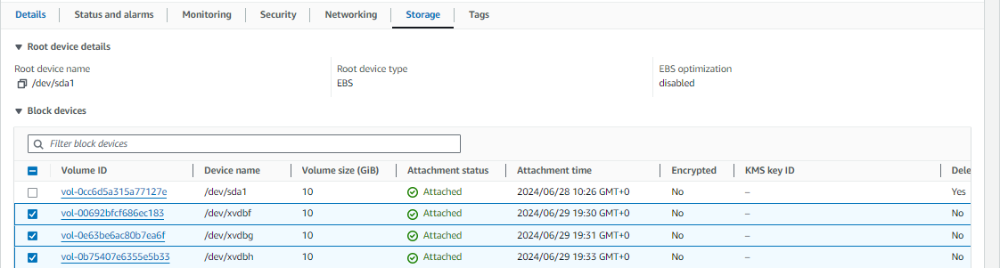

# DevOps Web Solution With WordPress

<div style="display: flex; justify-content: center; align-items: center; margin: 20px 0;">
   
</div>

## Introduction

In this project, I successfully set up a  WordPress web solution from scratch. I learned how to set up a physical web server, a database server, and a WordPress server. I also learned how to configure storage for better performance and scalability. Throughout the project, I used disk partitioning techniques to store data in different partitions to allow for better performance and scalability. I learned how to use `gdisk`, `mkfs`, `mount` to manage disk partitions in Linux.

## Pre-requisites

To follow along with this project, you need to have the following:

- An AWS account, which can be created [here](https://aws.amazon.com/)

- Understand the basics of Linux, you can learn more [here](https://www.tutorialspoint.com/unix/index.htm)

- Understand the basics of MySQL, you can learn more [here](https://www.tutorialspoint.com/mysql/index.htm)

## Task Summary

> The project requirement is as follows:
>
> 1. Set up a WordPress-based web server to serve content to a client.
> 2. Set up a database server to store data for the WordPress web server.
>
> The web server and the database server should mee the following requirements:
>
> - They should run on a Red Hat based Linux distribution on AWS
> - They Should have well-partitioned storage volumes attached to them.
> - The partitioning should be done in such a way that the web server and the database server have separate partitions for the operating system, the application, and the data.
> - The Database server should be a MySQL server and should listen on port 3306 for only the web server through private IP.


## Tasks

To kick things off, I created two AWS EC2 instances


In the coming sections, we will take a look at how I set up the web server and the database server to meet the requirements above.

## Part One - Setting Up Hardware and Storage

>In the coming sections, we will set up a web server and a database server on AWS. We will attach EBS volumes to the servers and partition the volumes to meet the requirements of the project.

### 1. Prepare a Web Server

I created a Red Hat-based Linux instance on AWS and set up a web server on it. I then attached three EBS volumes to the web server instance.



For details on how to set up an AWS EBS 
volume, see this simple guide [here](https://docs.aws.amazon.com/AWSEC2/latest/UserGuide/ebs-creating-volume.html)

I then configured the EBS volumes to meet the partition requirements stated earlier.

I will demonstrate how to set up one of the EBS volumes since the process is similar for all three volumes.

#### 1.1. Partition the EBS Volume

I SSH into the web server innstance to verify the attached EBS volumes using the `lsblk` command.

```bash

$ lsblk

```
I got the following terminal output to confirm


Let's also check if there are already existing partitions using `lvm2`package.

```bash
sudo yum update
sudo yum install lvm2
sudo lvmdiskscan
```

If there are no existing partitions you should get the following output

```bash

   /dev/xvda   [      8.00 GiB]
   /dev/xvdbf  [     10.00 GiB]
   /dev/xvdbg  [     10.00 GiB]
   /dev/xvdbh  [     10.00 GiB]
```


I then used the `gdisk` utility to partition the EBS volumes. To create a partition, you need the device names of the EBS volumes we attached.
`lsblk` command to get the device names of the EBS volumes.

```bash
lsblk
```

you should get an outputs similar to these :`/dev/xvdf`, `/dev/xvdg`, and `/dev/xvdh`  we will use `gdisk` with each of these names to create the partitions

##### Run `gdisk` command on each Device Name

```bash

sudo gdisk /dev/xvdf1
```
This will create a new partition on the EBS volume. You will be prompted to enter the following information:

- `Command (? for help):` Enter `n` to create a new partition.

- `Partition number (1-128, default 1):` Enter `1` to create the first partition.

- `First sector (34-209715166, default = 2048) or {+-}size{KMGTP}:` Press `Enter` to accept the default value.

- `Last sector (2048-209715166, default = 209715166) or {+-}size{KMGTP}:` Press `Enter` to accept the default value.

- `Current type is 'Linux filesystem'` Press `Enter` to accept the default value.

- `Changed type of partition to 'Linux filesystem'` Press `Enter` to accept the default value.

- `Command (? for help):` Enter `w` to write the changes to the disk.


After creating the partition, you can verify that the partition was created successfully using the `lsblk` command.

```bash
sudo lvmdiskscan
```
You should get a similar terminal output


You can see in the terminal output that I have three partitions created using the same steps.

You can repeat the same process to partition the remaining two EBS volumes.

Great!! by now you should have all three EBS volumes partitioned for our wordpress Web server.

Here is a quick recap of the steps we have taken so far:

- We created an EC2 instance on AWS to serve as our Web server
- [We created and attached](https://docs.aws.amazon.com/AWSEC2/latest/UserGuide/ebs-creating-volume.html) three EBS volumes(Disks)
- We partitioned all three volumes using the `gdisk` utility

**Next, we need to create physical volumes, volume groups, and logical volumes on the partitions we set up. Here’s why this is important:**

- **Physical Volumes (PVs)**: These are the actual disk partitions we use as the foundation for our storage system. By setting up physical volumes, we can manage storage resources more effectively.

- **Volume Groups (VGs)**: These combine multiple physical volumes into a single storage pool, allowing for greater flexibility and easier management of disk space across different disks.

- **Logical Volumes (LVs)**: Logical volumes are virtual partitions created from the volume group. They allow us to allocate storage dynamically for various purposes, such as the operating system, applications, and data.

This layered approach simplifies storage management, enhances scalability, and optimizes the disk usage of the wordpress site.

To create physical volumes, volume groups, and logical volumes, we will use the `pvcreate`, `vgcreate`, and `lvcreate` commands respectively.

#### 1.2. Create Physical Volumes, Volume Groups, and Logical Volumes

##### Create Physical Volumes

To create physical volumes, we will use the `pvcreate` command. We will create a physical volume for each partition we created earlier.

```bash
sudo pvcreate /dev/xvdf1
sudo pvcreate /dev/xvdg1
sudo pvcreate /dev/xvdh1
```
You would typically get the output below in each case

```bash

   Physical volume "/dev/xvdf1" successfully created.
   Physical volume "/dev/xvdg1" successfully created.
   Physical volume "/dev/xvdh1" successfully created.
```

##### Create Volume Groups

To create a volume group, we will use the `vgcreate` command. We will create a volume group for each physical volume we created earlier.

```bash
sudo vgcreate webserver-vg /dev/xvdf1 /dev/xvdg1 /dev/xvdh1
```

You should get the following output

```bash

   Volume group "webserver-vg" successfully created
```

The `vgcreate` command creates a volume group named `webserver-vg` that combines the three physical volumes we created earlier.


##### create Logical Volumes

As indicated earlier, Logical volumes are virtual partitions created from the volume group. We will create logical volumes for the operating system, the application, and the data. This will allow us to manage storage more efficiently and allocate space as required for different applications or data. 

```bash

sudo lvcreate -n os-lv -L 5G webserver-vg
sudo lvcreate -n app-lv -L 5G webserver-vg
sudo lvcreate -n data-lv -l 100%FREE webserver-vg
```

- **os-lv**: Allocates 5 GB for the operating system.
- **app-lv**: Allocates 5 GB for applications.
- **data-lv**: Uses the remaining space for data storage.

Let's verify that the logical volumes were created successfully using the `lvs` command.

```bash
sudo lvs
```

You should get the following output

```bash

   LV     VG          Attr       LSize   Pool Origin Data%  Meta%  Move Log Cpy%Sync Convert
   app-lv webserver-vg -wi-a----- 5.00g
   data-lv webserver-vg -wi-a----- 15.00g
   os-lv  webserver-vg -wi-a----- 5.00g
```

let's verify our entire setup using the `vgdisplay` command

#### view complete setup - VG, PV, LV
```bash
sudo vgdisplay -v 
```

You should get an output similar to this:


Great!! by now you should have all three EBS volumes partitioned and set up with physical volumes, volume groups, and logical volumes.

For the next steps, we will format the logical volumes and mount them to the appropriate directories.

#### 1.3. Format and Mount the Logical Volumes

For our WordPress web application, we will mount the logical volumes to the following directories:

- **Application**: `/var/www/html`
- **Data**: `/var/lib/mysql`

##### Mounting a Logical Volume

When we mount a logical volume we are :

- **1. Establishing a Connection**: We link the logical volume to a directory (e.g., /mnt/data). This directory serves as the entry point for accessing the logical volume's data.

- **2. Integrating with File System**: Mounted files and directories become part of the file system structure, enabling applications and users to interact with them.

- **Ensuring Accessibility to LVS**: Mounting ensures the operating system can read from and write to the logical volume, essential for efficient storage management, particularly for services like web servers.

Before we mount our logical volumes, we need to format them using the `mkfs` command. We will format the logical volumes as follows:

- **Application**: Format the `app-lv` logical volume as an ext4 file system.

- **Data**: Format the `data-lv` logical volume as an ext4 file system.

##### Format the Logical Volumes

```bash
sudo mkfs -t ext4 /dev/webserver-vg/app-lv
sudo mkfs -t ext4 /dev/webserver-vg/data-lv
```
The `mkfs` command formats the logical volumes to use the ext4 file system. This file system is widely used in Linux and is known for its reliability and performance. now we are ready to mount our logical volumes.

##### Mount the Logical Volumes

To mount the logical volumes, we will use the `mount` command. We will mount the logical volumes to the appropriate directories.

```bash

sudo mount /dev/webserver-vg/app-lv /var/www/html
```
This command mounts the `app-lv` logical volume to the `/var/www/html` directory. This directory is the default location for web content in Apache, the web server we will use for our WordPress site. If the directory does not exist, you can create it using the `mkdir` command. next up let's mount the data logical volume
Before we mount the data logical volume, it is a good practice to backup the existing data in the directory to be mounted. This is to prevent data loss in case of any issues during the mounting process. 

for instance during the mount process all existing data in `var/log` directory will be lost. To prevent this, we can backup the data using the `rsync` command.

```bash

sudo rsync -av /var/log/ /home/recovery/logs/
```
If `/home/recovery/logs/` does not exist, you can create it using the `mkdir` command.


##### Mount the Data Logical Volume

```bash

sudo mount /dev/webserver-vg/data-lv /var/log
```
After a sucessfull mount, we can restore the log files we backed up in the `/home/recovery/logs/` directory to the `/var/log/` directory using the `rsync` command.

```bash

sudo rsync -av /home/recovery/logs/ /var/log/
```

##### Persist the Mount Points

To ensure that the logical volumes are mounted automatically when the system boots, we need to update the `/etc/fstab` file. This file contains information about the file systems and devices that should be mounted at boot time.

we need the UUID of the logical volumes to update the `/etc/fstab` file. We can get the UUID of the logical volumes using the `blkid` command.

```bash

sudo blkid
```
Your terminal output should look similar to this:


Copy the UUID of the logical volumes(`app-lv` and `data-lv`) and update the `/etc/fstab` file using the `vim` editor.
and update the `/etc/fstab` file using the `vim` editor.

```bash

sudo vi /etc/fstab
```

Your `/etc/fstab` file should look similar to this:

```bash

   UUID=3e3b1b7d-1b7d-4b7d-8b7d-7b7d7b7d7b7d /var/www/html ext4 defaults 0 0
   UUID=3e3b1b7d-1b7d-4b7d-8b7d-7b7d7b7d7b7d /var/log ext4 defaults 0 0
```

let's test the configuration and reload the daemon

```bash
sudo mount -a
sudo systemctl daemon-reload
```

finally let's verify that the logical volumes are mounted correctly using the `df -h` command.

```bash 
df -h
```
Your terminal output should look similar to this:


Great!! by now you should have all three EBS volumes partitioned and set up with physical volumes, volume groups, and logical volumes. You should also have the logical volumes formatted and mounted to the appropriate directories.


Our web server now has the necessary storage resources to host the WordPress site. Next, we will prepare the database server to store data for the WordPress site.

### 2. Prepare a Database Server

The process of setting up the database server is similar to that of the web server. We will create a Red Hat-based Linux instance on AWS and attach an EBS volume to the database server instance. The only difference is that we will call our logical volumes `db-lv` instead of `apps-lv` as we did in setting up the storage for the web server. we will mount it to the `/db/` instead of `/var/www/html.`

I will not go through the steps in this documentation but you can follow the same steps we used to set up the web server to set up the database server.
At this point, we should have a 'web server' and a 'database server' set up with the necessary storage resources. The next step is give the 'web server' the ability to serve content to the client and the 'database server'.

## Part Two - Setting Up Software

>In the coming final sections, we will Install Apache and PHP on the web server, Install MySQL on the database server, and configure the database server to listen on port 3306 for only the web server through private IP.

### 3. Install Apache and PHP on the Web Server

Apache is a popular web server that is widely used to serve web content. PHP is a server-side scripting language that is used to create dynamic web pages. We will install Apache and PHP on the web server to enable it to serve content to the client.

#### Install Apache and PHP

In the web server instance, we will install Apache using the `yum` package manager.

```bash
sudo yum install wget httpd php php-mysqlnd php-fpm php-json
```
Start the Apache service and enable it to start at boot time.

```bash
sudo systemctl start httpd
sudo systemctl enable httpd
```

Additionally, let's install some PHP dependencies

```bash	
sudo yum install https://dl.fedoraproject.org/pub/epel/epel-release-latest-8.noarch.rpm

sudo yum install https://rpms.remirepo.net/enterprise/remi-release-8.rpm

sudo yum install yum-utils http://rpms.remirepo.net/enterprise/remi-release-8.rpm

sudo yum module list php 

sudo yum module reset php

sudo yum module enable php:remi-7.4

sudo yum install php php-common php-opcache php-mcrypt php-cli php-gd php-curl php-mysqlnd

```
Start the PHP service and enable it to start at boot time.

```bash

sudo systemctl start php-fpm
sudo systemctl enable php-fpm
```
Let's restart the Apache service to apply the changes.

```bash

sudo systemctl restart httpd
```

#### Download and Install WordPress

We will download the latest version of WordPress from the official website and install it on the web server.

```bash

cd /tmp
sudo wget https://wordpress.org/latest.tar.gz
sudo tar -xvzf latest.tar.gz
sudo mv wordpress/* /var/www/html/
```
#### Set up SELinux Policies

SELinux is a security feature in Linux that provides access control policies to protect the system from unauthorized access. We need to set up SELinux policies to allow Apache to write to the WordPress directory.

```bash

sudo chown -R apache:apache /var/www/html/

sudo chcon -t httpd_sys_rw_content_t /var/www/html/ -R

sudo setsebool -P httpd_can_network_connect_db 1
```

### Set Up MySQL on the Database Server

MySQL is a popular open-source relational database management system that is widely used to store data for web applications. We will install MySQL on the database server and configure it to listen on port 3306 for only the web server through a private IP.

To avoid some of the [data transfer charges](https://www.google.com/search?q=data+transfer+charges+by+cloud+providers&oq=data+transfer+charges+by+cloud+providers&aqs=chrome..69i57j33i160.21886j0j7&sourceid=chrome&ie=UTF-8) by some cloud providers when transferring data between servers in the same region, we can use the private IP of the webserver to connect to the database server in the same virtual private cloud.

##### *Every penny counts!!*


Assuming we have a sudden surge in traffic to our WordPress site, we will save money and probably reduce latency by making the instances share data using the local network of the virtual private cloud.

#### Install MySQL

We will install MySQL on the database server using the `yum` package manager.

```bash

sudo yum install mysql-server
```

Start the MySQL service and enable it to start at boot time.

```bash

sudo systemctl start mysqld

sudo systemctl enable mysqld
```

#### Configure MySQL

We will configure MySQL to listen on port 3306 for only the web server through a private IP. We will also create a database and a user for the WordPress site.

```bash

sudo mysql
```

You should get a MySQL prompt similar to this:

```bash

   mysql>
```

Create a database and a user for the WordPress site.

```bash

CREATE DATABASE wordpress;

CREATE USER 'wordpress'@'private_ip_of_webserver' IDENTIFIED BY 'password';

GRANT ALL PRIVILEGES ON wordpress.* TO 'wordpress'@'private_ip_of_webserver';

FLUSH PRIVILEGES;

EXIT;
```

Replace `private_ip_of_webserver` with the private IP of the web server instance and `password` with a secure password.

#### Update MySQL Configuration

We will update the MySQL configuration file to listen on port 3306 for only the web server through a private IP.

```bash

sudo vi /etc/my.cnf
```

Add the following lines to the configuration file:

```bash

   [mysqld]
   bind-address=private_ip_of_webserver
   port=3306
```

Replace `private_ip_of_webserver` with the private IP of the web server instance.

#### Update DB Server Firewall Rules

We will update the firewall rules on the database server to allow incoming traffic on port 3306 from the private IP of the web server using the `aws-cli`.


retrieve the security group id of the database server using the `aws-cli` command

```bash

# search for DB Server detail
aws ec2 describe-instances --filters "Name=tag:Name,Values=Database Server" --query "Reservations[*].Instances[*].[InstanceId,PrivateIpAddress,SecurityGroups[*].GroupId]" --output table
```

```bash
# update the security group to allow traffic from the web server
aws ec2 authorize-security-group-ingress --group-id sg-0b1a2c3d4e5f6g7h8 --protocol tcp --port 3306 --cidr private_ip_of_webserver/32
```

remember to replace `sg-0b1a2c3d4e5f6g7h8` with the security group ID of the database server and `private_ip_of_webserver` with the private IP of the web server instance.

you can check the security group rules using the `aws-cli` command

```bash

aws ec2 describe-security-groups --group-ids sg-0b1a2c3d4e5f6g7h8
```

#### Verify DB server connection from Web Server

To verify that the database server is listening on port 3306 for only the web server through a private IP, we can use the `mysql` command on the web server.
we need to instal mysql-client on the web server to do this.

```bash

sudo yum install mysql
```

```bash

mysql -h private_ip_of_db_server -u wordpress -p
```

You should be prompted to enter the password you set for the `WordPress` user. If you can connect successfully, it means the database server is listening on port 3306 for only the web server through a private IP.

I also updated the firewall rules on the webserver to allow traffic from the database server on port 3306


### 4. Configure WordPress

I added the database details to the WordPress sample configuration file to enable the WordPress site to connect to the database server.

```bash

cd /var/www/html/worpress

sudo cp wp-config-sample.php wp-config.php


sudo vi wp-config.php
```

Add the following lines to the configuration file:

```bash

   define('DB_NAME', 'wordpress');
   define('DB_USER', 'wordpress');
   define('DB_PASSWORD', 'password');
   define('DB_HOST', 'private_ip_of_db_server');
```

Replace `private_ip_of_db_server` with the private IP of the database server instance and `password` with the password you set for the `WordPress` user.


### 5. Access the WordPress Site

To access the WordPress site, open a web browser and enter the public IP of the web server instance in the address bar.

I then accessed the WordPress site using the public IP of the web server instance.

Live site: [WordPress Site](http://54.210.138.111/wordpress/)


## Conclusion

In this project, I successfully set up a WordPress web solution from scratch. I learned how to set up a physical web server, a database server, and a WordPress server. I also learned how to configure storage for better performance and scalability. Throughout the project, I used disk partitioning techniques to store data in different partitions to allow for better performance and scalability. I learned how to use `gdisk`, `mkfs`, `mount` to manage disk partitions in Linux.
